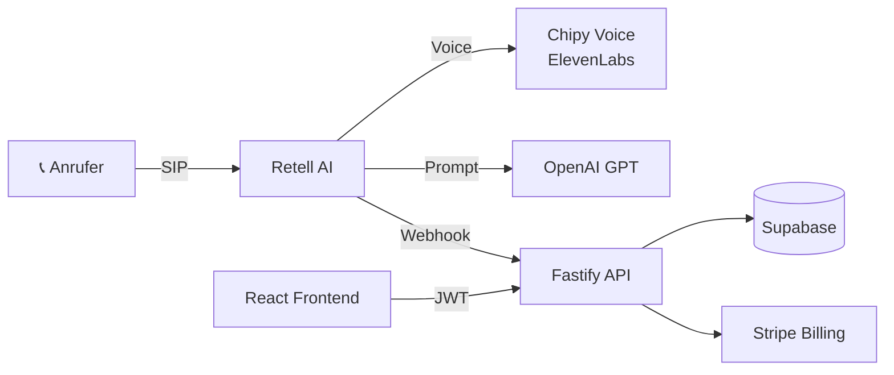

---
tags:
  - project
  - phonbot
  - mindrails
status: active
parent: "[[Mindrails/Overview|Mindrails]]"
created: 2026-04-18
code_path: ~/.openclaw/workspace/voice-agent-saas
stack:
  - Fastify 5
  - React 19
  - Supabase
  - Retell AI
  - Stripe
---

# Phonbot — Voice Agent SaaS

> Ein Produkt von [[Mindrails/Overview|Mindrails]].

> [!info] TL;DR
> SaaS wo Unternehmen KI-Telefonagenten bauen die Anrufe entgegennehmen. Retell + OpenAI + Supabase + Twillio.

## Architektur

## Stack

| Layer | Tech | Port Dev |
|-------|------|----------|
| API | Fastify 5 + TypeScript + Supabase + Redis | 3002 |
| Web | React 19 + Tailwind 4 + Vite | 3000 |
| Voice | Retell AI (ElevenLabs Hassieb-Kalla-Clone als Default, Cartesia-Rollback) | — |
| Payments | Stripe | — |

## Rollen (Agent-Koordination)

> [!note] Agent Pairing
> Ich bin **vaso** (Terminal), paired mit **termi** (VS Code).
> Koordination via `.collab/` im Repo-Root (NICHT `.coordination/`).

## Security Posture

> [!warning] Deep Audit 2026-04-18 — NEUE Criticals aufgetaucht
> Siehe [[Audit-2026-04-18-Deep]]: Secrets-Exposure, Twilio-Webhook-Signatur fehlt, 51 Silent-Catches, DSGVO-Lücken. Prod-relevant da Phonbot live auf phonbot.de.

> [!success] Audit Status davor (alte Findings)
> C1-C5 + H1-H8 + M1-M10 alle gefixt. ✅

- Multi-tenant mit `org_id` auf allen Queries
- AES-256-GCM für OAuth-Tokens + Cal.com-Keys
- Anti-Toll-Fraud: DACH-only Phone-Prefixes
- Rate-Limits: Global 100/min + per-route
- Turnstile CAPTCHA auf Public Endpoints

## Aktive Themen

- [[Phonbot/Pages|🗂 Page Inventory]] — alle 25 URLs (16 SPA + 9 Static) + Nav-Art + Sticky-Invarianten (Stand 2026-04-22)
- [[Phonbot/Pricing|💶 Preisgestaltung]] — Free/Nummer/Starter/Pro/Agency-Plan-Matrix + pro-Branche-Empfehlung + Drift-Checkliste (Stand 2026-04-22)
- [[Phonbot/Phonbot-Gesamtsystem|🧭 Gesamtsystem (Code-Basiert)]] — Single-Source-of-Truth-Index über 12 Modul-Notes (Stand 2026-04-21)
- [[Phonbot/SEO|🔎 SEO-Status]] — Technical SEO, Structured Data, AI-Discovery, Landing-Pages (Stand 2026-04-21)
- [[Phonbot/ZuTun|📝 ZuTun]] — offene Produkt-Aufgaben (Arzt-Branche, Mobile, Rollen, Agent-Tools, Kalender-Bug, Ticket-Fallback)
- **Code-Tasks & Bugs:** [github.com/haskallalk-eng/voice-agent-phonbot/issues](https://github.com/haskallalk-eng/voice-agent-phonbot/issues) — ausschließlich auf GitHub getrackt
- [[Phonbot/Decisions|📜 Decisions Log]] — _(noch leer)_

## Modul-Notes (code-basiert, 2026-04-21)

- Backend: [[Phonbot/modules/Backend-Infra]] · [[Phonbot/modules/Backend-Database]] · [[Phonbot/modules/Backend-Auth-Security]] · [[Phonbot/modules/Backend-Agents]] · [[Phonbot/modules/Backend-Voice-Telephony]] · [[Phonbot/modules/Backend-Outbound]] · [[Phonbot/modules/Backend-Billing-Usage]] · [[Phonbot/modules/Backend-Comm-Scheduling]] · [[Phonbot/modules/Backend-Insights-Admin]]
- Frontend: [[Phonbot/modules/Frontend-Shell]] · [[Phonbot/modules/Frontend-Pages]]
- Infra: [[Phonbot/modules/Shared-Infra-Tests]]

## Sessions

- [[Daily/2026-04-23|2026-04-23]] — Voice-Catalog auf sprach-nativ umgebaut (DE/EN/FR/ES/IT/TR/PL/NL je eigene Namen, multilinguale IDs geteilt), +5 Ct/Min-Pille in HQ-Gruppen-Header verschoben, Caddyfile-Änderungen von Codex dokumentiert (HTTP/3 off + /auth-Route — nicht angefasst). Offen: Grundrollen-Multiselect + Prompt-Template-Hinweis.
- [[Daily/2026-04-22|2026-04-22]] — Komplett-Relaunch der Website auf chipy-design (Nav-Unification, Emoji→SVG, animierter Live-Call-Dialog, Chipy-Avatar, Value-Section-Rewrite) + Ticket-Inbox-Refactor + Transfer-Rule-E.164-Fix + Hinweis-Tooltip. Skill `chipy-design` mehrfach erweitert, [[Pricing]] + [[Pages]] + [[Mindrails/Claude-Skills-und-MCPs]] als Vault-Referenz angelegt.
- [[Daily/2026-04-21|2026-04-21]] — Phonbot komplette Code-Kartierung in Obsidian (12 Module-Notes, Gesamtsystem-Index).

## Audits
- [[Audit-2026-04-18-Deep]] — 🔴 3 Criticals (Secrets, Twilio-Sig, Silent-Catches) + DSGVO-Lücken + Cost-Prognose
- [[Audit-2026-04-18-Bugs]] — 5 Critical Bugs (Math.ceil-Billing, Stripe-Races, Retell-Idempotency) + 10 Zeitbomben
- [[Audit-2026-04-18-Postfix]] — ✅ Alle Kernfixes clean. 🟠 4 HIGH noch offen (Cleanup-Jobs, Stripe UX-Race, paidPlans-Edge, Retell-Agent-Sync)
- [[Audit-2026-04-18-Final]] — ✅ Phase-3 verifiziert. 🔴 2 neue CRITICAL (migrate-silent-fail, no unhandledRejection). Score 7.5/10. Go-Live nach 30min-Fix.

## Default Voice

> [!important] Chipy (Maskottchen) — Stand Code 2026-04-21
> - **Default Voice ID:** `custom_voice_5269b3f4732a77b9030552fd67` (ElevenLabs Hassieb-Kalla-Clone, ~$0.040/min) — `retell.ts:16-17`
> - Override via `RETELL_DEFAULT_VOICE_ID` ohne Code-Deploy möglich
> - **Cartesia-Original** `custom_voice_28bd4920fa6523c6ac8c4e527b` existiert noch bei Retell als Rollback-Option (~$0.015/min), siehe `voice-catalog.ts:40-41`, Surcharge 0.05 €/min
> - Provider: ElevenLabs (primär) + Cartesia (Rollback) via Retell
> - Charakter: goldener Hamster → [[Phonbot/FoxLogo]]

## Links

- Repo: `~/.openclaw/workspace/voice-agent-saas`
- GitHub: https://github.com/haskallalk-eng/voice-agent-phonbot
- Production: https://phonbot.de
- Prod-Server: `root@87.106.111.213`, `/opt/phonbot`, Deploy via `scripts/deploy.sh`
