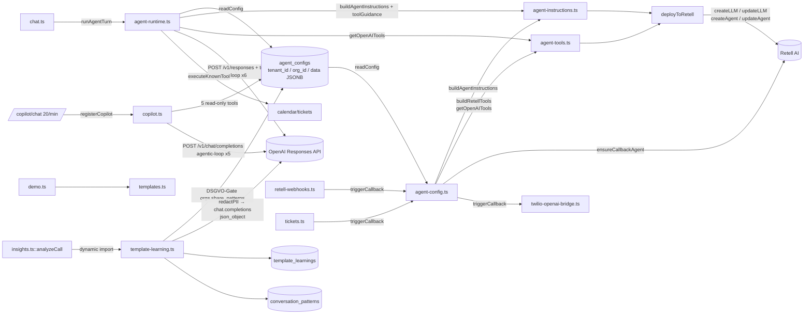

# Backend Agents — Konfiguration, Instructions, Runtime, Tools, Copilot, Templates

## Zweck

Dieses Modul kapselt alles was den KI-Agenten inhaltlich und prozedural ausmacht:

1. **Persistenz & CRUD** der Agent-Konfiguration pro `tenantId` / `orgId` in der Tabelle `agent_configs` (JSONB) — inkl. Deploy-Pfad zu Retell AI (LLM + Agent anlegen/aktualisieren), Callback-Agent-Provisionierung und Outbound-Rückruf-Trigger.
2. **System-Prompt-Aufbau** aus den Config-Feldern (Name, Firma, Öffnungszeiten, Services, Routing-Regeln, …) plus DSGVO/§ 201 StGB-Pflichttext.
3. **Runtime-Schleife** für Web-Chat: Prompt + Tools an die OpenAI Responses API, Tool-Calls ausführen, Ergebnisse zurückspeisen.
4. **Tool-Definitionen** (`calendar.findSlots`, `calendar.book`, `ticket.create`) — zweimal: als Retell-`RetellTool` (für den Telefonie-Pfad) und als OpenAI-`function`-Tool (für den Web-Chat-Pfad). Zusätzlich `transfer_call` für Live-Weiterleitung.
5. **Copilot "Chipy"** — eigener Assistent im Dashboard mit Tool-Access auf DB-Read-Only (Agent-Config, Tickets, Usage, Kalender, Nummern).
6. **Branchen-Templates** (Friseur, Handwerker, Arzt, Reinigung, Restaurant, KFZ) als statische Presets.
7. **Cross-Org Template-Learning-Pipeline** — extrahiert aus Call-Analysen branchenweite Muster und Prompt-Fixes (DSGVO-opt-in, PII-redacted).

## Datenmodell: agent_configs
(Verweis auf [[Backend-Database]])

Tabellen-Definition liegt in `apps/api/src/db.ts:382-395`:

```sql
create table if not exists agent_configs (
  tenant_id text primary key,
  updated_at timestamptz not null default now(),
  data jsonb not null
)
-- plus Indizes auf data->>'retellAgentId' und data->>'retellCallbackAgentId'
-- plus ALTER: org_id uuid references orgs(id) on delete cascade
```

Dieses Modul (`agent-config.ts`) ist der **Schreib-Owner** der Tabelle. Die wichtigsten Zugriffe:

| Operation | SQL (gekürzt) | Zeile | Ownership-Guard |
|---|---|---|---|
| Read (org-scoped) | `select data from agent_configs where tenant_id=$1 and (org_id=$2 or tenant_id=$2::text)` | `agent-config.ts:62` | orgId-Bind |
| Read Row für Ownership-Check | `SELECT data ... WHERE tenant_id=$1 AND (org_id=$2 OR (org_id IS NULL AND tenant_id=$2::text))` | `agent-config.ts:80` | Centralised check |
| Verfügbarkeits-Check | `SELECT org_id FROM agent_configs WHERE tenant_id=$1` | `agent-config.ts:94` | Anti-Takeover |
| Upsert | `INSERT … ON CONFLICT (tenant_id) DO UPDATE SET … WHERE agent_configs.org_id IS NULL OR agent_configs.org_id=EXCLUDED.org_id RETURNING tenant_id` | `agent-config.ts:112-123` | **ON CONFLICT-Guard** mit no-op bei fremdem org_id → `RETURNING`-leer → `409 TENANT_OWNED_BY_OTHER_ORG` |
| Liste per org | `SELECT tenant_id, data FROM agent_configs WHERE org_id=$1 OR tenant_id=$1::text ORDER BY updated_at DESC` | `agent-config.ts:455` | orgId-Bind |
| Insert neuer Agent | `INSERT INTO agent_configs (tenant_id, org_id, data, updated_at) VALUES …` | `agent-config.ts:497` | Tenant = `${orgId}-${Date.now()}` |
| Delete | `DELETE FROM agent_configs WHERE tenant_id=$1 AND org_id=$2` | `agent-config.ts:615` | org_id Zwang |
| Plan-Limit-Check | `SELECT COUNT(*) FROM agent_configs WHERE org_id=$1` | `agent-config.ts:477` | — |
| Erste deployte | `SELECT data ... WHERE org_id=$1 AND data->>'retellAgentId' IS NOT NULL ORDER BY updated_at DESC LIMIT 1` | `agent-config.ts:658` | orgId-Bind |
| Distinct retellAgentIds | `SELECT DISTINCT data->>'retellAgentId' AS a, data->>'retellCallbackAgentId' AS b FROM agent_configs WHERE org_id=$1` | `agent-config.ts:680` | orgId-Bind |
| Ownership-Check Call-Recording | `SELECT 1 FROM agent_configs WHERE org_id=$1 AND (data->>'retellAgentId'=$2 OR data->>'retellCallbackAgentId'=$2) LIMIT 1` | `agent-config.ts:706` | orgId-Bind |

Das Modul **liest** agent_configs zusätzlich in `copilot.ts:115` (`get_agent_config` Tool) und `template-learning.ts:91` (Industry-Lookup). Andere Module, die lesend zugreifen: `usage.ts`, `retell-webhooks.ts`, `admin.ts`, `phone.ts`, `insights.ts`, `learning-api.ts`, `outbound-agent.ts`, `org-id-cache.ts`, `tickets.ts`, `auth.ts`.

### Felder in `data` (JSONB) — aus `AgentConfigSchema` (`agent-config.ts:21-48`)

`tenantId`, `name`, `language` (de/en/fr/es/it/tr/pl/nl), `voice`, `businessName`, `businessDescription`, `address`, `openingHours`, `servicesText`, `systemPrompt`, `tools[]`, `fallback.{enabled,reason}`, `retellAgentId`, `retellLlmId`, `retellCallbackAgentId`, `retellCallbackLlmId`. `.passthrough()` erlaubt zusätzliche Felder (z.B. `knowledgeSources`, `speakingSpeed`, `calendarIntegrations`, `callRoutingRules`, `industry`, `templateId`).

## HTTP-Endpoints (nach Datei gruppiert)

### agent-config.ts (`registerAgentConfig`, ab `agent-config.ts:444`)

| Methode | Pfad | Auth | RateLimit | Zeile | Kurzbeschreibung |
|---|---|---|---|---|---|
| GET | `/agent-configs` | JWT | global | `448` | Alle Configs der org listen; leere Liste → Default |
| POST | `/agent-config/new` | JWT | global | `467` | Neuen Agent anlegen, respektiert Plan-Limit (free/starter 1, pro 3, agency 10) |
| GET | `/agent-config` | JWT | global | `508` | Config lesen (`?tenantId=` oder default = orgId) |
| GET | `/agent-config/preview` | JWT | global | `516` | Generierte Instructions + Tools + Fallback (nur Vorschau) |
| PUT | `/agent-config` | JWT | global | `530` | Config speichern (kein Retell-Deploy); Retell-IDs **server-authoritativ** aus DB gezogen, nicht aus Body |
| POST | `/agent-config/deploy` | JWT | global | `554` | Speichern + Retell AI sync (LLM+Agent erstellen/updaten); flusht `org-id-cache` |
| DELETE | `/agent-config/:tenantId` | JWT | global | `583` | Löschen; bei Age > 30d Passwort-Bestätigung via bcrypt; Phone-Numbers werden deassigned |
| POST | `/agent-config/web-call` | JWT | global | `627` | Web-Call-Token von Retell holen; atomare Minuten-Reservierung via `tryReserveMinutes` |
| GET | `/calls` | JWT | global | `674` | Call-History von Retell, gefiltert auf die `retellAgentId`s der org |
| GET | `/calls/:callId` | JWT | global | `693` | Einzelner Call; Agent-Ownership geprüft bevor Transkript/Recording herausgegeben wird |

Kein expliziter `config.rateLimit`-Override in diesen Routen — es gilt der globale Limit aus `index.ts`.

### agent-runtime.ts

Exportiert **keine HTTP-Route**. `runAgentTurn()` wird vom Chat-Modul aufgerufen (`chat.ts:4 → import { runAgentTurn } from './agent-runtime.js'`).

### agent-instructions.ts / agent-tools.ts / templates.ts

Reine Library-Module, keine Routen.

### copilot.ts (`registerCopilot`, `copilot.ts:382`)

| Methode | Pfad | Auth | RateLimit | Zeile | Kurzbeschreibung |
|---|---|---|---|---|---|
| POST | `/copilot/chat` | JWT | **20/min** | `384` | Chipy-Copilot-Chat mit Tool-Access (5 Read-Only-Tools), Agentic-Loop max 5 iter, Global-Timeout 60s, HMAC-signierte Assistant-History |

### template-learning.ts

Exportiert nur `processTemplateLearning()` (fire-and-forget), wird aus `insights.ts:888` nach `analyzeCall()` aufgerufen. Keine HTTP-Route.

## System-Prompt-Aufbau (`agent-instructions.ts`)

- **Entry-Point:** `buildAgentInstructions(cfg)` — `agent-instructions.ts:26`
- Ruft intern `buildOpeningHoursBlock(openingHours)` — `agent-instructions.ts:12`
- Konstante Fallback-Instructions: `DEFAULT_INSTRUCTIONS` — `agent-instructions.ts:5`

Welche Config-Felder fließen rein (in Reihenfolge, mit Zeilen):

| Feld | Verbaut in | Zeile |
|---|---|---|
| `systemPrompt` (mit `{{businessName}}`-Interpolation) | Prompt-Head | `28-30` |
| (statisch) **§ 201 StGB Aufzeichnungshinweis** | fixer Block nach Head | `40-46` |
| `name` | `Agent-Name: …` | `48` |
| `businessName` | `Firmenname: …` | `49` |
| `businessDescription` | `Beschreibung: …` (if present) | `51-53` |
| `address` | `Adresse: …` (if present) | `55-57` |
| `openingHours` | `buildOpeningHoursBlock(...)` — inkl. Zeitzone Europe/Berlin + geschlossen-Hinweis | `59-61`, Builder `14-23` |
| `servicesText` | `Angebotene Services: …` | `63-65` |
| `language` | `Hauptsprache: Deutsch`/`Englisch` | `67` |
| (statisch) Kurz-gesprochen-Regel | fix | `68` |
| `fallback.enabled` + `fallback.reason` | Routing-Fallback-Hinweis | `70-72` |
| `callRoutingRules[]` (passthrough-Feld) | Transfer-Regeln inkl. `transfer_call`-Tool-Hinweis, gefiltert auf `enabled !== false` | `75-95` |
| (statisch) `{{from_number}}` Dynamic-Variable-Block | fix | `98-103` |
| (statisch) End-of-Call-Feedback-Block | fix | `106-113` |
| (statisch) Gesprächsqualität / Datenqualität | fix | `115-127` |
| `businessName` (erneut) | Transparenz/KI-Outing | `133` |
| (statisch) Sprache / Sicherheit / DSGVO / Schwierige Situationen / Stille / Weitere / Stornierung / Preise | fix | `136-177` |

Beispiel-Snippet (aus `agent-instructions.ts:40-46`):

```ts
parts.push('');
parts.push('## Aufzeichnungshinweis (PFLICHT — rechtliche Vorgabe § 201 StGB)');
parts.push(`Unmittelbar nach deiner Begrüßung — BEVOR du inhaltlich etwas besprichst — sage EINMAL in einem Satz:`);
parts.push(`"Dieses Gespräch wird zur Qualitätssicherung aufgezeichnet. Wenn Sie nicht einverstanden sind, sagen Sie es bitte jetzt — sonst mache ich weiter."`);
```

Und die Systemprompt-Interpolation (`agent-instructions.ts:28-29`):

```ts
const prompt = (cfg.systemPrompt || DEFAULT_INSTRUCTIONS)
  .replace(/\{\{businessName\}\}/g, cfg.businessName);
```

## Tool-Definitionen (`agent-tools.ts`)

Interne Tool-Namen (mit Punkt) werden für OpenAI in `calendar_findSlots`-Style umgewandelt via `sanitizeToolName()` (`agent-tools.ts:10`). Die Retell-Variante nutzt ebenfalls Underscore (in `agent-config.ts:140, 158, 179`).

### Registrierte Known-Tools

| Name (intern) | Parameter (erforderlich **fett**) | Zweck | Definition in `agent-tools.ts` | Retell-Variante in `agent-config.ts` |
|---|---|---|---|---|
| `calendar.findSlots` | `service?`, `range?`, `preferredTime?` | Verfügbare Termin-Slots suchen | `48-63` | `137-153` |
| `calendar.book` | `customerName?`, `customerPhone?`, **`preferredTime`**, **`service`**, `notes?` | Termin buchen (nach Bestätigung) | `65-83` | `155-174` |
| `ticket.create` | `customerName?`, **`customerPhone`**, `preferredTime?`, `service?`, `notes?`, `reason?` | Rückruf-/Handoff-Ticket erstellen | `85-104` | `176-196` |

### Zusätzliches Retell-natives Tool

| Name | Typ | Quelle | Zeile | Zweck |
|---|---|---|---|---|
| `transfer_<target>` (pro unique target-Nummer) | `transfer_call` | aus `config.callRoutingRules[]` wenn `action==='transfer'` und `enabled!==false` | `agent-config.ts:207-236` | Warm-Transfer an echte Person, `show_transferee_as_caller: true` |

### Validation-Schemas (Zod)

`FindSlotsArgsSchema` (`agent-tools.ts:15`), `BookArgsSchema` (`21`), `TicketCreateArgsSchema` (`29`), `KnownToolNameSchema` (`7`).

### Tool-Execution

`executeKnownTool({name, args, tenantId, sessionId, source, cfg})` — `agent-tools.ts:125`

Dispatcher via `normalizeIncomingToolName()` (`109`), akzeptiert sowohl `calendar.findSlots` als auch `calendar_findSlots` (Underscore-Variante von OpenAI):

- `calendar.findSlots` → `findFreeSlots(tenantId, {...})` aus `calendar.js` (`136-147`)
- `calendar.book` → `bookSlot(tenantId, {...})`; bei `!result.ok` automatischer Ticket-Fallback via `createTicket()` (`149-179`)
- `ticket.create` → `createTicket({...})` (`181-200`)

Tool-Dispatch auf unbekannte Namen → `{ok:false, error:'UNKNOWN_TOOL'}` (`203`).

## Runtime-Wiring (`agent-runtime.ts`)

### Einziger Einstieg: `runAgentTurn({tenantId, sessionId, text, source})` (`agent-runtime.ts:70`)

**Invariante** (`agent-runtime.ts:76-81`): wird **nur** aus `chat.ts` aufgerufen und muss `tenantId === JWT.orgId` haben, damit der Ownership-Check in `readConfig(tenantId, orgId)` greift.

Sequenz:

1. **DB-Load:** `const cfg = await readConfig(input.tenantId, input.tenantId)` (`82`)
2. **API-Key-Guard:** fehlender `OPENAI_API_KEY` → statische Fallback-Antwort + Trace-Event (`84-89`)
3. **Tool-Build:** `const tools = getOpenAITools(cfg)` (`91`)
4. **Prompt-Build:** `const instructions = [buildAgentInstructions(cfg), toolGuidance()].join('\n\n')` (`92`) — `toolGuidance()` ergänzt Nutzungs-Regeln (`58-66`)
5. **Model-Pick:** `process.env.OPENAI_MODEL ?? 'gpt-4o-mini'` (`93`)
6. **Session-Write:** `pushMessage(sessionId, tenantId, {role:'user', content:text})` (`96`)
7. **History-Load:** `getMessages(sessionId, tenantId)` (`99`)
8. **Tool-Loop** bis zu **6 Runden** (`106-190`):
   - POST `https://api.openai.com/v1/responses` (`107`) mit `AbortSignal.timeout(30_000)` (`120`)
   - Wenn `output[*].type === 'function_call'`: Argumente parsen, `executeKnownTool(...)`, Trace-Events (`tool_call`/`tool_result`), Ergebnis als `function_call_output` ins `apiInput` schieben und `pushMessage(role:'tool')`
   - Wenn kein Function-Call: `normalizeText(data)` → `pushMessage(role:'assistant')` → return `{text}`
9. **Loop-Fallback** (`192-195`) mit Default-Text, wenn 6 Runden erschöpft sind.

### Retell-Deploy-Pfad (in `agent-config.ts`)

Der Telefonie-Pfad läuft **nicht** durch `runAgentTurn`. Stattdessen kompiliert `deployToRetell(config)` — `agent-config.ts:254`:

1. `getWebhookBaseUrl()` validiert/ermittelt Base-URL (`241-248`)
2. `buildAgentInstructions(config)` → `instructions` (`256`)
3. `buildRetellTools(config, webhookBase)` → `retellTools` (`257`)
4. Model: `process.env.RETELL_LLM_MODEL ?? 'gpt-4o-mini'` (`258`)
5. Sprachcode-Mapping de→de-DE etc. (`259-263`)
6. **3 Fälle** (`268-287`):
   - `llmId && agentId` → `Promise.all([updateLLM(...), retellUpdateAgent(...)])` (parallel)
   - `llmId && !agentId` → LLM updaten, dann Agent neu anlegen
   - keine IDs → LLM erst, dann Agent anlegen
7. Ergebnis: Config mit frischen `retellLlmId` + `retellAgentId`.

Separat: `ensureCallbackAgent(config, orgId)` — `agent-config.ts:317` — legt bei Bedarf einen zweiten Retell-LLM+Agent für **Callback**-Outbound an; nutzt `buildCallbackPrompt()` (`296-310`) mit Retell-Dynamic-Variables `{{customer_name}}`, `{{callback_reason}}` etc.

Outbound-Trigger: `triggerCallback({orgId, customerPhone, …})` — `agent-config.ts:356` — hinter Feature-Flag `CUSTOMER_OUTBOUND_ENABLED==='true'` (default off, `367-369`). Nutzt `triggerBridgeCall` (Twilio-OpenAI-Bridge) aus `twilio-openai-bridge.ts`.

## Copilot (`copilot.ts`) — "Chipy"

### Endpoints

Eine Route: **POST `/copilot/chat`** (`copilot.ts:384`), Auth via `app.authenticate`, RateLimit **20 req/min**.

### Tool-Katalog (read-only, DB-scoped) — `copilot.ts:64-105`

| Tool | DB-Query | Zeile |
|---|---|---|
| `get_agent_config` | `SELECT data FROM agent_configs WHERE org_id=$1 ORDER BY updated_at DESC LIMIT 1` + Secret-Stripping | `115-134` |
| `get_tickets_summary` | `SELECT status, COUNT(*) FROM tickets WHERE org_id=$1 GROUP BY status` | `137-154` |
| `get_usage` | `SELECT plan, minutes_used, minutes_limit FROM orgs WHERE id=$1` | `156-171` |
| `get_calendar_status` | `SELECT provider, email, connected_at FROM calendar_connections WHERE org_id=$1 LIMIT 1` | `173-188` |
| `get_phone_numbers` | `SELECT number, number_pretty, verified, method FROM phone_numbers WHERE org_id=$1` | `190-204` |

DB-Fehler werden **nicht** zur LLM zurückgegeben (`err → log.warn + generic 'internal'`, `209-216`) — verhindert Schema-Leak.

### OpenAI-Modell-Calls

- Endpoint: `https://api.openai.com/v1/chat/completions` (`456`)
- Modell: `process.env.OPENAI_MODEL ?? 'gpt-4o-mini'` (`463`)
- `max_tokens: 1024`, `temperature: 0.7` (`468-469`)
- **Kein Streaming** — einfacher Request/Response
- **Agentic Loop**: max 5 iter, letzte iter droppt `tools` und `tool_choice` damit das Modell gezwungen ist, Text zu antworten (`452-474`)
- Per-iteration timeout `30_000 ms`; **Global-Abort 60_000 ms** via `AbortSignal.any` (`443-444, 473`)

### Sicherheitsfeatures

- `ChatMessageSchema` erlaubt nur Rollen `user`/`assistant` (nicht `system`/`tool`) — `copilot.ts:15-19`
- **HMAC-signierte Assistant-History:** `HISTORY_SIG_SECRET` aus `JWT_SECRET` abgeleitet (`24-30`), `signAssistantMessage()` (`32`) / `verifyAssistantMessage()` (`38`) mit `timingSafeEqual`; Bindung an `orgId` (`35`) verhindert Cross-Org-Replay
- `trustedHistory`-Filter dropt unsignierte Assistant-Messages (`424-427`)
- Input-Cap: `MAX_HISTORY_TOTAL_CHARS = 8000` (`47`), max 20 History-Entries, Einzelmessage ≤ 2000 Zeichen (`16, 49-58`)
- Response enthält `sig` für nächsten Turn (`511-515`)

### System-Prompt

Statischer `SYSTEM_PROMPT`-String (`copilot.ts:221-378`) beschreibt Chipy-Persona, Dashboard-Navigation, Onboarding, Fehler-Hilfen. **Keine** Einspeisung von `agent_configs`-Daten in den Prompt; Nutzer-Daten kommen ausschließlich via Tool-Calls rein.

## Templates (`templates.ts`) + Learning-Loop (`template-learning.ts`)

### Templates (statisch)

Export: `TEMPLATES: Template[]` (`templates.ts:17`). 6 Branchen-Presets:

| id | Icon | Sprache | Services | Tools |
|---|---|---|---|---|
| `hairdresser` | 💇 | de | Friseur-Services | findSlots, book, ticket |
| `tradesperson` | 🔧 | de | Handwerk | findSlots, book, ticket |
| `medical` | 🏥 | de | Arzt | findSlots, book, ticket |
| `cleaning` | 🧹 | de | Reinigung | findSlots, ticket |
| `restaurant` | 🍕 | de | Restaurant | book, ticket |
| `auto` | 🚗 | de | KFZ-Werkstatt | findSlots, book, ticket |

`Template`-Shape (`templates.ts:3-15`): `id, icon, name, description, language, voice, prompt, businessDescription, servicesText, openingHours, tools[]`. Default-Voice = `DEFAULT_VOICE_ID` aus `retell.js`.

Verwendet nur in `demo.ts` — `demo.ts:57` (Template-Lookup für Demo-Agent), `demo.ts:165` (Whitelist-Check gegen unbegrenzten Retell-Spend), `demo.ts:205` (Liste für Frontend-Selector).

### Learning-Loop

Entry: `processTemplateLearning(orgId, callId, analysis)` — `template-learning.ts:45`, **fire-and-forget** aus `insights.ts:888` nach jeder Call-Analyse.

Konfiguration:
- Modell: `OPENAI_MODEL ?? 'gpt-4o-mini'` (`17`), via offizielles `openai`-npm (`12, 16`)
- `MIN_ORG_CONSENSUS = 3` (`21`) — min. 3 distinct orgs müssen dieselbe Kategorie melden
- `HIGH_SCORE_THRESHOLD = 9` (`24`) — ab dann Pattern-Extraction

**DSGVO-Gate**: `orgs.share_patterns === true` muss gesetzt sein — sonst Abbruch und kein Extract (`55-64`, fail-closed bei Exception).

Zwei parallele Pfade (`Promise.allSettled`, `68-73`):

1. **Cross-Org Aggregation** — `extractCrossOrgLearnings()` (`81`):
   - Liest `industry` + `templateId` aus `agent_configs.data` (`90-94`)
   - Findet Peer-Orgs in derselben Branche via `call_transcripts` (`105-109`)
   - Zählt für jede `bad_moment.category` wie viele distinct orgs betroffen sind (`130-137`, JSONB-`@>`-Contains)
   - Wenn `totalOrgsWithIssue >= MIN_ORG_CONSENSUS` und noch kein Eintrag in den letzten 30 Tagen (`144-152`):
   - PII-Redaction via `redactPII()` (`161`) — Belt-and-Suspenders
   - INSERT in `template_learnings(template_id, learning_type='prompt_rule', content, source_count, confidence, status='pending')` (`168-178`)
   - Confidence = `min(1.0, totalOrgsWithIssue / 10)`

2. **Pattern-Extraction** (nur bei `score >= 9`) — `extractConversationPattern()` (`183`):
   - Transcript + industry aus `call_transcripts` (`191-197`)
   - `safeTranscript = redactPII(transcript).slice(0, 4000)` vor OpenAI-Call (`209`)
   - OpenAI-Call: `response_format: { type: 'json_object' }`, `temperature: 0.3` (`212-234`)
   - Schema: `{pattern_type, situation, agent_response}` mit `pattern_type ∈ opener|objection_handle|close|booking|escalation|rapport|other`
   - **Output re-redacted** (`252-253`) — fängt hallucinated PII
   - INSERT in `conversation_patterns(direction='inbound', industry, pattern_type, situation, agent_response, effectiveness=score, source_calls=1)` (`255-266`)

### Learning-Metriken

- `template_learnings.source_count` (Anzahl orgs), `confidence` (0-1)
- `conversation_patterns.effectiveness` (= call-score 9/10), `source_calls` (+1 pro Call, hier hart `1`)

## Eingehende / Ausgehende Referenzen (grep)

### Wer importiert diese Module?

| Importiert | Von | Was |
|---|---|---|
| `agent-config.ts` | `index.ts:18` | `registerAgentConfig` (Route-Registrierung) |
| `agent-config.ts` | `retell-webhooks.ts:19`, `tickets.ts:7` | `triggerCallback` |
| `agent-config.ts` | `agent-instructions.ts:1`, `agent-runtime.ts:1`, `agent-tools.ts:3` | `readConfig` + Typ |
| `agent-instructions.ts` | `agent-config.ts:5`, `agent-runtime.ts:4` | `buildAgentInstructions` |
| `agent-instructions.ts` | `insights.ts:365`, `learning-api.ts:274` | dynamischer Import (`await import(...)`) für Prompt-Rebuild nach Rules-Update |
| `agent-runtime.ts` | `chat.ts:4` | `runAgentTurn` (einzige Callsite) |
| `agent-tools.ts` | `agent-runtime.ts:3` | `executeKnownTool`, `getOpenAITools` |
| `copilot.ts` | `index.ts:28` | `registerCopilot` |
| `templates.ts` | `demo.ts:9` | `TEMPLATES` (für Demo-Agent + Whitelist + Frontend-Liste) |
| `template-learning.ts` | `insights.ts:888` | `processTemplateLearning` (fire-and-forget) |

### Retell-Aufrufe aus diesem Modul (`retell.js`)

Aus `agent-config.ts:8-18`: `createLLM`, `updateLLM`, `createAgent` (aliased `retellCreateAgent`), `updateAgent` (aliased `retellUpdateAgent`), `createWebCall`, `listCalls`, `getCall`, `DEFAULT_VOICE_ID`, `RetellTool`-Typ.

### Outbound-Bridge

`agent-config.ts:19 → twilio-openai-bridge.ts::triggerBridgeCall` (nur aus `triggerCallback`, feature-flagged).

## Verbundene Notes

- [[Backend-Database]] — `agent_configs`-Schema, Migrations, org_id-FK
- [[Backend-Voice-Telephony]] — `retell.ts`, `retell-webhooks.ts`, `twilio-openai-bridge.ts`
- [[Backend-Auth-Security]] — `auth.ts::JwtPayload`, `app.authenticate`, HMAC-History-Sig
- [[Backend-Calendar]] — `calendar.ts::findFreeSlots/bookSlot` (Tool-Targets)
- [[Backend-Tickets]] — `tickets.ts::createTicket`, Callback-Trigger
- [[Backend-Insights]] — `insights.ts::analyzeCall` → `processTemplateLearning`
- [[Frontend-Pages]] — AgentBuilder, Testen, Copilot-Widget

## Mermaid



---

## Verwandt

- [[Phonbot/Phonbot-Gesamtsystem|🧭 Gesamtsystem]] · [[Phonbot/Overview|Phonbot Overview]]
- **Benutzt:** [[Backend-Auth-Security]] (JWT, requireAuth), [[Backend-Database]] (`agent_configs`, `template_learnings`, `conversation_patterns`), [[Backend-Voice-Telephony]] (Retell deploy), [[Backend-Insights-Admin]] (`analyzeCall → template-learning`)
- **Frontend:** [[Frontend-Pages]] (AgentBuilder, TestConsole), [[Frontend-Shell]] (api.ts agent-config Exports)
- **Findings:** [[Audit-2026-04-18-Deep]] H4 (§ 201 StGB Recording-Hinweis fehlt im Prompt), [[Audit-2026-04-18-Final]] H2 (Retell-Publishing-Race `agent-config.ts:572`)
- **Ideen:** [[Ideas/Chipy Voice-Varianten]] (Voice-Charakter-Varianten pro Branche)
