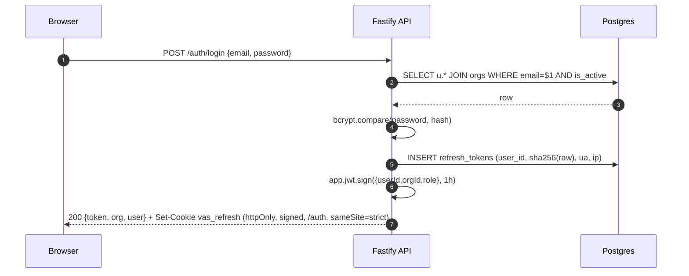
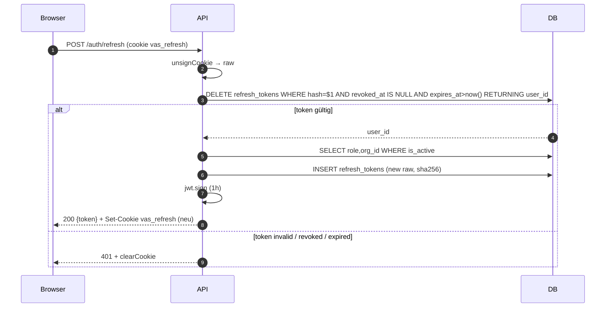
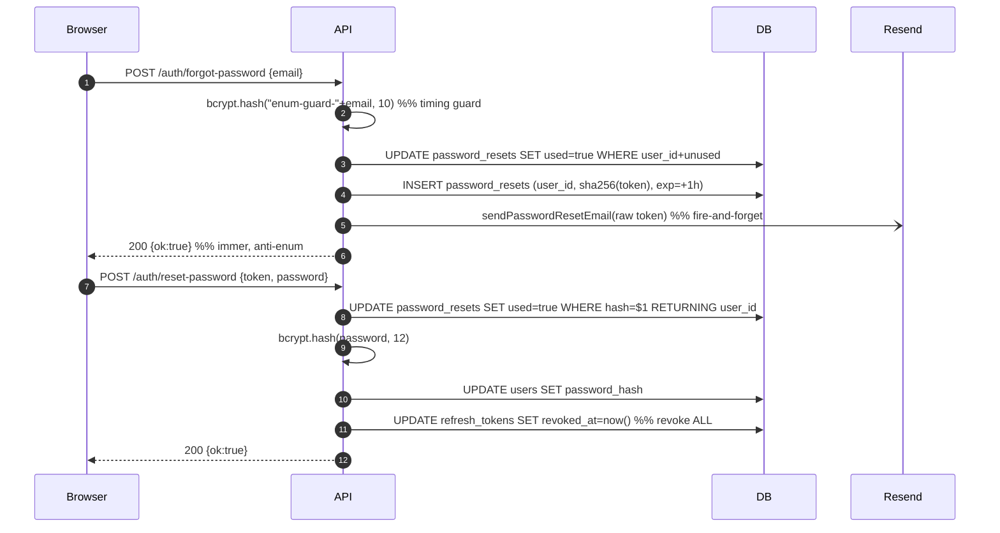

# Backend Auth & Security

## Zweck + CLAUDE.md-Posture-Referenz

Dieses Modul bündelt die Auth-Kette (Register/Login/Refresh/Logout/Account-Delete), JWT-Verifikation, Password-Hashing, symmetrische At-Rest-Encryption für OAuth-Tokens, PII-Redaction für Logs/Training-Export und Cloudflare-Turnstile-CAPTCHA für unauth. kostensensitive Endpoints.

CLAUDE.md §15 (Zitat):
> Auth: 1h access JWT (in-memory) + 30d refresh (httpOnly cookie, DB-rotated). Password-reset revokes all refresh tokens.
> Encryption at rest: AES-256-GCM (`crypto.ts`) für OAuth-Tokens + Cal.com-Keys. Prod: boot-throw wenn `ENCRYPTION_KEY` fehlt.
> DSGVO: PII-redaction (Pino-paths + `pii.redactPII()`), Sentry `beforeSend` strips bodies/user/cookies. Account-deletion cascades via FK.
> CAPTCHA: Cloudflare Turnstile auf `/demo/*` + `/outbound/website-callback`. Prod fail-closed.

## Auth-Endpoints (auth.ts)

| Methode | Pfad | Auth | Rate-Limit | Body (Zod) | Reply | Zeile |
|---|---|---|---|---|---|---|
| POST | `/auth/register` | — | 5 / 1min | `RegisterBody` (orgName, email, password 8-72) | `{token, org, user}` 201 | [auth.ts:87](../../../.openclaw/workspace/voice-agent-saas/apps/api/src/auth.ts) |
| POST | `/auth/login` | — | 10 / 1min | `LoginBody` (email, password ≤72) | `{token, org, user}` | auth.ts:169 |
| GET  | `/auth/me` | `app.authenticate` | — | — | `{id, email, role, org_*}` | auth.ts:216 |
| POST | `/auth/forgot-password` | — | 3 / 1min | `{email}` | `{ok:true}` (immer) | auth.ts:232 |
| POST | `/auth/reset-password` | — | 5 / 1min | `{token, password 8-72}` | `{ok:true}` | auth.ts:288 |
| POST | `/auth/verify-email` | — | — | `{token}` | `{ok:true}` | auth.ts:345 |
| POST | `/auth/resend-verification` | `app.authenticate` | 2 / 1min | — | `{ok:true}` | auth.ts:372 |
| POST | `/auth/refresh` | refresh-cookie only | 30 / 1min | — (cookie `vas_refresh`) | `{token}` | auth.ts:411 |
| POST | `/auth/logout` | refresh-cookie only | 30 / 1min | — | `{ok:true}` | auth.ts:464 |
| DELETE | `/auth/account` | `app.authenticate` + role=owner | 3 / 1min | — | `{ok:true}` | auth.ts:482 |

### Kurze Logik pro Route
- **register** (auth.ts:87): Zod-validate → Pre-check `users.email` (auth.ts:103) → `bcrypt.hash(password, 12)` (auth.ts:108) → Verify-Token + SHA-256 (auth.ts:109–113) → TX: `INSERT orgs` (auth.ts:120), `INSERT users ON CONFLICT DO NOTHING` (auth.ts:132) → send verify + welcome emails fire-and-forget (auth.ts:150–154) → `issueTokenPair()` (auth.ts:157) → 201.
- **login** (auth.ts:169): SELECT user JOIN orgs WHERE is_active (auth.ts:180) → `bcrypt.compare` (auth.ts:194) → `issueTokenPair()` (auth.ts:201) — `email_verified` NIE Blocker (auth.ts:199).
- **me** (auth.ts:216): JWT → SELECT user + org.
- **forgot-password** (auth.ts:232): Immer 200 (Anti-Enumeration via response-body + `bcrypt.hash` Timing-Guard auth.ts:251) → UPDATE alte Tokens `used=true` (auth.ts:269) → INSERT `password_resets` mit SHA-256 Token (auth.ts:265, 273) → Email fire-and-forget.
- **reset-password** (auth.ts:288): SHA-256 incoming token (auth.ts:303) → atomic `UPDATE password_resets SET used=true ... RETURNING user_id` (auth.ts:309) → `bcrypt.hash(..., 12)` (auth.ts:320) → UPDATE users (auth.ts:322) → **Revoke ALL refresh_tokens** (auth.ts:327–331).
- **verify-email** (auth.ts:345): SHA-256 incoming → `UPDATE users SET email_verified=true` (auth.ts:357).
- **resend-verification** (auth.ts:372): Noop wenn schon verifiziert (auth.ts:389) sonst neue SHA-256-Hash persistieren + Mail.
- **refresh** (auth.ts:411): `req.unsignCookie` (auth.ts:424) → `DELETE refresh_tokens ... RETURNING user_id` (Rotation, single-use, auth.ts:431) → SELECT user is_active → `issueTokenPair()` neu. Wrapped: jede Exception → 401 + clearCookie (auth.ts:455).
- **logout** (auth.ts:464): `UPDATE refresh_tokens SET revoked_at = now()` (auth.ts:471) + `clearCookie`.
- **account** (DELETE, auth.ts:482): Nur `role === 'owner'` (auth.ts:491). Stripe-subscription cancel (auth.ts:502–513), Retell-agents + LLMs + phone-numbers + Twilio release in `Promise.allSettled` (auth.ts:535–594). DB-TX: DELETE `crm_leads` (anon), `DELETE FROM orgs` cascade-FK (auth.ts:619), Hard-delete user (auth.ts:622).

## JWT & Refresh-Token

- **JwtPayload** Interface: `{ userId: string; orgId: string; role: 'owner'|'admin'|'member' }` — auth.ts:636.
- **Access-Token:**
  - Signing in `issueTokenPair` (auth.ts:57–60) mit `app.jwt.sign({userId, orgId, role}, { expiresIn: ACCESS_TOKEN_TTL })`.
  - `ACCESS_TOKEN_TTL = '1h'` (auth.ts:15).
  - In-memory only (CLAUDE.md §10 + §15). Begründung in auth.ts:8–14: "XSS → token leak → 7 days of attacker access with no revocation".
- **Refresh-Token:**
  - Cookie-Name `vas_refresh` (auth.ts:17).
  - Pfad `/auth` (auth.ts:18) — Browser sendet Cookie nur an `/auth/refresh` + `/auth/logout`.
  - TTL: 30 Tage (`REFRESH_TOKEN_TTL_MS = 30*24*60*60*1000`, auth.ts:16).
  - Cookie-Options: `httpOnly`, `secure` in prod, `sameSite: 'strict'`, `signed: true` (auth.ts:20–29).
  - `app.register(cookie, { secret: jwtSecret ... })` in index.ts:164 → Cookie-Signatur mit `JWT_SECRET`.
  - `issueRefreshToken` persistiert SHA-256 Hash + user_agent + ip in `refresh_tokens` (auth.ts:35–49).
  - **Rotation on every use:** `DELETE FROM refresh_tokens WHERE token_hash=$1 AND revoked_at IS NULL AND expires_at > now() RETURNING user_id` (auth.ts:431–436) — stolen cookie = single-use.
- **DB-Tabelle `refresh_tokens`:** Definition in db.ts:287 (`CREATE TABLE IF NOT EXISTS`), Indizes auf `user_id` (db.ts:298) + `expires_at` (db.ts:299), FK `refresh_tokens_user_id_fkey` (db.ts:313–317), orphan-cleanup db.ts:309.
- **authenticate-Decorator:** index.ts:167–173, Body: `await req.jwtVerify(); catch → 401`.

## Password-Hashing & Reset

- **bcrypt-Rounds: 12** — `bcrypt.hash(password, 12)` bei Register (auth.ts:108), Reset (auth.ts:320) und Timing-Enum-Guard mit 10 rounds (auth.ts:251).
- **Password-Policy:** `PASSWORD_MIN=8` / `PASSWORD_MAX=72` (auth.ts:71–72). Begründung auth.ts:66–70: bcrypt trunkiert >72 Bytes → gleiche Hashes → Login-Bypass mit beliebigem >72-Byte-Suffix. Cap schützt auch gegen `z.string()`-DoS.
- **Reset-Flow:**
  1. `/auth/forgot-password` (auth.ts:232) — immer 200, `bcrypt.hash` als konstant-Zeit-Guard (auth.ts:251), alte Unused-Tokens invalidieren (DEEP-05, auth.ts:269), SHA-256 Token persistieren (auth.ts:265, 273), Expiry 1h (auth.ts:266), Mail fire-and-forget (auth.ts:279).
  2. `/auth/reset-password` (auth.ts:288) — atomic claim `UPDATE ... SET used=true RETURNING user_id` (auth.ts:309), bcrypt-rehash, UPDATE users.
- **Password-reset revokes all refresh tokens:** auth.ts:325–331:
  ```
  UPDATE refresh_tokens SET revoked_at = now()
   WHERE user_id = $1 AND revoked_at IS NULL
  ```
- **H1-Hardening** (auth.ts:110–113, 262–265, 394–395): Nur SHA-256 der Verify/Reset-Tokens in DB — bei DB-Leak kein URL-Rekonstrukt möglich.

## Middleware / Decorators

- **`app.authenticate`**: Decorator in apps/api/src/index.ts:167 — `req.jwtVerify()`, 401 bei Fehler.
- **`requireRole`**: KEIN expliziter Decorator — Rolle wird inline geprüft, z. B. `if (role !== 'owner') return 403` (auth.ts:491). Andere Rolle-Guards (z. B. `requireCustomerOutbound` in outbound-agent.ts:379) leben pro Modul.
- **`app.authenticate` Nutzer (grep, 44 Treffer in 18 Dateien):**
  - auth.ts:216, 373, 483
  - agent-config.ts:445 (gesamter auth-block)
  - billing.ts:278
  - calendar.ts:1156, 1187, 1325, 1388, 1446, 1477, 1610
  - chat.ts:46
  - copilot.ts:387
  - insights.ts:1060, 1142, 1156, 1164, 1174
  - learning-api.ts:40, 68, 183
  - outbound-agent.ts:362, 379, 400, 418, 431, 463, 478, 490, 508, 651, 677, 711, 720
  - phone.ts:342
  - tickets.ts:167
  - traces.ts:141
  - training-export.ts:225, 308
  - voices.ts:26, 41, 65

## Crypto (crypto.ts)

- **Algo:** AES-256-GCM (`crypto.createCipheriv('aes-256-gcm', key, iv)`, crypto.ts:37 / `createDecipheriv`, crypto.ts:57).
- **Key:** `ENCRYPTION_KEY` env (crypto.ts:10), Validierung auf 64 hex chars = 32 Bytes (crypto.ts:15).
- **IV:** 12 Bytes random per message (`crypto.randomBytes(12)`, crypto.ts:36).
- **Auth-Tag:** GCM authTag in Wire-Format `enc:v1:<iv-hex>:<auth-tag-hex>:<ciphertext-hex>` (crypto.ts:4, 40).
- **Legacy Passthrough:** Decrypt gibt Plaintext unverändert zurück, wenn kein `enc:v1:`-Präfix (crypto.ts:46) — Rollout-kompatibel.
- **Fail-closed in prod:**
  - `ENCRYPTION_KEY` nicht gesetzt → `throw` in prod (crypto.ts:25–27).
  - Falsch formatierter Key → `throw` in prod (crypto.ts:16–18).
- **Signaturen:**
  - `encrypt(plaintext: string | null | undefined): string | null` — crypto.ts:33.
  - `decrypt(value: string | null | undefined): string | null` — crypto.ts:43.
  - `ENCRYPTION_ENABLED` boolean-Flag — crypto.ts:31.
- **Verwendet (grep):**
  - calendar.ts:6 (Import `encrypt as encryptToken, decrypt as decryptToken`).
  - calendar.ts:220 (Google access_token decrypt), calendar.ts:227 (refresh_token), calendar.ts:234 (api_key).
  - calendar.ts:319, 479, 1299 (INSERT Google/M365 tokens encrypted).
  - calendar.ts:1374 (INSERT Cal.com api_key encrypted).
  - calendar.ts:1591 (Microsoft tokens encrypted).
  - Tests: apps/api/src/__tests__/crypto.test.ts (roundtrip, legacy passthrough, corrupt ciphertext, unicode).

## PII-Redaction (pii.ts)

- **Signaturen:**
  - `redactPII(text: string | null | undefined): string` — pii.ts:43.
  - `redactMessages(messages: unknown): unknown` — pii.ts:56 (map über Array, redact `.content`).
- **Redaction-Tokens:** `[EMAIL]`, `[IBAN]`, `[PHONE]`, `[DOB]`, `[ADDRESS]`, `[CC]` (pii.ts:13, 19–40).
- **Regex-Reihenfolge matter** (pii.ts:15): Email → IBAN → Phone (intl + DE national) → DOB → DE-Adresse → CC (mit digit-Count Check pii.ts:37–40, um 13–19 Ziffern sauber als CC zu erkennen).
- **Nutzer (grep):**
  - template-learning.ts:14 (import), :161 (prompt_fix), :209 (transcript 4000-char-Cap), :252 (situation), :253 (response).
  - training-export.ts:115–117 (dynamic import + redactMessages + system_prompt).
- **Logger-redact-paths (Pino, index.ts:50–73):** zentrale Policy im Fastify-Logger — Secrets (`authorization`, `cookie`, `x-api-key`, `x-retell-signature`, `stripe-signature`, `password`), PII (`email`, `phone`, `customerName`, `customerPhone`, `caller`, `name`) sowohl bare als auch `*.x` (nested) und `req.body.*`. Censor: `[REDACTED]`. Querverweis: [[Backend-Infra]].

## Captcha / Turnstile (captcha.ts)

- **Verify-Endpoint:** `VERIFY_URL = 'https://challenges.cloudflare.com/turnstile/v0/siteverify'` (captcha.ts:18), Timeout 5s (captcha.ts:19, AbortSignal.timeout captcha.ts:77).
- **Signatur:** `verifyTurnstile(token: string | undefined, remoteIp?: string): Promise<boolean>` — captcha.ts:52.
- **Fail-closed-Matrix:**
  - prod + no SECRET → **false** (captcha.ts:54; boot-warn captcha.ts:24–29).
  - prod + SECRET → echte Verifikation.
  - dev + no SECRET → **true** (captcha.ts:55, lokale DX).
  - dev + SECRET → echte Verifikation.
- **Empty-Token-Regel** (captcha.ts:57–67): Bei leerem Token immer `true` (Defense-in-depth, nicht Hard-Gate). Begründung: Ad-Blocker/Autostart/SPA-Redirect. Prod loggt Skip mit IP (captcha.ts:65).
- **Nutzer (grep):**
  - demo.ts:12 (import), demo.ts:234 (`/demo/call`), demo.ts:259 (`/demo/callback`).
  - outbound-agent.ts:20 (import), outbound-agent.ts:539 (`/outbound/website-callback`).
- **Tests:** apps/api/src/__tests__/captcha.test.ts — prüft prod-no-secret (false), dev-no-secret (true), empty-token defense-in-depth, network-fail.

## Sicherheits-/DSGVO-Posture (Checkliste)

- [x] JWT in-memory only — auth.ts:8–14 (Begründung), Frontend CLAUDE.md §10 (`_accessToken` module-scope).
- [x] refresh-cookie httpOnly / signed / sameSite=strict / path=/auth — auth.ts:20–29, 17–18.
- [x] refresh-token Rotation (single-use) — auth.ts:431–436.
- [x] refresh-token-hash in DB (nicht plaintext) — auth.ts:31–33, 41.
- [x] bcrypt password hashing, rounds=12 — auth.ts:108, 320.
- [x] password-length-cap 8–72 gegen bcrypt-silent-truncation — auth.ts:66–72.
- [x] password-reset revokes ALL refresh_tokens — auth.ts:325–331.
- [x] Anti-enumeration auf `/auth/forgot-password` (response + timing) — auth.ts:241–252.
- [x] SHA-256 statt plaintext für verify-/reset-Tokens — auth.ts:110–113, 262–265, 394–395.
- [x] AES-GCM at-rest encryption für OAuth- & Cal.com-Tokens — crypto.ts:33–64; calendar.ts:319/479/1299/1374/1591.
- [x] Encryption fail-closed in prod — crypto.ts:16–18, 25–27.
- [x] Rate-limits per-route — auth.ts:88, 170, 233, 289, 374, 412, 465, 484.
- [x] Turnstile auf öffentlichen Cost-Amplification-Routes — demo.ts:234, 259; outbound-agent.ts:539.
- [x] Turnstile fail-closed in prod — captcha.ts:24–29, 54.
- [x] PII redaction in Logs (Pino paths) — index.ts:50–73.
- [x] PII redaction in Training-Export + Template-Learning — training-export.ts:115–117; template-learning.ts:161/209/252/253.
- [x] GDPR Right-to-Erasure via `DELETE /auth/account` + FK-Cascade — auth.ts:482–633.
- [x] Stripe-/Retell-/Twilio-Cleanup in `Promise.allSettled` bei Account-Delete — auth.ts:535–594.
- [x] Cookie mit `JWT_SECRET` signiert (Defense-in-depth) — index.ts:162–164.
- [x] `authenticate`-Decorator zentral; 401 auf Verify-Fail — index.ts:167–173.

## Eingehende / Ausgehende Referenzen (grep)

**auth.ts exportiert:**
- `registerAuth(app)` → genutzt in index.ts:186.
- `JwtPayload` Type → importiert in agent-config.ts:3, billing.ts:5, calendar.ts:5, chat.ts:7, copilot.ts:5, outbound-agent.ts:18, phone.ts:10, tickets.ts:5, sowie inline-typed in learning-api.ts, traces.ts, training-export.ts, insights.ts, voices.ts, auth.ts (self).

**crypto.ts exportiert:**
- `encrypt`, `decrypt`, `ENCRYPTION_ENABLED` → nur `calendar.ts:6` (in src). `db.ts:178` kommentiert `decrypt()`. Tests in `__tests__/crypto.test.ts`.

**pii.ts exportiert:**
- `redactPII`, `redactMessages` → `template-learning.ts:14`, `training-export.ts:115`. Tests in `__tests__/pii.test.ts`.

**captcha.ts exportiert:**
- `verifyTurnstile` → `demo.ts:12`, `outbound-agent.ts:20`. Tests in `__tests__/captcha.test.ts`.

**auth.ts importiert:**
- `node:crypto`, `fastify`, `bcrypt`, `./db.js` (`pool`), `zod`, `./email.js` (`sendPasswordResetEmail`, `sendVerificationEmail`, `sendWelcomeEmail`).

## Verbundene Notes

- [[Backend-Infra]] — Pino-Logger/Sentry-Setup, Cookie-Plugin, Helmet-CSP.
- [[Backend-Database]] — `refresh_tokens`, `password_resets`, `users`, `orgs` Tabellen + FK-Cascade.
- [[Backend-Calendar]] — Hauptnutzer der `encrypt/decrypt`-Functions (Google/M365/Cal.com).
- [[Backend-Voice-Telephony]] — Outbound + Demo Routes, die `verifyTurnstile` nutzen.
- [[Backend-Training-Export]] — `redactPII`/`redactMessages` Nutzer.
- [[Frontend-Shell]] — `_accessToken` in-memory, Bootstrap über `POST /auth/refresh`.
- [[Backend-Billing]] — Stripe-Cancel im Account-Delete-Flow.

## Mermaid

### Login-Sequence



### Refresh + Rotation



### Password-Reset



### Encrypt/Decrypt (Calendar OAuth)

```mermaid
sequenceDiagram
  participant API as calendar.ts
  participant Crypto as crypto.ts
  participant DB
  API->>Crypto: encrypt(access_token)
  Crypto->>Crypto: iv=randomBytes(12); aes-256-gcm(key,iv)
  Crypto-->>API: "enc:v1:<iv>:<tag>:<ct>"
  API->>DB: INSERT calendar_connections (access_token enc, refresh_token enc, ...)
  Note right of DB: Later retrieval
  DB-->>API: row.access_token
  API->>Crypto: decrypt(row.access_token)
  alt starts with enc:v1:
    Crypto->>Crypto: aes-256-gcm decrypt + verify authTag
    Crypto-->>API: plaintext
  else legacy plaintext row
    Crypto-->>API: pass-through
  end
```

---

## Verwandt

- [[Phonbot/Phonbot-Gesamtsystem|🧭 Gesamtsystem]] · [[Phonbot/Overview|Phonbot Overview]]
- **Konsumiert von:** [[Backend-Agents]], [[Backend-Comm-Scheduling]] (crypto.ts für OAuth/Cal-Tokens), [[Backend-Insights-Admin]] (requireAdmin), **alle** Backend-Routen via `app.authenticate`
- **Frontend:** [[Frontend-Shell]] (auth.tsx, silent-refresh coalescing), [[Frontend-Pages]] (LoginPage, OnboardingWizard)
- **Datenbank:** [[Backend-Database]] (`users`, `refresh_tokens`, `password_resets`)
- **Findings:** [[Audit-2026-04-18-Deep]] C1 (Secrets-Exposure), [[Audit-2026-04-18-Bugs]] H3 (Refresh-Rotation Double-Consume), [[Audit-2026-04-18-Bugs]] H4 (OAuth-State Fail-Open bei Redis-Down)
