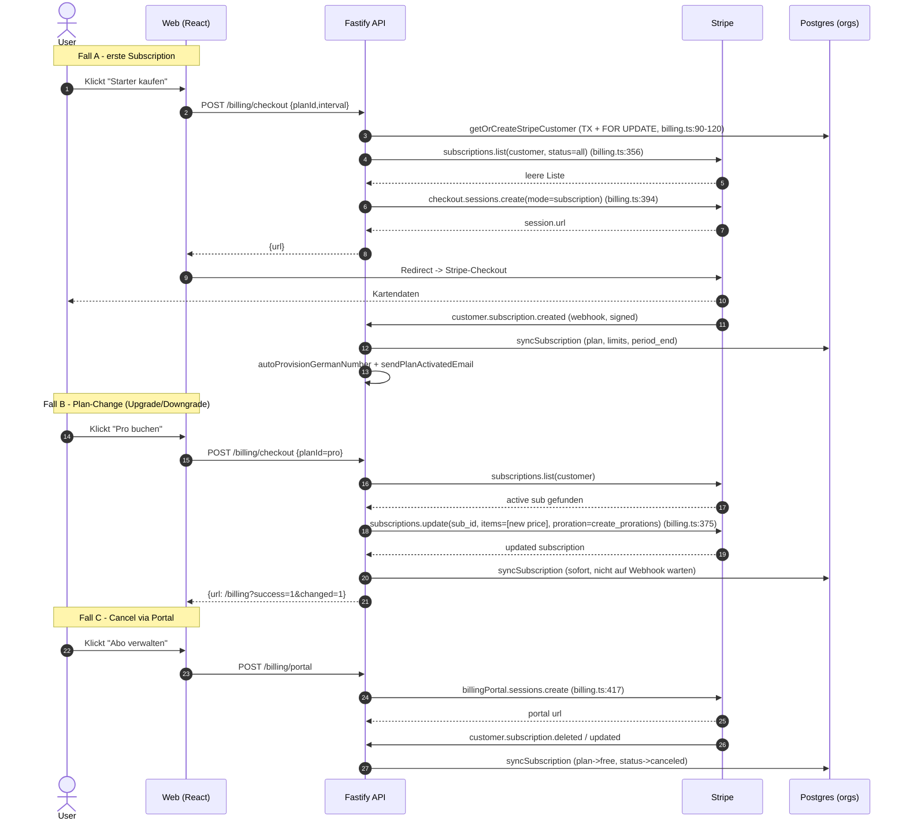
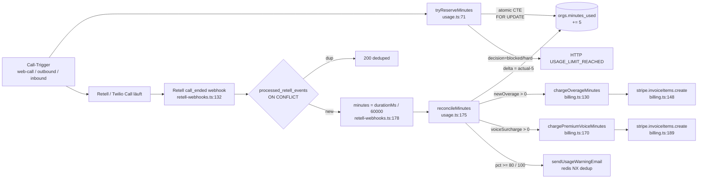
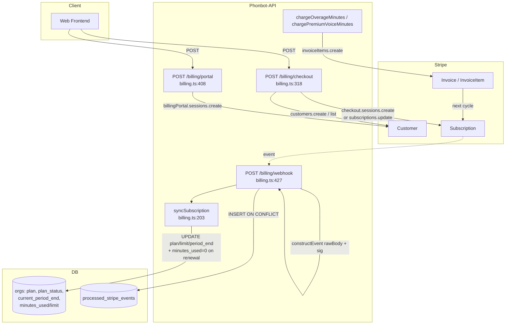

# Backend-Billing-Usage

## Zweck
Modul kapselt das komplette Monetarisierungs- und Abrechnungssystem von Phonbot:

- **Plan-Katalog** (Free / Nummer / Starter / Pro / Agency) mit Minuten-Quoten und Overage-Raten — [[#PLANS]].
- **Stripe-Integration**: Customer anlegen (TOCTOU-safe), Checkout/Portal, Plan-Change mit Proration, Webhooks (signiert + idempotent).
- **Minuten-Tracking**: atomare Reservation vor Call-Start (`tryReserveMinutes`), Reconcile am Call-Ende (`reconcileMinutes`), Overage- und Premium-Voice-Billing via Stripe Invoice Items.
- **Periodic Reset** beim Stripe-Renewal (`current_period_end`-Vergleich auf Unix-Sekunden-Basis).
- **Warn-Mails** bei 80% / 100% Nutzung (Redis-gedupt).

Gegenstück zur Call-Ausführung: `retell-webhooks.ts` (inbound + outbound Reconcile), `outbound-agent.ts` (outbound-Reserve), `agent-config.ts` (web-call-Reserve). Siehe [[Backend-Retell-Webhooks]], [[Backend-Outbound]], [[Backend-Agent-Config]].

## Endpoints (Tabelle)

| Method | Path                  | Auth         | Datei / Zeile                  | Zweck |
|--------|-----------------------|--------------|--------------------------------|-------|
| GET    | `/billing/plans`      | public       | `billing.ts:281`               | Plan-Liste mit Preis, Minuten, Agenten, `hasYearly`. |
| GET    | `/billing/status`     | JWT          | `billing.ts:291`               | Aktueller Plan, Status, Perioden-Ende, `minutesUsed/Limit/Remaining`. |
| POST   | `/billing/checkout`   | JWT          | `billing.ts:318`               | Checkout Session bzw. In-place `subscriptions.update` mit Proration. |
| POST   | `/billing/portal`     | JWT          | `billing.ts:408`               | Stripe Billing Portal Session (manage/cancel). |
| POST   | `/billing/webhook`    | Stripe-Sig   | `billing.ts:427`               | Stripe-Event-Endpunkt (signaturverifiziert + idempotent). |

Der globale Rate-Limiter nimmt `/billing/webhook` explizit von der 100/min-IP-Drossel aus: `apps/api/src/index.ts:126`.

## Stripe-Webhook (Signatur + Idempotenz)

### Signatur-Nachweis
- Raw-Body-Capture passiert in einem globalen `addContentTypeParser('application/json', { parseAs: 'buffer' }, …)` in `apps/api/src/index.ts:134-149`. Dabei wird das Buffer-Objekt an `req.rawBody` angehängt (`index.ts:138`), bevor das JSON geparst wird. Der Kommentar im Code stellt explizit klar: _"Must be registered before any body parser"_ (`index.ts:133`).
- Im Handler wird der Header `stripe-signature` gelesen (`billing.ts:430`) und mit `stripe.webhooks.constructEvent(rawBody, sig, STRIPE_WEBHOOK_SECRET)` gegen das Webhook-Secret verifiziert (`billing.ts:436`).
- Fehlschlag → `400 Invalid signature` (`billing.ts:438`). Es wird bewusst keine Details geloggt (kein Timing-Oracle).

### Idempotenz (`processed_stripe_events`)
- DDL in `apps/api/src/db.ts:327-333`:
  ```sql
  CREATE TABLE IF NOT EXISTS processed_stripe_events (
    event_id    TEXT PRIMARY KEY,
    event_type  TEXT NOT NULL,
    received_at TIMESTAMPTZ NOT NULL DEFAULT now()
  );
  ```
- Claim-Insert in `billing.ts:449-455`:
  ```sql
  INSERT INTO processed_stripe_events (event_id, event_type)
  VALUES ($1, $2)
  ON CONFLICT (event_id) DO NOTHING
  RETURNING event_id
  ```
  Kein `RETURNING`-Row → Duplikat → `200 { ok:true, deduped:true }` (`billing.ts:456-459`). Der 200er ist bewusst: Stripe soll **nicht** weiter retrien.
- Fallback: Wenn die Dedup-Query selbst fehlschlägt (z. B. Tabelle fehlt beim ersten Migrate), wird weiterverarbeitet → at-least-once statt failing webhooks (`billing.ts:460-464`).
- Hintergrund-Prune löscht Rows älter als 90 Tage (`db.ts:647`).

### Event-Handler
| Event | Handler | Datei / Zeile |
|-------|---------|---------------|
| `customer.subscription.created` | `syncSubscription` + optional `autoProvisionGermanNumber` + `sendPlanActivatedEmail` | `billing.ts:468-487` |
| `customer.subscription.updated` / `deleted` | `syncSubscription` | `billing.ts:488-492` |
| `customer.subscription.paused` / `resumed` | Nur `plan_status` auf `paused` / `active` | `billing.ts:493-505` |
| `invoice.payment_failed` | `plan_status='past_due'` + `sendPaymentFailedEmail` | `billing.ts:506-527` |

## Subscription-Lifecycle: checkout → active → cancel



- **TOCTOU-Guard** bei `getOrCreateStripeCustomer` via `SELECT … FOR UPDATE` + Transaction (`billing.ts:90-120`). Verhindert, dass parallele Checkouts zwei Stripe-Customers für eine Org anlegen und die zweite `UPDATE` den ersten verwaist → _"still billable, never referenced"_ (Kommentar `billing.ts:89`).
- **In-place Plan-Change** (`billing.ts:356-391`): `subscriptions.update` mit `proration_behavior: 'create_prorations'` — ohne das würde jedes Upgrade eine zweite Checkout-Session → doppelte parallel aktive Subscription → Doppelbelastung (Code-Kommentar `billing.ts:350-355`).
- **Sofort-Sync nach `update`** (`billing.ts:385`): `syncSubscription(updated)` läuft synchron, damit `/billing/status` nach Redirect nicht 500 ms – 2 s lang den alten Plan zeigt; der Webhook bleibt als Consistency-Backstop.
- **Metadata-Kreuzcheck** in `syncSubscription` (`billing.ts:210-226`): `metadata.orgId` aus Sub wird gegen `stripe_customer_id→orgId`-Mapping der DB verglichen. Bei Mismatch → DB gewinnt + Warn-Log.
- **Period-Reset** (`billing.ts:239-252`): Vergleich via `EXTRACT(EPOCH FROM current_period_end)::bigint` — **nicht** `Date.getTime()` um DST-Drift zu vermeiden. Nur beim _Übergang_ zwischen zwei bekannten Perioden wird `minutes_used=0` gesetzt (`billing.ts:249-251`); erster Subscription-Lauf setzt bloß die Periode.

### Stripe-SDK-Calls (vollständig)
| Call | Datei / Zeile | Zweck |
|------|---------------|-------|
| `stripe.customers.create` | `billing.ts:103` | Customer pro Org (einmalig, unter Row-Lock). |
| `stripe.invoiceItems.create` (overage) | `billing.ts:148` | Abrechnung überschrittener Plan-Minuten. |
| `stripe.invoiceItems.create` (premium voice) | `billing.ts:189` | Surcharge pro Minute für teure Voices (z. B. Chipy ElevenLabs). |
| `stripe.subscriptions.list` | `billing.ts:356` | Existierende Sub vor Checkout/Upgrade suchen. |
| `stripe.subscriptions.update` | `billing.ts:375` | In-place Plan-Change mit Proration. |
| `stripe.checkout.sessions.create` | `billing.ts:394` | Erst-Subscription (Kartencapture). |
| `stripe.billingPortal.sessions.create` | `billing.ts:417` | Self-Service Portal (cancel/payment-method/invoices). |
| `stripe.webhooks.constructEvent` | `billing.ts:436` | Signatur-Verifikation. |

## usage.ts — Minuten-Mathematik

- **Spaltentyp**: `orgs.minutes_used NUMERIC(10,2)` (`db.ts:257`), `orgs.minutes_limit INT` (`db.ts:244`). Migration von `INT` → `NUMERIC(10,2)` idempotent via `DO $$ … IF data_type='integer' THEN ALTER …` (`db.ts:251-261`). Grund: sekundengenaue Abrechnung (AGB §5) statt `Math.ceil` → ~10 % Überabrechnung bei kurzen Calls.
- **JS-seitiger Type-Parser**: `pg.types.setTypeParser(1700, …)` in `db.ts:13` mappt Postgres OID 1700 (NUMERIC/DECIMAL) auf `parseFloat(val)` — statt node-pg-Default (String). Damit funktionieren `minutesLimit - minutesUsed` und `Math.max` ohne String-Math-Bugs an jeder Read-Seite.
- **Call-Längen-Konvertierung** (siehe [[Backend-Retell-Webhooks]], `retell-webhooks.ts:178`): `minutes = Math.round((durationMs / 60_000) * 100) / 100` → 2 Nachkommastellen. Beispiel: 61 s = 1.02 min.
- **Default-Reserve**: `DEFAULT_CALL_RESERVE_MINUTES = 5` (`usage.ts:20`). Pre-Call-Puffer, am Call-Ende per Delta reconciled.
- **Overage-Raten** (`billing.ts:20-71` → `PLANS.*.overchargePerMinute`): Nummer 0.22 €, Starter 0.22 €, Pro 0.20 €, Agency 0.15 €, Free 0.
- **Premium-Voice-Surcharge** (`usage.ts:187-206` + `voice-catalog.ts`): applied auf **alle** Minuten des Calls (nicht nur Overage), weil höhere TTS-Kosten pro Minute anfallen. Fire-and-forget via `stripe.invoiceItems.create`.

### reconcileMinutes — Delta-Logik

- Datei: `usage.ts:175-278`.
- `delta = actualMinutes - reservedMinutes` (`usage.ts:208`). `delta === 0` → early return.
- Atomic CTE mit `FOR UPDATE` + `RETURNING` in einer Anweisung (`usage.ts:216-225`): liest alten und neuen Wert + Plan + Name in einem Roundtrip → keine Race zwischen SELECT und UPDATE.
- Unterlauf-Schutz: `GREATEST(0, minutes_used + delta)` (`usage.ts:221`) → fast-hangup kann nicht in negative Zahlen drücken.
- **Overage-Abrechnung** (`usage.ts:234-240`): nur das **neu** hinzugekommene Overage (`overageAfter - overageBefore`) wird via `chargeOverageMinutes` → `stripe.invoiceItems.create` verbucht. Kein Doppel-Billing.
- **80 % / 100 %-Warnmails** (`usage.ts:244-277`): Redis-NX-Key `usage_warn:{orgId}:{threshold}` mit EX 30 Tagen. Fail-closed wenn Redis down (`usage.ts:253-254`). Only-once per Billing-Cycle pro Threshold; Top-Threshold gewinnt (`break` in 274).

## tryReserveMinutes + Race-Safety

- Datei: `usage.ts:71-166`.
- **Problem (E7)**: Alter Flow _"check then increment at end"_ erlaubte 10 parallelen Callern, jeweils `allowed: true` zu lesen, bevor einer der `UPDATE`s landete → unbounded Overage.
- **Lösung**: 1 SQL-Statement mit drei CTEs:
  1. `locked` — `SELECT … FOR UPDATE` auf die Org-Row (`usage.ts:120-123`).
  2. `decision` — `CASE` über `plan_status`, `minutes_used + $2 <= minutes_limit`, `plan = ANY($3::text[])`: liefert `blocked | within_limit | overage_allowed | hard_blocked` (`usage.ts:124-137`).
  3. `applied` — `UPDATE … WHERE decision.decision IN ('within_limit','overage_allowed') RETURNING new_used` (`usage.ts:138-145`).
- Finales `SELECT` joined `decision` mit `applied` → JS bekommt Entscheidung + Post-State (`usage.ts:146-153`).
- **Paid-Plan-Sentinel** (`usage.ts:91-97`): wenn alle Plans `overchargePerMinute=0`, wird `__NO_PAID_PLAN_CONFIGURED__` eingefügt, damit `ANY($3::text[])` nicht immer false wird (Schutz vor stummer Billing-Blockade bei Config-Fehler).
- **Blocked Statuses** (`usage.ts:33-40` + CASE in SQL): `incomplete | incomplete_expired | past_due | unpaid | paused | canceled`. Erlaubt: `active`, `trialing`, `free`.
- **Return**: `{ allowed, minutesUsed, minutesLimit }` (`usage.ts:160-165`).
- Parallel-Caller serialisieren auf der Row-Lock; Over-Shoot ausgeschlossen.

### Aufruf-Pfade
| Caller | Datei / Zeile | Kontext |
|--------|---------------|---------|
| `apps/api/src/agent-config.ts:633` | Web-Call-Test-Button (`POST /agent-config/web-call`). |
| `apps/api/src/outbound-agent.ts:273` | Outbound Call-Trigger (vor Twilio-Dial). |

### Minuten-Schreiber (wer füllt `orgs.minutes_used`?)
- **Reserve-Writer** (addiert `DEFAULT_CALL_RESERVE_MINUTES=5`):
  - `agent-config.ts:633` (Web-Call)
  - `outbound-agent.ts:273` (Outbound via Twilio/Retell)
- **Reconcile-Writer** (korrigiert um `actual - reserved`):
  - `retell-webhooks.ts:186` → einziger Aufruf von `reconcileMinutes` — läuft im `call_ended`-Branch, gated durch `processed_retell_events` ON CONFLICT (`retell-webhooks.ts:160-171`).
- **`incrementMinutesUsed`** (`usage.ts:54-60`): legacy/raw, hat aktuell keinen Production-Caller (Grep innerhalb `apps/api/src` findet nur die Definition selbst). In Kommentar als _"legacy paths that don't go through reservation"_ markiert (`usage.ts:51-53`).
- **Reset-Writer**: `syncSubscription` (`billing.ts:261`) setzt `minutes_used = 0` nur bei Perioden-Wechsel; außerdem implizit bei Plan-Wechsel über `minutes_limit = $7`.
- **`twilio-openai-bridge.ts`**: schreibt **keine** Minuten direkt — ist reine Audio-Bridge. Relevantes Minuten-Accounting passiert im vorgeschalteten `outbound-agent.ts` (Reserve) und via Retell-Webhook (Reconcile). Siehe [[Backend-Twilio-Bridge]].

## DB-Tabellen (Querverweis → [[Backend-Database]])

| Tabelle / Spalte | Rolle im Modul | Migration-Zeile |
|------------------|----------------|-----------------|
| `orgs.stripe_customer_id` (TEXT, partial-unique) | 1:1 Org ↔ Stripe-Customer | `db.ts:228` + `db.ts:234` |
| `orgs.stripe_subscription_id` (TEXT UNIQUE) | 1:1 Org ↔ aktuelle Subscription | `db.ts:238` |
| `orgs.plan` (TEXT) | free / nummer / starter / pro / agency | — (basis-spalte) |
| `orgs.plan_status` (TEXT default `free`) | Stripe-Status-Mirror | `db.ts:239` |
| `orgs.plan_interval` (TEXT) | month / year | `db.ts:241` |
| `orgs.current_period_end` (TIMESTAMPTZ) | Renewal-Trigger für Period-Reset | `db.ts:242` |
| `orgs.minutes_used` (NUMERIC(10,2)) | Kern-Counter | `db.ts:243` + Migration `db.ts:251-261` |
| `orgs.minutes_limit` (INT default 100) | Plan-Quota | `db.ts:244` |
| `processed_stripe_events (event_id PK)` | Stripe-Webhook-Idempotenz | `db.ts:327-333` |
| `processed_retell_events (call_id PK)` | Retell-`call_ended`-Idempotenz (schützt reconcileMinutes) | `db.ts:340-346` |
| `users.email` + `users.role='owner'` | Empfänger für Plan-Activated / Payment-Failed / Usage-Warn Mails | — |

## Eingehende Referenzen (wer importiert dieses Modul?)

| Importeur | Symbol | Datei / Zeile |
|-----------|--------|---------------|
| `apps/api/src/index.ts:20` | `registerBilling` | Boot-Wiring. |
| `apps/api/src/index.ts:192` | `await registerBilling(app)` | Route-Registrierung. |
| `apps/api/src/usage.ts:7` | `PLANS, PlanId, chargeOverageMinutes, chargePremiumVoiceMinutes` | Reconcile + Quoten. |
| `apps/api/src/agent-config.ts:6` | `tryReserveMinutes, DEFAULT_CALL_RESERVE_MINUTES` | Web-Call. |
| `apps/api/src/outbound-agent.ts:272` | dito (dynamic import) | Outbound. |
| `apps/api/src/retell-webhooks.ts:16` | `reconcileMinutes, DEFAULT_CALL_RESERVE_MINUTES` | call_ended. |
| `apps/api/src/auth.ts:497` | `stripe_subscription_id` (SQL read) | Account-Delete-Flow. |
| `apps/api/src/admin.ts:286` | `minutes_used/limit` (SQL read) | Admin-Dashboard. |
| `apps/api/src/copilot.ts:158-169` | `minutes_used/limit` | In-App Assistant. |

## Ausgehende Referenzen (externe Abhängigkeiten)

- `stripe` (SDK) — `billing.ts:1,14` — Customer / Checkout / Portal / Subscriptions / InvoiceItems / Webhook-Signatur.
- `./db.js` (`pool`) — transaktionale Queries + Atomic CTE.
- `./auth.js` (`JwtPayload`) — `orgId/userId` aus JWT auf Billing-Routen.
- `./phone.js` (`autoProvisionGermanNumber`) — Nummer-Provisioning bei Subscription.created.
- `./email.js` (`sendPlanActivatedEmail`, `sendPaymentFailedEmail`, `sendUsageWarningEmail`) — Transaktionsmails.
- `./voice-catalog.js` (`getVoiceSurcharge`) — Premium-Voice-Rate-Lookup in `reconcileMinutes`.
- `./redis.js` — Dedup-Key für 80/100 %-Warnmails.
- `zod` — Body-Validation `/billing/checkout`.

## Verbundene Notes
- [[Backend-Database]] — Tabellen `orgs`, `processed_stripe_events`, `processed_retell_events`.
- [[Backend-Retell-Webhooks]] — `call_ended` → `reconcileMinutes`.
- [[Backend-Outbound]] — `outbound-agent.ts` reserviert vor Twilio-Dial.
- [[Backend-Twilio-Bridge]] — schreibt KEINE Minuten; nur Audio-Bridge.
- [[Backend-Agent-Config]] — `/agent-config/web-call` reserviert Minuten.
- [[Backend-Auth]] — Refresh-Token-Cascade beim Account-Delete greift auch `stripe_subscription_id`.
- [[Backend-Email]] — Plan-Activated / Payment-Failed / Usage-Warn.
- [[Voice-Catalog]] — Premium-Voice-Surcharge-Quelle.

## Mermaid — Minuten-Pfad (Reserve → Reconcile)



## Mermaid — Stripe-Flow (Webhook + Lifecycle)



## Bekannte Audit-Fixes in diesem Modul (Querverweis)
- **E7 Race** — behoben durch Single-Statement-CTE in `tryReserveMinutes` (`usage.ts:99-153`).
- **Stripe-Retry-Doppelbilling** — behoben via `processed_stripe_events` ON CONFLICT (`billing.ts:447-465`).
- **TOCTOU bei Customer-Create** — behoben via Row-Lock in `getOrCreateStripeCustomer` (`billing.ts:90-120`).
- **DST-Drift beim Period-Reset** — behoben via `EXTRACT(EPOCH)::bigint`-Vergleich (`billing.ts:239-252`).
- **Doppel-Abo bei Plan-Wechsel** — behoben via `subscriptions.update` statt neuer Checkout (`billing.ts:356-391`).
- **`INT` → `NUMERIC(10,2)` für Sekundengenauigkeit** — `db.ts:251-261` + Type-Parser `db.ts:13`.

---

## Verwandt

- [[Phonbot/Phonbot-Gesamtsystem|🧭 Gesamtsystem]] · [[Phonbot/Overview|Phonbot Overview]]
- **Koppelt an:** [[Backend-Voice-Telephony]] (`retell-webhooks.ts:186` reconcileMinutes), [[Backend-Outbound]] (Outbound-Minuten), [[Backend-Database]] (`orgs`, `processed_stripe_events`)
- **Frontend:** [[Frontend-Pages]] (BillingPage, PhoneManager Checkout-Redirect)
- **Findings:** [[Audit-2026-04-18-Bugs]] C1-C3 (Math.ceil, Stripe-Race, tryReserveMinutes atomar), [[Audit-2026-04-18-Postfix]] O1+O2 (Event-Cleanup, Stripe-Sync-UX-Race), [[Audit-2026-04-18-Final]] H4 (Webhook-Handler nicht transaktional)
