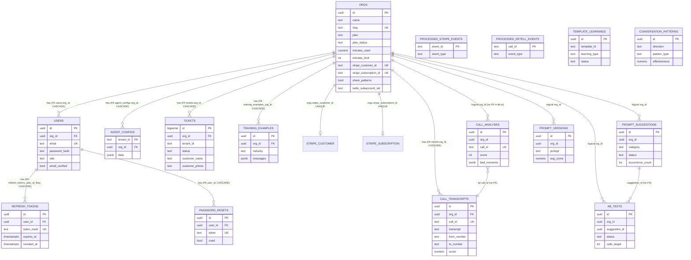

# Backend Database — PostgreSQL Schema (Single Source of Truth: db.ts)

## Übersicht
- Datenbank: **Supabase Postgres** (CLAUDE.md §8 — "PostgreSQL via Supabase")
- Pool via `pg` (`pg.Pool`) — Connection-String aus `process.env.DATABASE_URL` (db.ts:L15)
- **Numeric-Typ-Parser:** `NUMERIC/DECIMAL` (OID 1700) wird als JS-`number` geparst (nicht String) — db.ts:L13. Trade-off: Float-Präzision akzeptabel weil nur für Minuten (2 Nachkommastellen, kleine Werte) genutzt.
- **Migration:** `migrate()` läuft beim Boot von `apps/api/src/index.ts` (db.ts:L144). Idempotent via `CREATE TABLE IF NOT EXISTS` + `ALTER TABLE ADD COLUMN IF NOT EXISTS` + `DO $$ ... pg_constraint`-Pattern.
- **Pool-Proxy** mit Lazy-Init (db.ts:L97–L137) — resolveHost läuft asynchron, Queries warten auf `_poolReady`.
- **Advisory Lock** serialisiert parallele `migrate()`-Aufrufe aus Rolling-Deploys (db.ts:L142, L162) — Key `92541803715`.
- **DSGVO-Boot-Guard:** wenn `NODE_ENV=production` UND `ENCRYPTION_KEY` fehlt UND encrypted calendar-rows existieren → Boot wird abgebrochen (db.ts:L182–L196).

---

## Tabellen (Schema)

> Alle Tabellen werden in `runMigrationBody()` (db.ts:L173–L621) erzeugt. Jede Spalte ist mit db.ts:Lxxx belegt.

### `orgs` (db.ts:L200–L281)
**Zweck:** Top-Level-Tenant. Organisation, Billing-Träger, Twilio-Subaccount-Owner, Pattern-Sharing-Consent.

**Spalten (Basis — db.ts:L201–L208):**
| Spalte | Typ | Default | Nullable | Constraint |
|---|---|---|---|---|
| id | uuid | gen_random_uuid() | NOT NULL | PRIMARY KEY (L202) |
| created_at | timestamptz | now() | NOT NULL | (L203) |
| name | text | — | NOT NULL | (L204) |
| slug | text | — | YES | UNIQUE (L205) |
| plan | text | 'free' | NOT NULL | (L206) |
| is_active | boolean | true | NOT NULL | (L207) |

**Spalten (ALTER, Stripe-Billing — db.ts:L228–L244):**
| Spalte | Typ | Default | Nullable | Quelle |
|---|---|---|---|---|
| stripe_customer_id | text | — | YES | UNIQUE (L228) + partial-unique-index (L233–L237) |
| stripe_subscription_id | text | — | YES | UNIQUE (L238) |
| plan_status | text | 'free' | NOT NULL | (L239); Werte: free \| trialing \| active \| past_due \| canceled |
| plan_interval | text | — | YES | month \| year (L241) |
| current_period_end | timestamptz | — | YES | (L242) |
| minutes_used | NUMERIC(10,2) | 0 | NOT NULL | ursprünglich INT (L243) → DO-Block migriert auf NUMERIC (L251–L261) |
| minutes_limit | int | 100 | NOT NULL | (L244) |

**Spalten (ALTER, Twilio / Regulatorik — db.ts:L264–L273):**
| Spalte | Typ | Default | Nullable |
|---|---|---|---|
| twilio_subaccount_sid | text | — | YES (L264) |
| twilio_address_sid | text | — | YES (L265) |
| twilio_bundle_sid | text | — | YES (L266) |
| twilio_bundle_status | text | 'none' | YES (L267); Werte: none \| draft \| pending-review \| in-review \| twilio-approved \| twilio-rejected |
| business_street | text | — | YES (L269) |
| business_city | text | — | YES (L270) |
| business_postal_code | text | — | YES (L271) |
| business_document_url | text | — | YES (L272) |
| business_website | text | — | YES (L273) |

**Spalten (ALTER, Pattern-Sharing — db.ts:L280–L281):**
| Spalte | Typ | Default | Nullable |
|---|---|---|---|
| share_patterns | boolean | false | NOT NULL (L280) — GDPR Art. 6 opt-in |
| share_patterns_consented_at | timestamptz | — | YES (L281) |

**Spalten (extern referenziert, NICHT in db.ts definiert):** `outbound_prompt`, `outbound_prompt_v`, `outbound_llm_id` — werden in `apps/api/src/outbound-agent.ts` / `outbound-insights.ts` gelesen/geschrieben, müssen via separater Migration existieren.

**Indizes:** keine expliziten Basis-Indizes ausser dem implizit über PK/UNIQUE; Partial-unique-Index `orgs_stripe_customer_id_notnull_uniq` (L233–L237).

**Foreign Keys:** — (Root-Tabelle)

**Genutzt von (grep-Nachweise):**
- `apps/api/src/auth.ts:L121` — INSERT
- `apps/api/src/auth.ts:L222` — SELECT JOIN users
- `apps/api/src/auth.ts:L497` — SELECT stripe_subscription_id
- `apps/api/src/auth.ts:L619` — DELETE (account-deletion)
- `apps/api/src/billing.ts:L82,L94,L110,L138,L179,L216,L243,L255,L297,L340,L412,L478,L500,L514,L520` — SELECT/UPDATE (Stripe-Flow)
- `apps/api/src/agent-config.ts:L472` — SELECT plan
- `apps/api/src/admin.ts:L216,L217,L289` — SELECT COUNT/plan
- `apps/api/src/phone.ts:L366` — SELECT plan, plan_status
- `apps/api/src/usage.ts:L57,L122,L139,L219,L221,L302` — UPDATE minutes_used, SELECT limits
- `apps/api/src/outbound-agent.ts:L231,L289` — SELECT outbound_prompt/name
- `apps/api/src/outbound-insights.ts:L316,L352,L357` — SELECT/UPDATE outbound_prompt(_v), outbound_llm_id
- `apps/api/src/tickets.ts:L139` — SELECT JOIN users
- `apps/api/src/learning-api.ts:L46,L78` — SELECT/UPDATE
- `apps/api/src/template-learning.ts:L58` — SELECT share_patterns
- `apps/api/src/copilot.ts:L158` — SELECT plan, minutes_used, minutes_limit

---

### `users` (db.ts:L212–L222)
**Zweck:** Account innerhalb einer org. Auth, RBAC (owner/admin/member).

**Spalten (Basis):**
| Spalte | Typ | Default | Nullable | Constraint |
|---|---|---|---|---|
| id | uuid | gen_random_uuid() | NOT NULL | PRIMARY KEY (L213) |
| created_at | timestamptz | now() | NOT NULL | (L214) |
| org_id | uuid | — | NOT NULL | FK → orgs(id) ON DELETE CASCADE (L215) |
| email | text | — | NOT NULL | UNIQUE (L216) |
| password_hash | text | — | NOT NULL | (L217) |
| role | text | 'member' | NOT NULL | CHECK role IN ('owner','admin','member') (L218–L219) |
| is_active | boolean | true | NOT NULL | (L220) |

**Spalten (ALTER, Email-Verify):**
| Spalte | Typ | Default | Nullable |
|---|---|---|---|
| email_verified | boolean | false | NOT NULL (L418) |
| email_verify_token | text | — | YES (L419) |

**Indizes:**
- `users_org_idx ON users(org_id)` (L224)
- `users_email_idx ON users(email)` (L225)

**Foreign Keys:** `org_id → orgs(id) ON DELETE CASCADE` (L215)

**Genutzt von (grep-Nachweise):**
- `apps/api/src/auth.ts:L103,L133,L183,L222,L255,L322,L358,L381,L396,L444,L608,L622` — Registration, Login, password-reset, email-verify, delete
- `apps/api/src/agent-config.ts:L605` — SELECT password_hash (re-auth guard)
- `apps/api/src/admin.ts:L215,L266,L288` — SELECT COUNT / list
- `apps/api/src/billing.ts:L340,L478,L520` — SELECT email JOIN orgs (notification)
- `apps/api/src/tickets.ts:L139` — SELECT email for owner notification
- `apps/api/src/usage.ts:L260` — SELECT owner email (quota-warn)
- `apps/api/src/db.ts:L309` — DELETE FROM refresh_tokens WHERE user_id NOT IN (SELECT id FROM users) (orphan-cleanup)

---

### `refresh_tokens` (db.ts:L286–L321)
**Zweck:** 30-Tage-Refresh-JWT, als SHA-256-Hash persistiert. Rotation: Delete + Insert in Transaktion. FK+CASCADE schützt vor "Zombie-Tokens" nach Account-Delete.

**Spalten (db.ts:L287–L297):**
| Spalte | Typ | Default | Nullable | Constraint |
|---|---|---|---|---|
| id | UUID | gen_random_uuid() | NOT NULL | PRIMARY KEY (L288) |
| user_id | UUID | — | NOT NULL | FK → users(id) ON DELETE CASCADE (L316–L318, später via DO-Block) |
| token_hash | TEXT | — | NOT NULL | UNIQUE (L290) |
| expires_at | TIMESTAMPTZ | — | NOT NULL | (L291) |
| created_at | TIMESTAMPTZ | now() | NOT NULL | (L292) |
| revoked_at | TIMESTAMPTZ | — | YES | (L293) |
| user_agent | TEXT | — | YES | (L294) |
| ip | TEXT | — | YES | (L295) |

**Indizes:**
- `refresh_tokens_user_idx ON refresh_tokens(user_id)` (L298)
- `refresh_tokens_expires_idx ON refresh_tokens(expires_at)` (L299)

**Foreign Keys:** `user_id → users(id) ON DELETE CASCADE` — idempotent via DO-Block + pg_constraint-Check (L310–L321). Vor FK werden Orphans gelöscht (L309).

**Genutzt von:**
- `apps/api/src/auth.ts:L44` — INSERT (login/refresh)
- `apps/api/src/auth.ts:L328` — UPDATE revoked_at (password-reset revoke-all)
- `apps/api/src/auth.ts:L432` — DELETE (logout/rotation)
- `apps/api/src/auth.ts:L472` — UPDATE revoked_at (logout single)

---

### `processed_stripe_events` (db.ts:L327–L333)
**Zweck:** Idempotency-Dedup-Key für Stripe-Webhooks (Stripe retried bis 3 Tage).

**Spalten:**
| Spalte | Typ | Default | Nullable | Constraint |
|---|---|---|---|---|
| event_id | TEXT | — | NOT NULL | PRIMARY KEY (L329) |
| event_type | TEXT | — | NOT NULL | (L330) |
| received_at | TIMESTAMPTZ | now() | NOT NULL | (L331) |

**Indizes:** `processed_stripe_events_received_idx ON processed_stripe_events(received_at)` (L334)

**Genutzt von:**
- `apps/api/src/billing.ts:L450` — INSERT ON CONFLICT (event_id) DO NOTHING
- `apps/api/src/db.ts:L647` — DELETE > 90 days (Cleanup-Job)

---

### `processed_retell_events` (db.ts:L340–L346)
**Zweck:** Idempotency-Dedup für Retell `call_ended`. Ohne Dedup: Retry → doppelte `reconcileMinutes()` + doppelte OpenAI-Analyse = doppelte Kosten.

**Spalten:**
| Spalte | Typ | Default | Nullable | Constraint |
|---|---|---|---|---|
| call_id | TEXT | — | NOT NULL | PRIMARY KEY (L342) |
| event_type | TEXT | — | NOT NULL | (L343) |
| received_at | TIMESTAMPTZ | now() | NOT NULL | (L344) |

**Indizes:** `processed_retell_events_received_idx ON processed_retell_events(received_at)` (L347)

**Genutzt von:**
- `apps/api/src/retell-webhooks.ts:L161` — INSERT ON CONFLICT (call_id) DO NOTHING
- `apps/api/src/db.ts:L648` — DELETE > 90 days (Cleanup-Job)

---

### `tickets` (db.ts:L358–L379)
**Zweck:** Handoff-Tickets aus Voice-Calls (Rückruf, Fehlschläge, Human-Handover).

**Spalten (Basis):**
| Spalte | Typ | Default | Nullable | Constraint |
|---|---|---|---|---|
| id | bigserial | (auto) | NOT NULL | PRIMARY KEY (L360) |
| created_at | timestamptz | now() | NOT NULL | (L361) |
| updated_at | timestamptz | now() | NOT NULL | (L362) |
| tenant_id | text | 'demo' | NOT NULL | (L364) — Legacy-String-Tenant |
| status | text | 'open' | NOT NULL | (L366) |
| source | text | — | YES | (L369) |
| session_id | text | — | YES | (L370) |
| reason | text | — | YES | (L371) |
| customer_name | text | — | YES | (L373) **PII** |
| customer_phone | text | — | NOT NULL | (L374) **PII** |
| preferred_time | text | — | YES | (L375) |
| service | text | — | YES | (L376) |
| notes | text | — | YES | (L377) |

**Spalten (ALTER — nachträglich):**
- `org_id uuid REFERENCES orgs(id) ON DELETE CASCADE` (L395)
- `source text` (L398) — idempotent falls alte Tabelle
- `session_id text` (L399)
- `reason text` (L400)

**Indizes:**
- `tickets_tenant_created_idx ON tickets (tenant_id, created_at desc)` (L403–L404)
- `tickets_tenant_status_idx ON tickets (tenant_id, status)` (L408–L409)
- `tickets_session_idx ON tickets (session_id)` (L413–L414)

**One-time Cleanup:** `DELETE FROM tickets WHERE org_id IS NULL;` (L354) — pre-auth-Altlasten.

**Foreign Keys:** `org_id → orgs(id) ON DELETE CASCADE` (L395)

**Genutzt von:**
- `apps/api/src/tickets.ts:L106` — INSERT (Ticket anlegen)
- `apps/api/src/tickets.ts:L187,L238` — SELECT (Liste/Einzel)
- `apps/api/src/tickets.ts:L292` — UPDATE
- `apps/api/src/copilot.ts:L139` — SELECT für Copilot-Kontext
- `apps/api/src/admin.ts:L219` — SELECT COUNT

---

### `agent_configs` (db.ts:L382–L387)
**Zweck:** Voice-Agent-Konfiguration pro tenant. JSONB-Blob mit `systemPrompt`, `retellAgentId`, `retellCallbackAgentId`, `voice`, `name`, …

**Spalten (Basis):**
| Spalte | Typ | Default | Nullable | Constraint |
|---|---|---|---|---|
| tenant_id | text | — | NOT NULL | PRIMARY KEY (L383) |
| updated_at | timestamptz | now() | NOT NULL | (L384) |
| data | jsonb | — | NOT NULL | (L385) |

**Spalten (ALTER):**
- `org_id uuid REFERENCES orgs(id) ON DELETE CASCADE` (L394)

**Indizes (JSONB-Expression-Indizes für Webhook-Routing):**
- `agent_configs_retell_agent_id_idx ON agent_configs ((data->>'retellAgentId'))` (L390)
- `agent_configs_retell_cb_agent_id_idx ON agent_configs ((data->>'retellCallbackAgentId'))` (L391)

**Foreign Keys:** `org_id → orgs(id) ON DELETE CASCADE` (L394)

**Genutzt von:**
- `apps/api/src/agent-config.ts:L62,L63,L80,L94,L113 (INSERT),L376,L455,L478,L497 (INSERT),L590,L615 (DELETE),L658,L681,L706` — CRUD + on-conflict upsert auf `tenant_id`
- `apps/api/src/insights.ts:L112,L124,L150,L234 (UPDATE),L336 (UPDATE),L357,L490 (UPDATE),L535 (UPDATE)` — Prompt-Update-Flow
- `apps/api/src/learning-api.ts:L257,L266 (UPDATE)` — Apply template-learning
- `apps/api/src/phone.ts:L286,L400,L410,L628,L720` — Agent-Lookup für Call-Routing
- `apps/api/src/copilot.ts:L116` — SELECT data
- `apps/api/src/template-learning.ts:L92` — SELECT industry
- `apps/api/src/outbound-agent.ts:L292` — SELECT agent_name
- `apps/api/src/org-id-cache.ts:L31` — JSONB-Lookup für Retell-Webhook-Routing
- `apps/api/src/admin.ts:L287` — SELECT COUNT (agents per org)
- `apps/api/src/usage.ts:L190` — SELECT voice_id
- `apps/api/src/auth.ts:L518` — SELECT (account-delete cascade info)
- `apps/api/src/tickets.ts:L102` — SELECT org_id resolution

---

### `password_resets` (db.ts:L422–L430)
**Zweck:** Single-use Password-Reset-Tokens.

**Spalten:**
| Spalte | Typ | Default | Nullable | Constraint |
|---|---|---|---|---|
| id | UUID | gen_random_uuid() | NOT NULL | PRIMARY KEY (L424) |
| user_id | UUID | — | NOT NULL | FK → users(id) ON DELETE CASCADE (L425) |
| token | TEXT | — | NOT NULL | UNIQUE (L426) |
| expires_at | TIMESTAMPTZ | — | NOT NULL | (L427) |
| used | BOOLEAN | false | NOT NULL | (L428) |

**Foreign Keys:** `user_id → users(id) ON DELETE CASCADE` (L425)

**Genutzt von:**
- `apps/api/src/auth.ts:L270` — UPDATE used=true (invalidate existing)
- `apps/api/src/auth.ts:L274` — INSERT
- `apps/api/src/auth.ts:L310` — UPDATE used=true (consume)

---

### `call_analyses` (db.ts:L433–L444)
**Zweck:** KI-Score + Bad-Moments pro Call (für Prompt-Verbesserung).

**Spalten:**
| Spalte | Typ | Default | Nullable | Constraint |
|---|---|---|---|---|
| id | UUID | gen_random_uuid() | NOT NULL | PRIMARY KEY (L435) |
| org_id | UUID | — | NOT NULL | (L436) — kein FK in db.ts! |
| call_id | TEXT | — | NOT NULL | UNIQUE (L442) |
| score | INT | — | NOT NULL | (L438) |
| bad_moments | JSONB | '[]' | NOT NULL | (L439) |
| overall_feedback | TEXT | '' | NOT NULL | (L440) |
| created_at | TIMESTAMPTZ | now() | NOT NULL | (L441) |

**Indizes:** `call_analyses_org_id ON call_analyses(org_id)` (L445)

**Genutzt von:**
- `apps/api/src/insights.ts:L142,L156,L183,L287,L316,L321,L472,L526,L603,L612,L618,L635,L681,L770,L778,L846 (INSERT),L898,L1067` — Prompt-Loop
- `apps/api/src/template-learning.ts:L132` — SELECT AVG

---

### `prompt_suggestions` (db.ts:L448–L461)
**Zweck:** Von AI generierte Prompt-Verbesserungsvorschläge (pending/applied/rejected/ab_promoted/ab_rejected/rolled_back/auto_applied).

**Spalten (Basis):**
| Spalte | Typ | Default | Nullable | Constraint |
|---|---|---|---|---|
| id | UUID | gen_random_uuid() | NOT NULL | PRIMARY KEY (L450) |
| org_id | UUID | — | NOT NULL | (L451) |
| category | TEXT | — | NOT NULL | (L452) |
| issue_summary | TEXT | — | NOT NULL | (L453) |
| suggested_addition | TEXT | — | NOT NULL | (L454) |
| occurrence_count | INT | 1 | NOT NULL | (L455) |
| status | TEXT | 'pending' | NOT NULL | (L456) |
| applied_at | TIMESTAMPTZ | — | YES | (L457) |
| effectiveness | TEXT | — | YES | (L458) |
| all_examples | JSONB | — | YES | (L459) |
| created_at | TIMESTAMPTZ | now() | NOT NULL | (L460) |

**ALTER (nachträglich — bei Altbestand):**
- `effectiveness TEXT` (L463)
- `all_examples JSONB` (L464)
- `embedding JSONB` (L465)

**Indizes:** `prompt_suggestions_org_id ON prompt_suggestions(org_id, status)` (L462)

**Genutzt von:**
- `apps/api/src/insights.ts:L240 (UPDATE),L246 (UPDATE),L304,L545 (UPDATE),L592,L629 (UPDATE),L666 (INSERT),L746 (INSERT),L951,L995 (INSERT),L1009 (UPDATE),L1041 (UPDATE),L1049 (INSERT),L1073,L1147,L1152 (UPDATE),L1160 (UPDATE)` — Suggest/Apply-Flow
- `apps/api/src/outbound-insights.ts:L173` — INSERT ON CONFLICT (org_id, issue_summary)

---

### `prompt_versions` (db.ts:L469–L478)
**Zweck:** Historische Prompt-Snapshots (für Rollback + A/B-Vergleich).

**Spalten:**
| Spalte | Typ | Default | Nullable | Constraint |
|---|---|---|---|---|
| id | UUID | gen_random_uuid() | NOT NULL | PRIMARY KEY (L470) |
| org_id | UUID | — | NOT NULL | (L471) |
| prompt | TEXT | — | NOT NULL | (L472) |
| reason | TEXT | '' | NOT NULL | (L473) |
| avg_score | NUMERIC(4,2) | — | YES | (L474) |
| call_count | INT | 0 | NOT NULL | (L475) |
| created_at | TIMESTAMPTZ | now() | NOT NULL | (L476) |

**Indizes:** `prompt_versions_org_id ON prompt_versions(org_id)` (L479)

**Genutzt von:**
- `apps/api/src/insights.ts:L323 (INSERT),L434 (INSERT),L448,L461,L482,L500 (DELETE),L511,L541 (INSERT),L547,L1078,L1168` — Version-Flow

---

### `ab_tests` (db.ts:L483–L498)
**Zweck:** A/B-Test zwischen Control- und Variant-Prompt, endet bei `calls_target` mit decision_reason.

**Spalten:**
| Spalte | Typ | Default | Nullable | Constraint |
|---|---|---|---|---|
| id | UUID | gen_random_uuid() | NOT NULL | PRIMARY KEY (L484) |
| org_id | UUID | — | NOT NULL | (L485) |
| suggestion_id | UUID | — | NOT NULL | (L486) |
| variant_prompt | TEXT | — | NOT NULL | (L487) |
| control_prompt | TEXT | — | NOT NULL | (L488) |
| control_avg_score | NUMERIC(4,2) | — | YES | (L489) |
| calls_target | INT | 8 | NOT NULL | (L490) |
| variant_calls | INT | 0 | NOT NULL | (L491) |
| variant_scores | JSONB | '[]' | NOT NULL | (L492) |
| status | TEXT | 'running' | NOT NULL | (L493) |
| decision_reason | TEXT | — | YES | (L494) |
| created_at | TIMESTAMPTZ | now() | NOT NULL | (L495) |
| completed_at | TIMESTAMPTZ | — | YES | (L496) |

**Indizes:** `ab_tests_org_status ON ab_tests(org_id, status)` (L499)

**Genutzt von:**
- `apps/api/src/insights.ts:L167,L189 (INSERT),L227 (UPDATE),L257,L272 (UPDATE),L1085` — A/B-Flow

---

### `call_transcripts` (db.ts:L503–L532)
**Zweck:** Transkripte + Call-Metadaten für Learning-System. **DSGVO Art. 5 — 90-Tage-Retention** (COMMENT L602, Cleanup L627–L633).

**Spalten (Basis):**
| Spalte | Typ | Default | Nullable | Constraint |
|---|---|---|---|---|
| id | UUID | gen_random_uuid() | NOT NULL | PRIMARY KEY (L504) |
| org_id | UUID | — | NOT NULL | (L505) — Retrofit-FK via DO-Block (L605–L620) |
| call_id | TEXT | — | NOT NULL | UNIQUE (L506) |
| direction | TEXT | 'inbound' | NOT NULL | (L507) |
| transcript | TEXT | — | NOT NULL | (L508) **PII** |
| duration_sec | INT | — | YES | (L509) |
| from_number | TEXT | — | YES | (L510) **PII** |
| to_number | TEXT | — | YES | (L511) **PII** |
| template_id | TEXT | — | YES | (L512) |
| industry | TEXT | — | YES | (L513) |
| agent_prompt | TEXT | — | YES | (L514) |
| score | NUMERIC(4,2) | — | YES | (L515) |
| conv_score | NUMERIC(4,2) | — | YES | (L516) |
| outcome | TEXT | — | YES | (L517) |
| bad_moments | JSONB | — | YES | (L518) |
| metadata | JSONB | '{}' | YES | (L519) |
| created_at | TIMESTAMPTZ | now() | NOT NULL | (L520) |

**Spalten (ALTER — Satisfaction v2):**
- `satisfaction_score NUMERIC(4,2)` (L529)
- `satisfaction_signals JSONB` (L530)
- `repeat_caller BOOLEAN DEFAULT false` (L531)
- `disconnection_reason TEXT` (L532)

**Indizes (L523–L526):**
- `idx_transcripts_org ON call_transcripts(org_id)`
- `idx_transcripts_industry ON call_transcripts(industry)`
- `idx_transcripts_score ON call_transcripts(score)`
- `idx_transcripts_created ON call_transcripts(created_at DESC)`

**Foreign Keys:** `org_id → orgs(id) ON DELETE CASCADE` via DO-Block (L605–L620, idempotent; Fehler-swallow bei pre-existing orphan rows)

**COMMENT:** `DSGVO Art. 5: 90-day retention policy. Rows older than 90 days are purged daily by cleanupOldTranscripts().` (L602)

**Genutzt von:**
- `apps/api/src/retell-webhooks.ts:L208` — INSERT (Call-Ende)
- `apps/api/src/insights.ts:L853 (UPDATE)` — Score-Update
- `apps/api/src/outbound-insights.ts:L132 (UPDATE)` — Outbound-Score-Update
- `apps/api/src/satisfaction-signals.ts:L98,L138 (UPDATE)` — Satisfaction-Signale
- `apps/api/src/template-learning.ts:L106,L193` — DISTINCT org_id + join für training
- `apps/api/src/training-export.ts:L89` — FROM für Training-Generation
- `apps/api/src/learning-api.ts:L147` — SELECT COUNT, AVG
- `apps/api/src/admin.ts:L218` — SELECT COUNT
- `apps/api/src/db.ts:L630` — DELETE > 90 days (`cleanupOldTranscripts`)

---

### `template_learnings` (db.ts:L536–L549)
**Zweck:** Pro-Template generische Prompt-Regeln (cross-org Lernen).

**Spalten:**
| Spalte | Typ | Default | Nullable | Constraint |
|---|---|---|---|---|
| id | UUID | gen_random_uuid() | NOT NULL | PRIMARY KEY (L537) |
| template_id | TEXT | — | NOT NULL | (L538) |
| learning_type | TEXT | 'prompt_rule' | NOT NULL | (L539) |
| content | TEXT | — | NOT NULL | (L540) |
| source_count | INT | 1 | NOT NULL | (L541) |
| avg_impact | NUMERIC(4,2) | — | YES | (L542) |
| confidence | NUMERIC(3,2) | — | YES | (L543) |
| embedding | JSONB | — | YES | (L544) |
| status | TEXT | 'pending' | NOT NULL | (L545) |
| created_at | TIMESTAMPTZ | now() | NOT NULL | (L546) |
| applied_at | TIMESTAMPTZ | — | YES | (L547) |

**Indizes:** `idx_tl_template ON template_learnings(template_id, status)` (L550)

**Genutzt von:**
- `apps/api/src/template-learning.ts:L145,L169 (INSERT)` — cross-org lernen
- `apps/api/src/learning-api.ts:L102,L154,L197,L248 (UPDATE)` — apply-Flow

---

### `conversation_patterns` (db.ts:L554–L566)
**Zweck:** Cross-Tenant-Pool aus redigierten Call-Patterns (opt-in via `orgs.share_patterns`).

**Spalten:**
| Spalte | Typ | Default | Nullable | Constraint |
|---|---|---|---|---|
| id | UUID | gen_random_uuid() | NOT NULL | PRIMARY KEY (L555) |
| direction | TEXT | 'inbound' | NOT NULL | (L556) |
| industry | TEXT | — | YES | (L557) |
| pattern_type | TEXT | — | NOT NULL | (L558) |
| situation | TEXT | — | NOT NULL | (L559) |
| agent_response | TEXT | — | NOT NULL | (L560) |
| effectiveness | NUMERIC(4,2) | — | YES | (L561) |
| usage_count | INT | 0 | NOT NULL | (L562) |
| source_calls | INT | 0 | NOT NULL | (L563) |
| embedding | JSONB | — | YES | (L564) |
| created_at | TIMESTAMPTZ | now() | NOT NULL | (L565) |

**Indizes:** `idx_patterns_industry ON conversation_patterns(industry, pattern_type)` (L568)

**Genutzt von:**
- `apps/api/src/template-learning.ts:L256 (INSERT)` — pattern-share
- `apps/api/src/learning-api.ts:L127,L148` — SELECT/COUNT

---

### `training_examples` (db.ts:L572–L584)
**Zweck:** OpenAI fine-tuning-ready chat_completion/messages-Beispiele pro Industry (+ optional org-scoped).

**Spalten (Basis):**
| Spalte | Typ | Default | Nullable | Constraint |
|---|---|---|---|---|
| id | UUID | gen_random_uuid() | NOT NULL | PRIMARY KEY (L573) |
| example_type | TEXT | 'chat_completion' | NOT NULL | (L574) |
| direction | TEXT | — | NOT NULL | (L575) |
| industry | TEXT | — | YES | (L576) |
| system_prompt | TEXT | — | YES | (L577) |
| messages | JSONB | — | NOT NULL | (L578) |
| score | NUMERIC(4,2) | — | YES | (L579) |
| quality_label | TEXT | — | YES | (L580) |
| metadata | JSONB | '{}' | YES | (L581) |
| created_at | TIMESTAMPTZ | now() | NOT NULL | (L582) |

**Spalten (ALTER, GDPR-Cascade):**
- `org_id UUID` (L587) — FK `training_examples_org_fk → orgs(id) ON DELETE CASCADE` via DO-Block (L588–L597)

**Indizes (L598–L599):**
- `idx_training_industry ON training_examples(industry, quality_label)`
- `idx_training_org ON training_examples(org_id)`

**Foreign Keys:** `org_id → orgs(id) ON DELETE CASCADE` (L591–L595, idempotent)

**Genutzt von:**
- `apps/api/src/training-export.ts:L94,L120 (INSERT),L152,L164,L167,L176,L179,L194 (INSERT),L247` — Export-Pipeline
- `apps/api/src/learning-api.ts:L156` — SELECT COUNT

---

## Externe Tabellen (in anderen Dateien migriert, nicht in db.ts, aber von db.ts referenziert)

| Tabelle | Migrations-Datei | Cleanup-Referenz in db.ts |
|---|---|---|
| `calendar_connections` | `apps/api/src/calendar.ts:L104` (`migrateCalendar()`) | L185 (encryption-guard SELECT), keine DELETE |
| `crm_leads` | `apps/api/src/outbound-agent.ts:L90` (`migrateOutbound()`) | L663 (`cleanupOldLeads` DELETE > 90 days) |
| Twilio-Phone-Numbers | `apps/api/src/phone.ts:L36` (`migratePhone()`) | — |

`orgs` hat zusätzlich die Spalten `outbound_prompt`, `outbound_prompt_v`, `outbound_llm_id` — diese sind in `outbound-agent.ts` / `outbound-insights.ts` im Einsatz, aber nicht in db.ts-Migrationen zu finden (vermutlich in `migrateOutbound()`).

---

## Migrationen

| Funktion | Zeile | Was sie macht |
|---|---|---|
| `migrate()` | db.ts:L144 | Public entry-point. Nimmt `pool.connect()`, setzt `pg_advisory_lock(92541803715)`, ruft `runMigrationBody()`, released lock + client. Serialisiert Rolling-Deploys. |
| `runMigrationBody()` | db.ts:L173 | Die eigentliche DDL-Sequenz: Encryption-Key-Sanity-Check → orgs/users + indices → Stripe-Alters → Twilio-Alters → pattern-sharing-Alters → refresh_tokens + FK-DO-Block → processed_stripe_events → processed_retell_events → tickets-cleanup → tickets + indices + ALTERs → email-verify-alters → password_resets → call_analyses → prompt_suggestions + alters → prompt_versions → ab_tests → call_transcripts + indices + alters → template_learnings → conversation_patterns → training_examples + FK-DO-Block + indices → COMMENT + retrofit-FK für call_transcripts. |
| `cleanupOldTranscripts()` | db.ts:L627 | DELETE FROM call_transcripts WHERE created_at < NOW() - INTERVAL '90 days'. DSGVO Art. 5. Täglicher Cron via `setInterval` in `index.ts`. Returns `rowCount`. |
| `cleanupOldWebhookDedupKeys()` | db.ts:L644 | DELETE > 90 days aus `processed_stripe_events` + `processed_retell_events` (parallel via `Promise.all`). Returns `{stripe, retell}` rowCounts. |
| `cleanupOldLeads()` | db.ts:L660 | DELETE FROM crm_leads WHERE created_at < NOW() - INTERVAL '90 days'. DSGVO Art. 5. (Tabelle in `outbound-agent.ts` migriert.) |

---

## Pool-Lebenszyklus

### `resolveHost(dbUrl)` (db.ts:L22–L58)
- Zerlegt `DATABASE_URL` → hostname + port + user + password + database
- DNS-Resolve mit 5s-Timeout (L28–L32) — verhindert Hänger bei DNS-Ausfall, sonst würde der Module-Import Server-Boot blockieren
- IPv4 zuerst (`resolve4`), Fallback auf IPv6 (`resolve6`) — defensiv gegen Netzwerke mit ENOENT bei IPv6-only
- Gibt fertiges `pg.PoolConfig` zurück mit SSL (`rejectUnauthorized: true` per default; Override via `DB_REJECT_UNAUTHORIZED=false`), `servername: hostname` für SNI, `max` konfigurierbar via `PG_POOL_MAX` (default 20), `idleTimeoutMillis: 30_000`, `connectionTimeoutMillis: 10_000`

### Lazy-Init (db.ts:L61–L76)
- `_pool`, `_poolReady` Module-Scoped
- Wenn `DATABASE_URL` gesetzt: `resolveHost(...)` → `new Pool(config)`. Bei Fehler: Fallback auf `new Pool({connectionString: DATABASE_URL, ...})`

### Proxy (db.ts:L97–L137)
- Exported als `pool` — ein `Proxy<pg.Pool>` wenn `DATABASE_URL`, sonst `null`
- `prop === 'then'` gibt `undefined` zurück — verhindert, dass der Proxy als Promise behandelt wird
- **EventEmitter-Methods** (`on/off/once/emit/listeners/…` — Set L81–L85) werden **synchron** forwarded; wenn `_pool` noch nicht da ist, wartet `.then()` und attached den Call nachträglich. Rückgabe `_target` (für chaining). Grund: `pool.on('error', …)` muss direkt aufrufbar sein — sonst crasht Node beim idle-disconnect (Kommentar L79–L80).
- `prop === 'connect'` (L122–L128): async, awaitet `_poolReady`, returned `_pool.connect()` (liefert `PoolClient`, nicht den Proxy)
- Alle anderen Methods (`query`, `end`, …) (L129–L135): async, awaitet `_poolReady`, ruft `attachPoolErrorHandler()` lazy, forward an `_pool`
- `attachPoolErrorHandler()` (L89–L95) — einmaliger `pool.on('error', …)` (idempotent via `_errorHandlerAttached`)

### `if (!pool)` Guard-Pattern
- `migrate()` (db.ts:L145), `runMigrationBody()` (L174), `cleanupOldTranscripts()` (L628), `cleanupOldWebhookDedupKeys()` (L645), `cleanupOldLeads()` (L661)
- Ermöglicht API-Start ohne DB (Websocket/UI-Prototyping); Tickets fallback auf in-memory Store (L146–L149)
- CLAUDE.md §8: "Pool ist ein Proxy — wird lazy initialisiert, immer `if (!pool)` prüfen"

---

## Multi-Tenancy

### `org_id`-Filter
**93 Treffer von `WHERE org_id =` über 12 Dateien:**
- `apps/api/src/insights.ts` — **37 Stellen** (Prompt-Loop, call_analyses, prompt_suggestions, prompt_versions, ab_tests)
- `apps/api/src/calendar.ts` — 14 Stellen (calendar_connections)
- `apps/api/src/outbound-agent.ts` — 8 Stellen
- `apps/api/src/agent-config.ts` — 7 Stellen
- `apps/api/src/phone.ts` — 7 Stellen
- `apps/api/src/outbound-insights.ts` — 6 Stellen
- `apps/api/src/copilot.ts` — 4 Stellen
- `apps/api/src/training-export.ts` — 3 Stellen
- `apps/api/src/learning-api.ts` — 2 Stellen
- `apps/api/src/auth.ts` — 2 Stellen
- `apps/api/src/template-learning.ts` — 2 Stellen
- `apps/api/src/tickets.ts` — 1 Stelle

CLAUDE.md §15: "Multi-Tenant: Jede DB-Query mit `WHERE org_id = $1` (aus JWT). `agent_configs` hat SQL-Level `ON CONFLICT WHERE org_id` Guard."

### `ON CONFLICT`-Guards
- `agent_configs.ts:L115` — ON CONFLICT (tenant_id) DO UPDATE (upsert)
- `auth.ts:L135` — ON CONFLICT (email) DO NOTHING (registration race)
- `billing.ts:L452` — ON CONFLICT (event_id) DO NOTHING (Stripe-dedup)
- `calendar.ts:L1294, L1370, L1586` — ON CONFLICT (org_id, provider) DO UPDATE (calendar-upsert)
- `calendar.ts:L1654` — ON CONFLICT (org_id) DO UPDATE (schedule)
- `insights.ts:L847` — ON CONFLICT (call_id) DO NOTHING (call_analyses-idempotency)
- `outbound-insights.ts:L173` — ON CONFLICT (org_id, issue_summary) **WHERE status = 'pending'** (Partial-Unique-Conflict)
- `phone.ts:L127, L579` — ON CONFLICT (number) DO NOTHING
- `retell-webhooks.ts:L163, L210` — ON CONFLICT (call_id) DO NOTHING (dedup + transcript-idempotency)

---

## DSGVO-relevante Spalten (PII)

| Tabelle | PII-Spalten | Quelle |
|---|---|---|
| `users` | `email` (L216), `password_hash` (L217), `email_verify_token` (L419) | db.ts:L212–L222, L418–L419 |
| `tickets` | `customer_name` (L373), `customer_phone` (L374), `notes` (L377) | db.ts:L358–L378 |
| `call_transcripts` | `transcript` (L508), `from_number` (L510), `to_number` (L511), `metadata` (L519) | db.ts:L503–L521 |
| `refresh_tokens` | `ip` (L295), `user_agent` (L294) | db.ts:L295, L294 |
| `orgs` | `name` (L204), `business_street/city/postal_code/website/document_url` (L269–L273), `stripe_customer_id` (L228) | db.ts:L201–L273 |

**Retention / Cascade:**
- `call_transcripts`: 90-Tage-Retention (COMMENT L602), Cleanup `cleanupOldTranscripts()` L627
- `crm_leads` (extern): 90-Tage-Retention via `cleanupOldLeads()` L660
- Account-delete kaskadiert: `users → refresh_tokens` (FK L316–L318), `users → password_resets` (FK L425), `orgs → users/agent_configs/tickets/call_transcripts/training_examples` (FK L215/L394/L395/L611/L592)

---

## Eingehende Referenzen (wer importiert aus db.ts?)

**`import { pool } from './db.js'` (21 Dateien):**
- `apps/api/src/auth.ts:L4`
- `apps/api/src/billing.ts:L4`
- `apps/api/src/calendar.ts:L4`
- `apps/api/src/demo.ts:L10`
- `apps/api/src/copilot.ts:L4`
- `apps/api/src/learning-api.ts:L14`
- `apps/api/src/insights.ts:L23`
- `apps/api/src/outbound-insights.ts:L18`
- `apps/api/src/org-id-cache.ts:L10`
- `apps/api/src/agent-config.ts:L4`
- `apps/api/src/phone.ts:L8`
- `apps/api/src/outbound-agent.ts:L17`
- `apps/api/src/retell-webhooks.ts:L17`
- `apps/api/src/admin.ts:L4`
- `apps/api/src/satisfaction-signals.ts:L8`
- `apps/api/src/template-learning.ts:L13`
- `apps/api/src/tickets.ts:L3`
- `apps/api/src/usage.ts:L6`
- `apps/api/src/training-export.ts:L16`
- `apps/api/src/twilio-openai-bridge.ts:L15`

**`import { migrate, pool, cleanupOldTranscripts, cleanupOldLeads, cleanupOldWebhookDedupKeys } from './db.js'`:**
- `apps/api/src/index.ts:L12` — einziger Consumer der Migration + Cleanup-Funktionen (Boot + setInterval)

---

## Ausgehende Referenzen (was importiert db.ts?)

- `pg` (node_modules) → `pg.Pool`, `pg.PoolConfig`, `pg.types` (db.ts:L1, L7, L13)
- `node:dns/promises` → `dns.resolve4`, `dns.resolve6` (db.ts:L2)
- `node:url` → `URL` (db.ts:L3)
- `./env.js` — side-effect: lädt `dotenv` bevor `process.env` gelesen wird (db.ts:L4)
- `./logger.js` → `logBg` für Orphan-Cleanup-Error-Logging (db.ts:L5)

---

## Verbundene Notes
- [[Backend-Infra]]
- [[Backend-Auth-Security]]
- [[Backend-Agents]]
- [[Backend-Voice-Telephony]]
- [[Backend-Billing-Usage]]
- [[Backend-Calendar-Integrations]]
- [[Backend-Learning-Insights]]
- [[Backend-Webhooks]]
- [[Backend-Tickets-CRM]]
- [[DSGVO-Compliance]]

---

## Mermaid ER-Diagramm

---

## Verwandt

- [[Phonbot/Phonbot-Gesamtsystem|🧭 Gesamtsystem]] · [[Phonbot/Overview|Phonbot Overview]]
- **Tabellen-Owner:** [[Backend-Auth-Security]] (`users`, `refresh_tokens`, `password_resets`) · [[Backend-Agents]] (`agent_configs`, `template_learnings`, `conversation_patterns`) · [[Backend-Voice-Telephony]] (`processed_retell_events`, `call_transcripts`) · [[Backend-Billing-Usage]] (`orgs`, `processed_stripe_events`) · [[Backend-Insights-Admin]] (`call_analyses`, `prompt_suggestions/versions`, `ab_tests`, `tickets`, `training_examples`) · [[Backend-Outbound]] (`outbound_calls*`) · [[Backend-Comm-Scheduling]] (`calendar_connections`, `chipy_*`, `crm_leads`)
- **Bootstrap:** [[Backend-Infra]] (`migrate()` in `index.ts` mit `pg_advisory_lock`)
- **Findings:** [[Audit-2026-04-18-Deep]] M5 (Fehlende org_id-Indizes), [[Audit-2026-04-18-Final]] C1 (migrate() silent-fail in Prod)
