# Backend Infra — Bootstrap, Env, Logger, Redis, Sentry, Session

## Zweck
Der Backend-Infra-Layer lädt zuerst die `.env`-Datei, initialisiert Sentry und startet dann Fastify inklusive Plugin-/Route-Registrierung (`apps/api/src/index.ts:1` Kommentar: "must be first — loads .env before anything reads process.env").

## Bootstrap-Reihenfolge (apps/api/src/index.ts)

1. `import './env.js'` — dotenv-Load, muss als Erstes laufen (`apps/api/src/index.ts:1`).
2. `import { initSentry, Sentry } from './sentry.js'` (`apps/api/src/index.ts:2`).
3. Weitere Imports (Fastify, Plugins, Routen-Module) (`apps/api/src/index.ts:4`-`apps/api/src/index.ts:33`).
4. `initSentry()` ausführen (`apps/api/src/index.ts:35`).
5. `SENTRY_DSN` aus `process.env` lesen (`apps/api/src/index.ts:36`).
6. `Fastify({ logger: { redact: ... }, trustProxy: true })` instanziieren (`apps/api/src/index.ts:40`-`apps/api/src/index.ts:77`).
7. `setBgLogger(app.log)` — root-Logger an Module weiterreichen (`apps/api/src/index.ts:80`).
8. `await app.register(websocket)` (`apps/api/src/index.ts:81`).
9. `await app.register(formbody)` — Twilio x-www-form-urlencoded (`apps/api/src/index.ts:84`).
10. `await app.register(helmet, { contentSecurityPolicy: ... })` (`apps/api/src/index.ts:87`-`apps/api/src/index.ts:112`).
11. `await app.register(cors, { origin: APP_URL, credentials: true })` (`apps/api/src/index.ts:113`-`apps/api/src/index.ts:116`).
12. `await app.register(rateLimit, { max: 100, timeWindow: '1 minute', allowList: ... })` (`apps/api/src/index.ts:120`-`apps/api/src/index.ts:130`).
13. `app.addContentTypeParser('application/json', { parseAs: 'buffer' }, ...)` — Raw-Body für Stripe (`apps/api/src/index.ts:134`-`apps/api/src/index.ts:149`).
14. JWT-Secret prüfen (Prod-Throw wenn fehlt) (`apps/api/src/index.ts:152`-`apps/api/src/index.ts:158`).
15. `await app.register(jwt, { secret })` (`apps/api/src/index.ts:159`).
16. `await app.register(cookie, { secret })` (`apps/api/src/index.ts:164`).
17. `app.decorate('authenticate', ...)` — JWT-Verify-Hook (`apps/api/src/index.ts:167`-`apps/api/src/index.ts:173`).
18. `await migrate()` — DB-Migration (`apps/api/src/index.ts:176`).
19. `await connectRedis()` (`apps/api/src/index.ts:180`).
20. Warnung wenn `DATABASE_URL` fehlt (`apps/api/src/index.ts:181`-`apps/api/src/index.ts:183`).
21. Route-Register-Block (`apps/api/src/index.ts:186`-`apps/api/src/index.ts:204`).
22. Zusätzliche Migrationen: `migratePhone`, `migrateCalendar`, `migrateOutbound` (`apps/api/src/index.ts:207`-`apps/api/src/index.ts:209`).
23. Global Error-Handler registrieren (`apps/api/src/index.ts:218`-`apps/api/src/index.ts:235`).
24. Cleanup-Jobs (stuck calls, transcripts, leads, phone-sync, webhook-dedup) via `setInterval`/`setTimeout` (`apps/api/src/index.ts:239`-`apps/api/src/index.ts:310`).
25. `/health` Route (`apps/api/src/index.ts:312`-`apps/api/src/index.ts:359`).
26. `await app.listen({ port, host: '0.0.0.0' })` (`apps/api/src/index.ts:361`-`apps/api/src/index.ts:362`).
27. SIGINT/SIGTERM-Handler (`apps/api/src/index.ts:365`-`apps/api/src/index.ts:371`).

## Registrierte Plugins (Fastify)

| Plugin | Import | Config | File:Line |
|---|---|---|---|
| `@fastify/websocket` | `import websocket from '@fastify/websocket'` | (keine) | `apps/api/src/index.ts:81` |
| `@fastify/formbody` | `import formbody from '@fastify/formbody'` | (keine) — für Twilio-URL-encoded Webhooks | `apps/api/src/index.ts:84` |
| `@fastify/helmet` | `import helmet from '@fastify/helmet'` | CSP mit defaults, scriptSrc Turnstile, connectSrc LiveKit/Retell, `crossOriginEmbedderPolicy: false` | `apps/api/src/index.ts:87`-`apps/api/src/index.ts:112` |
| `@fastify/cors` | `import cors from '@fastify/cors'` | `origin: process.env.APP_URL.split(',')`, `credentials: true` | `apps/api/src/index.ts:113`-`apps/api/src/index.ts:116` |
| `@fastify/rate-limit` | `import rateLimit from '@fastify/rate-limit'` | `max: 100`, `timeWindow: '1 minute'`, allowList für `/retell/`, `/billing/webhook`, `/outbound/twiml/`, `/outbound/ws/`, `/outbound/status/` | `apps/api/src/index.ts:120`-`apps/api/src/index.ts:130` |
| `@fastify/jwt` | `import jwt from '@fastify/jwt'` | `secret: jwtSecret` (Fallback: `'dev-secret-change-in-prod'` nur dev) | `apps/api/src/index.ts:159` |
| `@fastify/cookie` | `import cookie from '@fastify/cookie'` | `secret: jwtSecret` — signierte Refresh-Cookies | `apps/api/src/index.ts:164` |

Zusätzlich: `app.addContentTypeParser('application/json', { parseAs: 'buffer' }, ...)` setzt `req.rawBody` für Stripe-Signature-Verify (`apps/api/src/index.ts:134`-`apps/api/src/index.ts:149`).

`app.decorate('authenticate', ...)` registriert den JWT-Auth-Hook (`apps/api/src/index.ts:167`-`apps/api/src/index.ts:173`).

## Registrierte Routen-Module

| registerXxx() | Quelldatei | Zeile in index.ts | Quelle-Zeile |
|---|---|---|---|
| `registerAuth(app)` | `apps/api/src/auth.ts` | `apps/api/src/index.ts:186` | `apps/api/src/auth.ts:85` |
| `registerTickets(app)` | `apps/api/src/tickets.ts` | `apps/api/src/index.ts:187` | `apps/api/src/tickets.ts:166` |
| `registerTraces(app)` | `apps/api/src/traces.ts` | `apps/api/src/index.ts:188` | `apps/api/src/traces.ts:138` |
| `registerChat(app)` | `apps/api/src/chat.ts` | `apps/api/src/index.ts:189` | `apps/api/src/chat.ts:40` |
| `registerAgentConfig(app)` | `apps/api/src/agent-config.ts` | `apps/api/src/index.ts:190` | `apps/api/src/agent-config.ts:444` |
| `registerRetellWebhooks(app)` | `apps/api/src/retell-webhooks.ts` | `apps/api/src/index.ts:191` | `apps/api/src/retell-webhooks.ts:129` |
| `registerBilling(app)` | `apps/api/src/billing.ts` | `apps/api/src/index.ts:192` | `apps/api/src/billing.ts:277` |
| `registerDemo(app)` | `apps/api/src/demo.ts` | `apps/api/src/index.ts:193` | `apps/api/src/demo.ts:201` |
| `registerPhone(app)` | `apps/api/src/phone.ts` | `apps/api/src/index.ts:194` | `apps/api/src/phone.ts:341` |
| `registerCalendar(app)` | `apps/api/src/calendar.ts` | `apps/api/src/index.ts:195` | `apps/api/src/calendar.ts:1137` |
| `registerVoices(app)` | `apps/api/src/voices.ts` | `apps/api/src/index.ts:196` | `apps/api/src/voices.ts:17` |
| `registerInsights(app)` | `apps/api/src/insights.ts` | `apps/api/src/index.ts:197` | `apps/api/src/insights.ts:1059` |
| `registerOutbound(app)` | `apps/api/src/outbound-agent.ts` | `apps/api/src/index.ts:198` | `apps/api/src/outbound-agent.ts:361` |
| `registerTwilioBridge(app)` | `apps/api/src/twilio-openai-bridge.ts` | `apps/api/src/index.ts:199` | `apps/api/src/twilio-openai-bridge.ts:261` |
| `registerCopilot(app)` | `apps/api/src/copilot.ts` | `apps/api/src/index.ts:200` | `apps/api/src/copilot.ts:382` |
| `registerLearningApi(app)` | `apps/api/src/learning-api.ts` | `apps/api/src/index.ts:201` | `apps/api/src/learning-api.ts:33` |
| `registerTrainingExport(app)` | `apps/api/src/training-export.ts` | `apps/api/src/index.ts:202` | `apps/api/src/training-export.ts:210` |
| `registerContact(app)` | `apps/api/src/contact.ts` | `apps/api/src/index.ts:203` | `apps/api/src/contact.ts:24` |
| `registerAdmin(app)` | `apps/api/src/admin.ts` | `apps/api/src/index.ts:204` | `apps/api/src/admin.ts:35` |

Zusätzliche Migrationen (keine Routen):
- `migrate` aus `./db.js` (`apps/api/src/index.ts:12`, aufgerufen in `apps/api/src/index.ts:176`).
- `migratePhone`, `migrateCalendar`, `migrateOutbound` im Loop (`apps/api/src/index.ts:207`-`apps/api/src/index.ts:209`).
- `syncTwilioNumbersToDb` aus `./phone.js` wird importiert (`apps/api/src/index.ts:22`) und in `runPhoneSync()` alle 6 h gerufen (`apps/api/src/index.ts:289`).

## Env-Variablen

Nur Variablen aus `env.ts` und den assigned files (`index.ts`, `sentry.ts`, `redis.ts`):

| Name | Required? | Default | Verwendet in | Zeile |
|---|---|---|---|---|
| `OPENAI_MODEL` | optional (warn wenn nicht in Whitelist) | — | `env.ts` | `apps/api/src/env.ts:29` |
| `NODE_ENV` | — | `undefined` (treated != 'production') | `env.ts`, `index.ts`, `sentry.ts`, `redis.ts` | `apps/api/src/env.ts:46`, `apps/api/src/index.ts:154`, `apps/api/src/index.ts:217`, `apps/api/src/sentry.ts:14`, `apps/api/src/redis.ts:13` |
| `DATABASE_URL` | required (prod throw) | — | `env.ts` (Prod-Check), `index.ts` (Warn) | `apps/api/src/env.ts:48`, `apps/api/src/index.ts:181` |
| `JWT_SECRET` | required (prod throw in index.ts) | `'dev-secret-change-in-prod'` (dev only) | `env.ts` (Prod-Check), `index.ts` (jwt + cookie) | `apps/api/src/env.ts:49`, `apps/api/src/index.ts:152`, `apps/api/src/index.ts:159`, `apps/api/src/index.ts:164` |
| `ENCRYPTION_KEY` | required (prod throw) | — | `env.ts` | `apps/api/src/env.ts:50` |
| `RETELL_API_KEY` | required (prod throw) | — | `env.ts` | `apps/api/src/env.ts:51` |
| `OPENAI_API_KEY` | required (prod throw) | — | `env.ts` | `apps/api/src/env.ts:52` |
| `TWILIO_ACCOUNT_SID` | required (prod throw) | — | `env.ts` | `apps/api/src/env.ts:53` |
| `TWILIO_AUTH_TOKEN` | required (prod throw) | — | `env.ts` | `apps/api/src/env.ts:54` |
| `STRIPE_SECRET_KEY` | required (prod throw) | — | `env.ts` | `apps/api/src/env.ts:55` |
| `STRIPE_WEBHOOK_SECRET` | required (prod throw) | — | `env.ts` | `apps/api/src/env.ts:56` |
| `SENTRY_DSN` | optional (disabled wenn fehlt) | `''` | `index.ts`, `sentry.ts` | `apps/api/src/index.ts:36`, `apps/api/src/sentry.ts:4` |
| `APP_URL` | optional | `'http://localhost:5173'` | `index.ts` (CORS origin) | `apps/api/src/index.ts:114` |
| `REDIS_URL` | optional (ohne → null) | — | `redis.ts` | `apps/api/src/redis.ts:4`, `apps/api/src/redis.ts:12`-`apps/api/src/redis.ts:14` |
| `REDIS_ALLOW_PLAINTEXT` | optional | — | `redis.ts` (Prod-Plaintext-Opt-Out) | `apps/api/src/redis.ts:15` |
| `PORT` | optional | `3001` | `index.ts` | `apps/api/src/index.ts:361` |

## Logger (pino)

Fastify Pino-Logger konfiguriert in `apps/api/src/index.ts:44`-`apps/api/src/index.ts:74`.

Redact-Paths (`apps/api/src/index.ts:51`-`apps/api/src/index.ts:72`):
- Secrets: `req.headers.authorization` (`:53`), `req.headers.cookie` (`:54`), `req.headers["x-api-key"]` (`:55`), `req.headers["x-retell-signature"]` (`:56`), `req.headers["stripe-signature"]` (`:57`), `*.authorization` (`:58`), `*.password` (`:59`).
- PII (DSGVO): `email`, `phone`, `customerName`, `customerPhone`, `caller` (`apps/api/src/index.ts:64`).
- PII einstufig: `*.email`, `*.phone`, `*.customerName`, `*.customerPhone`, `*.caller` (`apps/api/src/index.ts:65`).
- Request-Body-PII: `req.body.email`, `req.body.phone`, `req.body.name`, `req.body.customerName`, `req.body.customerPhone`, `req.body.message` (`apps/api/src/index.ts:66`-`apps/api/src/index.ts:68`).
- `name` auf Root (`apps/api/src/index.ts:71`) — nur weil pino selbst keinen `name` setzt.
- Censor-String: `'[REDACTED]'` (`apps/api/src/index.ts:73`).

PII-Schutz-Hinweise: Kommentar im Code (`apps/api/src/index.ts:60`-`apps/api/src/index.ts:63`) erklärt, dass PII-Call-Sites (`demo.ts`, `contact.ts`, `outbound-agent.ts`, `twilio-openai-bridge.ts`, `phone.ts`) redigiert werden.

Der root-Logger wird nach der Fastify-Instanziierung über `setBgLogger(app.log)` an `logger.ts` weitergereicht (`apps/api/src/index.ts:80`), damit Background-Jobs und Module ohne `FastifyRequest` den gleichen Pipeline inkl. Sentry nutzen (`apps/api/src/logger.ts:8`-`apps/api/src/logger.ts:16`). `logger.ts` exportiert:
- `setBgLogger(l: FastifyBaseLogger)` (`apps/api/src/logger.ts:14`).
- `log.warn / log.error / log.info` mit Fallback auf `console.*` (`apps/api/src/logger.ts:20`-`apps/api/src/logger.ts:42`).
- `logBg(op, extra?)` — fire-and-forget Helper für `.catch(logBg('op-name'))` (`apps/api/src/logger.ts:47`-`apps/api/src/logger.ts:57`).

## Sentry beforeSend

`initSentry()` in `apps/api/src/sentry.ts:6` prüft `SENTRY_DSN` (Abort wenn leer, `apps/api/src/sentry.ts:7`-`apps/api/src/sentry.ts:10`). `Sentry.init()` ab `apps/api/src/sentry.ts:12`, `tracesSampleRate: 0.1` (`apps/api/src/sentry.ts:15`). `sendDefaultPii: false` explizit gesetzt (`apps/api/src/sentry.ts:54`).

Gestrippte Felder in `beforeSend` (`apps/api/src/sentry.ts:16`-`apps/api/src/sentry.ts:51`):
- `event.request.headers.authorization` (`apps/api/src/sentry.ts:19`).
- `event.request.headers.cookie` (`apps/api/src/sentry.ts:20`).
- `event.request.headers["x-api-key"]` (`apps/api/src/sentry.ts:21`).
- `event.request.headers["x-retell-signature"]` (`apps/api/src/sentry.ts:22`).
- `event.request.headers["stripe-signature"]` (`apps/api/src/sentry.ts:23`).
- `event.request.headers["x-forwarded-for"]` — PII (Caller-IP) (`apps/api/src/sentry.ts:24`).
- `event.request.data` — Request-Body komplett gelöscht (`apps/api/src/sentry.ts:29`).
- `event.request.query_string` (`apps/api/src/sentry.ts:30`).
- `event.request.cookies` (`apps/api/src/sentry.ts:31`).
- `event.user` auf `{ id }` reduziert (Email/IP/Username raus) (`apps/api/src/sentry.ts:35`-`apps/api/src/sentry.ts:38`).
- `event.contexts.runtime` gelöscht (`apps/api/src/sentry.ts:40`).
- Breadcrumb-Data: `body`, `request_body`, `response_body`, `cookies` gelöscht (`apps/api/src/sentry.ts:42`-`apps/api/src/sentry.ts:49`).

## Redis

Connection-Aufbau in `apps/api/src/redis.ts`:
- `REDIS_URL = process.env.REDIS_URL` (`apps/api/src/redis.ts:4`).
- Prod-Guard: wirft bei plain `redis://` ohne `REDIS_ALLOW_PLAINTEXT=true` (`apps/api/src/redis.ts:11`-`apps/api/src/redis.ts:20`).
- `redis = REDIS_URL ? createClient({ url: REDIS_URL }) : null` (`apps/api/src/redis.ts:22`-`apps/api/src/redis.ts:24`).
- `connectRedis()`: registriert `error`-Listener (`apps/api/src/redis.ts:29`-`apps/api/src/redis.ts:33`), ruft `redis.connect()` im try/catch (`apps/api/src/redis.ts:35`-`apps/api/src/redis.ts:41`); Fehler ist non-fatal → Fallback auf In-Memory.

Wer benutzt Redis? (Importe von `./redis.js`):
- `apps/api/src/calendar.ts:7` — `redis`.
- `apps/api/src/chat.ts:6` — `redis`.
- `apps/api/src/demo.ts:11` — `redis`.
- `apps/api/src/index.ts:13` — `connectRedis`, `redis`.
- `apps/api/src/phone.ts:9` — `redis`.
- `apps/api/src/session-store.ts:12` — `redis`.
- `apps/api/src/traces.ts:3` — `redis`.
- `apps/api/src/twilio-openai-bridge.ts:16` — `redis`.
- `apps/api/src/training-export.ts:17` — `redis`.

## Session-Store / Org-ID-Cache

### Session-Store (`apps/api/src/session-store.ts`)

- Zweck: Conversation-Sessions mit Tenant-Isolation; Redis wenn verfügbar, sonst In-Memory (`apps/api/src/session-store.ts:2`-`apps/api/src/session-store.ts:10`).
- Key-Schema: `session:${sessionId}` via `redisKey()` (`apps/api/src/session-store.ts:49`-`apps/api/src/session-store.ts:51`).
- TTL: `SESSION_TTL_SECONDS = 2 * 60 * 60` (2 h) (`apps/api/src/session-store.ts:32`); in-memory via Interval-Cleanup alle 10 min (`apps/api/src/session-store.ts:42`-`apps/api/src/session-store.ts:47`).
- Max Messages pro Session: `MAX_MESSAGES = 100` (`apps/api/src/session-store.ts:29`, Trim in `apps/api/src/session-store.ts:157`-`apps/api/src/session-store.ts:159`).
- In-Memory OOM-Guard: `MAX_SESSIONS = 5000`, Eviction oldest-first (`apps/api/src/session-store.ts:38`, `apps/api/src/session-store.ts:90`-`apps/api/src/session-store.ts:93`).
- Tenant-Check beim Lesen: `readSession()` filtert auf `s.tenantId !== tenantId → null` (`apps/api/src/session-store.ts:57`-`apps/api/src/session-store.ts:70`).
- Race-Condition-Fix via `SET NX EX` bei Redis, in-memory Re-Check (`apps/api/src/session-store.ts:113`-`apps/api/src/session-store.ts:143`); Cross-Tenant-Kollision → Error `SESSION_ID_COLLISION` statusCode 409 (`apps/api/src/session-store.ts:123`, `apps/api/src/session-store.ts:138`).
- Public API: `pushMessage()` (`:150`), `getMessages()` (`:163`), `clearSession()` (`:172`), `listSessions()` (`:182`).

### Org-ID-Cache (`apps/api/src/org-id-cache.ts`)

- Zweck: LRU-Cache für `agentId → orgId` Lookups, Extrahiert um zirkuläre Abhängigkeit zu brechen (`apps/api/src/org-id-cache.ts:2`-`apps/api/src/org-id-cache.ts:8`).
- Max-Größe: `ORG_ID_CACHE_MAX = 500` (`apps/api/src/org-id-cache.ts:12`).
- DB-Lookup: `data->>'retellAgentId' = $1 OR data->>'retellCallbackAgentId' = $1` in `agent_configs` (`apps/api/src/org-id-cache.ts:30`-`apps/api/src/org-id-cache.ts:35`).
- Negative Results werden NICHT gecached (Kommentar `apps/api/src/org-id-cache.ts:18`-`apps/api/src/org-id-cache.ts:21`).
- LRU-Eviction: First-Key wenn Max erreicht (`apps/api/src/org-id-cache.ts:39`-`apps/api/src/org-id-cache.ts:42`).
- `invalidateOrgIdCache(agentId)` — Evict nach Re-Deploy (`apps/api/src/org-id-cache.ts:53`-`apps/api/src/org-id-cache.ts:55`).

## Eingehende Referenzen

### `env.ts` (side-effect import `./env.js`)
- `apps/api/src/calendar.ts:1` — `import './env.js'`.
- `apps/api/src/db.ts:4` — `import './env.js'`.
- `apps/api/src/index.ts:1` — `import './env.js'`.
- `apps/api/src/redis.ts:2` — `import './env.js'`.
- `apps/api/src/sentry.ts:2` — `import './env.js'`.

### `logger.ts`
- `apps/api/src/db.ts:5` — `import { logBg } from './logger.js'`.
- `apps/api/src/index.ts:33` — `import { setBgLogger } from './logger.js'`.
- `apps/api/src/insights.ts:24` — `import { logBg } from './logger.js'`.
- `apps/api/src/retell-webhooks.ts:13` — `import { logBg } from './logger.js'`.
- `apps/api/src/training-export.ts:18` — `import { logBg } from './logger.js'`.

### `sentry.ts`
- `apps/api/src/index.ts:2` — `import { initSentry, Sentry } from './sentry.js'`.

### `redis.ts`
- `apps/api/src/calendar.ts:7` — `import { redis } from './redis.js'`.
- `apps/api/src/chat.ts:6` — `import { redis } from './redis.js'`.
- `apps/api/src/demo.ts:11` — `import { redis } from './redis.js'`.
- `apps/api/src/index.ts:13` — `import { connectRedis, redis } from './redis.js'`.
- `apps/api/src/phone.ts:9` — `import { redis } from './redis.js'`.
- `apps/api/src/session-store.ts:12` — `import { redis } from './redis.js'`.
- `apps/api/src/traces.ts:3` — `import { redis } from './redis.js'`.
- `apps/api/src/twilio-openai-bridge.ts:16` — `import { redis } from './redis.js'`.
- `apps/api/src/training-export.ts:17` — `import { redis } from './redis.js'`.

### `utils.ts`
- `apps/api/src/contact.ts:4` — `import { escapeHtml } from './utils.js'`.
- `apps/api/src/email.ts:2` — `import { escapeHtml } from './utils.js'`.

### `types.d.ts`
Ambient declarations (`apps/api/src/types.d.ts:4`-`apps/api/src/types.d.ts:15`), wird vom TypeScript-Compiler automatisch geladen; kein expliziter Import notwendig.

### `session-store.ts`
- `apps/api/src/agent-runtime.ts:5` — `import { pushMessage, getMessages } from './session-store.js'`.
- `apps/api/src/chat.ts:5` — `import { getMessages, clearSession, listSessions } from './session-store.js'`.

### `org-id-cache.ts`
- `apps/api/src/agent-config.ts:7` — `import { invalidateOrgIdCache } from './org-id-cache.js'`.
- `apps/api/src/retell-webhooks.ts:21` — `import { getOrgIdByAgentId } from './org-id-cache.js'`.

## Ausgehende Referenzen

### `index.ts` importiert
- `./env.js` (side-effect) — `apps/api/src/index.ts:1`.
- `./sentry.js` → `initSentry`, `Sentry` — `apps/api/src/index.ts:2`.
- `fastify` → `Fastify`, `FastifyError`, `FastifyRequest` — `apps/api/src/index.ts:4`.
- `@fastify/cors` — `apps/api/src/index.ts:5`.
- `@fastify/helmet` — `apps/api/src/index.ts:6`.
- `@fastify/jwt` — `apps/api/src/index.ts:7`.
- `@fastify/cookie` — `apps/api/src/index.ts:8`.
- `@fastify/rate-limit` — `apps/api/src/index.ts:9`.
- `@fastify/websocket` — `apps/api/src/index.ts:10`.
- `@fastify/formbody` — `apps/api/src/index.ts:11`.
- `./db.js` → `migrate`, `pool`, `cleanupOldTranscripts`, `cleanupOldLeads`, `cleanupOldWebhookDedupKeys` — `apps/api/src/index.ts:12`.
- `./redis.js` → `connectRedis`, `redis` — `apps/api/src/index.ts:13`.
- `./auth.js` → `registerAuth` — `apps/api/src/index.ts:14`.
- `./tickets.js` → `registerTickets` — `apps/api/src/index.ts:15`.
- `./traces.js` → `registerTraces` — `apps/api/src/index.ts:16`.
- `./chat.js` → `registerChat` — `apps/api/src/index.ts:17`.
- `./agent-config.js` → `registerAgentConfig` — `apps/api/src/index.ts:18`.
- `./retell-webhooks.js` → `registerRetellWebhooks` — `apps/api/src/index.ts:19`.
- `./billing.js` → `registerBilling` — `apps/api/src/index.ts:20`.
- `./demo.js` → `registerDemo` — `apps/api/src/index.ts:21`.
- `./phone.js` → `registerPhone`, `migratePhone`, `syncTwilioNumbersToDb` — `apps/api/src/index.ts:22`.
- `./calendar.js` → `registerCalendar`, `migrateCalendar` — `apps/api/src/index.ts:23`.
- `./voices.js` → `registerVoices` — `apps/api/src/index.ts:24`.
- `./insights.js` → `registerInsights` — `apps/api/src/index.ts:25`.
- `./outbound-agent.js` → `registerOutbound`, `migrateOutbound` — `apps/api/src/index.ts:26`.
- `./twilio-openai-bridge.js` → `registerTwilioBridge` — `apps/api/src/index.ts:27`.
- `./copilot.js` → `registerCopilot` — `apps/api/src/index.ts:28`.
- `./learning-api.js` → `registerLearningApi` — `apps/api/src/index.ts:29`.
- `./training-export.js` → `registerTrainingExport` — `apps/api/src/index.ts:30`.
- `./contact.js` → `registerContact` — `apps/api/src/index.ts:31`.
- `./admin.js` → `registerAdmin` — `apps/api/src/index.ts:32`.
- `./logger.js` → `setBgLogger` — `apps/api/src/index.ts:33`.

### `env.ts` importiert
- `dotenv` — `apps/api/src/env.ts:1`.

### `logger.ts` importiert
- `fastify` (type-only) → `FastifyBaseLogger` — `apps/api/src/logger.ts:1`.

### `sentry.ts` importiert
- `@sentry/node` → `* as Sentry` — `apps/api/src/sentry.ts:1`.
- `./env.js` (side-effect) — `apps/api/src/sentry.ts:2`.

### `redis.ts` importiert
- `redis` → `createClient`, `RedisClientType` — `apps/api/src/redis.ts:1`.
- `./env.js` (side-effect) — `apps/api/src/redis.ts:2`.

### `utils.ts` importiert
Keine Imports (`apps/api/src/utils.ts:1`-`apps/api/src/utils.ts:13`, reine Utility-Funktionen).

### `types.d.ts` importiert
- `@fastify/jwt` (side-effect) — `apps/api/src/types.d.ts:1`.
- `fastify` (type-only) → `FastifyRequest`, `FastifyReply` — `apps/api/src/types.d.ts:2`.

### `session-store.ts` importiert
- `./redis.js` → `redis` — `apps/api/src/session-store.ts:12`.

### `org-id-cache.ts` importiert
- `./db.js` → `pool` — `apps/api/src/org-id-cache.ts:10`.

## Verbundene Obsidian-Notes
- [[Backend-Database]]
- [[Backend-Auth-Security]]
- [[Backend-Retell-Webhooks]]
- [[Backend-Stripe-Billing]]
- [[Backend-Twilio-Bridge]]
- [[Backend-Observability]]

## Mermaid

```mermaid
graph TD
  Env["env.ts<br/>dotenv + Prod-Secrets-Guard"]
  Sentry["sentry.ts<br/>initSentry + beforeSend"]
  Logger["logger.ts<br/>setBgLogger / log / logBg"]
  Redis["redis.ts<br/>createClient + connectRedis"]
  Index["index.ts<br/>Fastify Bootstrap"]
  Session["session-store.ts<br/>Redis/Memory Fallback"]
  OrgCache["org-id-cache.ts<br/>agentId→orgId LRU"]
  Utils["utils.ts<br/>escapeHtml"]
  Types["types.d.ts<br/>FastifyInstance.authenticate"]
  DB["db.ts"]

  Env --> Index
  Env --> Sentry
  Env --> Redis
  Sentry --> Index
  Logger --> Index
  Redis --> Index
  Redis --> Session
  DB --> OrgCache
  Index --> Session
  Index --> OrgCache
  Index --> DB
  Types --> Index
  Utils --> Contact["contact.ts"]
  Utils --> Email["email.ts"]

  Index -->|registerAuth| Auth[auth.ts]
  Index -->|registerTickets| Tickets[tickets.ts]
  Index -->|registerTraces| Traces[traces.ts]
  Index -->|registerChat| Chat[chat.ts]
  Index -->|registerAgentConfig| AgentConfig[agent-config.ts]
  Index -->|registerRetellWebhooks| RetellWH[retell-webhooks.ts]
  Index -->|registerBilling| Billing[billing.ts]
  Index -->|registerDemo| Demo[demo.ts]
  Index -->|registerPhone| Phone[phone.ts]
  Index -->|registerCalendar| Calendar[calendar.ts]
  Index -->|registerVoices| Voices[voices.ts]
  Index -->|registerInsights| Insights[insights.ts]
  Index -->|registerOutbound| Outbound[outbound-agent.ts]
  Index -->|registerTwilioBridge| TwilioBridge[twilio-openai-bridge.ts]
  Index -->|registerCopilot| Copilot[copilot.ts]
  Index -->|registerLearningApi| Learning[learning-api.ts]
  Index -->|registerTrainingExport| TrainExport[training-export.ts]
  Index -->|registerContact| Contact
  Index -->|registerAdmin| Admin[admin.ts]
```

---

## Verwandt

- [[Phonbot/Phonbot-Gesamtsystem|🧭 Gesamtsystem]] · [[Phonbot/Overview|Phonbot Overview]]
- **Bootstrapped alle Module:** [[Backend-Auth-Security]] · [[Backend-Agents]] · [[Backend-Voice-Telephony]] · [[Backend-Outbound]] · [[Backend-Billing-Usage]] · [[Backend-Comm-Scheduling]] · [[Backend-Insights-Admin]] · [[Backend-Database]] (migrate)
- **Infra:** [[Shared-Infra-Tests]] (docker-compose, Caddyfile, CI-Workflow)
- **Findings:** [[Audit-2026-04-18-Bugs]] H6 (Redis ohne maxmemory — behoben), [[Audit-2026-04-18-Postfix]] M7 (pg_advisory_lock — behoben), [[Audit-2026-04-18-Final]] C1 (migrate silent-fail), [[Audit-2026-04-18-Final]] C2 (keine unhandledRejection-Handler), [[Audit-2026-04-18-Final]] H1 (Graceful WS-Shutdown), [[Audit-2026-04-18-Final]] H3 (Phone-Pool 6h-Retry)
