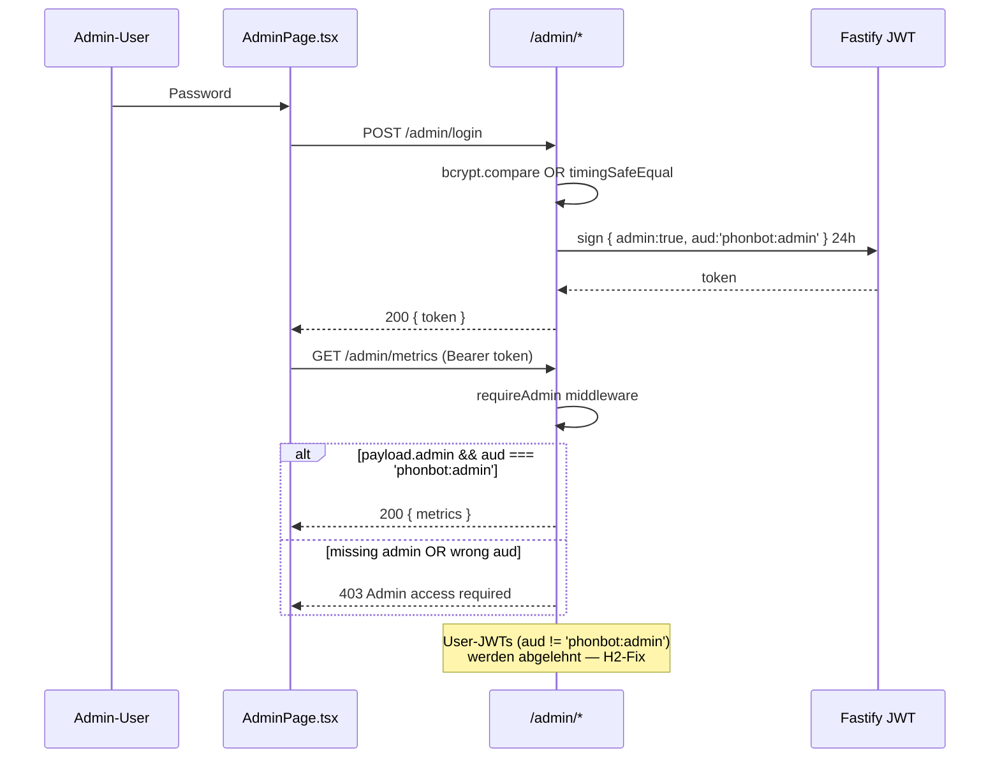

# Backend-Insights-Learning-Admin

Zustaendig fuer: **AI-Insights / Continuous-Learning-Loop**, **Sessions-Traces**, **Satisfaction-Signals**, **Support-Tickets**, **Cross-Tenant-Learning-API**, **DSGVO-relevanten Training-Export** und **Platform-Admin-Panel**.

Alle 7 Dateien werden aus `apps/api/src/index.ts` registriert:

| Line | Register-Call |
|------|---------------|
| `index.ts:187` | `await registerTickets(app)` |
| `index.ts:188` | `await registerTraces(app)` |
| `index.ts:197` | `await registerInsights(app)` |
| `index.ts:201` | `await registerLearningApi(app)` |
| `index.ts:202` | `await registerTrainingExport(app)` |
| `index.ts:204` | `await registerAdmin(app)` |

---

## 1. `insights.ts` (1180 Z) — AI-Insights & Continuous-Learning-Loop v4

### Routen

| Methode | Pfad | Auth | Datei:Zeile |
|---------|------|------|-------------|
| GET | `/insights` | `app.authenticate` | `insights.ts:1060` |
| POST | `/insights/suggestions/:id/apply` | `app.authenticate` | `insights.ts:1142` |
| POST | `/insights/suggestions/:id/reject` | `app.authenticate` | `insights.ts:1156` |
| POST | `/insights/versions/:id/restore` | `app.authenticate` | `insights.ts:1164` |
| POST | `/insights/consolidate` | `app.authenticate` | `insights.ts:1174` |

Alle Routen sind **tenant-gescoped** — `orgId` kommt ausschliesslich aus dem JWT (`req.user.orgId`, z.B. `insights.ts:1062`), nie aus Body/Query.

### Konstanten (Learning-Knobs)

```ts
AUTO_APPLY_THRESHOLD = 3               // insights.ts:31
SIMILARITY_THRESHOLD = 0.82            // insights.ts:32
HOLISTIC_REVIEW_INTERVAL = 10          // insights.ts:33
CONSOLIDATION_FIX_INTERVAL = 5         // insights.ts:34
COOLDOWN_CALLS = 5                     // insights.ts:38
AB_TEST_SCORE_THRESHOLD = 7.0          // insights.ts:42
AB_TEST_CALLS_TARGET = 15              // insights.ts:43
AB_TEST_MIN_LIFT = 0.5                 // insights.ts:44
AB_TEST_MAX_DROP = 0.3                 // insights.ts:45
```

### Datenbank-Tabellen (gelesen/geschrieben)

- `agent_configs` (Read/Write `systemPrompt` via `jsonb_set`) — `insights.ts:112, 336-340, 490-493, 536-539`
- `call_analyses` (INSERT Score + `bad_moments`) — `insights.ts:846-849`
- `call_transcripts` (Enrichment mit `score`, `bad_moments`, `agent_prompt`, `industry`, `template_id`, `outcome`) — `insights.ts:853-866`
- `prompt_suggestions` (INSERT/UPDATE Pending/Applied/Rejected/Recurrence) — `insights.ts:666-669, 994-1003, 1008-1015, 1048-1053`
- `prompt_versions` (Snapshot + Rollback-History) — `insights.ts:323-326, 434-437, 541-543`
- `ab_tests` (A/B-Test Runner + variant_scores jsonb) — `insights.ts:188-193, 227-229, 271-274`

### Top-10 Kern-Queries (Aggregationen + Zeitbuckets)

1. **Avg-Score ueber letzte 10 Calls** (Basis fuer Dynamic-Threshold)
   ```sql
   SELECT AVG(score) FROM (SELECT score FROM call_analyses WHERE org_id=$1 ORDER BY created_at DESC LIMIT 10)
   ```
   `insights.ts:778`

2. **Avg-Score letzte 20 Calls + STDDEV** (Outlier-Detection)
   ```sql
   SELECT AVG(score), STDDEV(score) FROM (SELECT score FROM call_analyses WHERE org_id=$1 ORDER BY created_at DESC LIMIT 20)
   ```
   `insights.ts:897`

3. **Calls seit letzter Prompt-Aenderung** (Cooldown-Guard)
   ```sql
   SELECT COUNT(*) FROM call_analyses WHERE org_id=$1 AND created_at > $2
   ```
   mit `$2 = agent_configs.updated_at` — `insights.ts:149-156`

4. **Holistic-Review-Fenster (letzte 10 Calls, Bad-Moments)**
   ```sql
   SELECT score, bad_moments, overall_feedback FROM call_analyses
   WHERE org_id=$1 ORDER BY created_at DESC LIMIT 10
   ```
   `insights.ts:681-683`

5. **A/B-Test Baseline (letzte 15 Calls)**
   ```sql
   SELECT AVG(score) FROM (SELECT score FROM call_analyses WHERE org_id=$1 ORDER BY created_at DESC LIMIT $2)
   ```
   mit `$2 = AB_TEST_CALLS_TARGET (15)` — `insights.ts:182-185`

6. **Consolidation-Quality: Score nach Consolidation**
   ```sql
   SELECT AVG(score) FROM (SELECT score FROM call_analyses WHERE org_id=$1 ORDER BY created_at DESC LIMIT 3)
   ```
   `MIN_CALLS_AFTER_CONSOLIDATION=3` — `insights.ts:471-473`

7. **Rollback-Check: Score letzte 5 Calls**
   ```sql
   SELECT AVG(score) FROM (SELECT score FROM call_analyses WHERE org_id=$1 ORDER BY created_at DESC LIMIT 5)
   ```
   `insights.ts:525-527`

8. **Main `/insights` Dashboard-Fetch (letzte 30 Calls)**
   ```sql
   SELECT call_id, score, bad_moments, overall_feedback, created_at
   FROM call_analyses WHERE org_id=$1 ORDER BY created_at DESC LIMIT 30
   ```
   `insights.ts:1066-1067`

9. **Applied-Fix-Effectiveness (> 1h alt, 10 Stueck)**
   ```sql
   SELECT ... FROM prompt_suggestions
   WHERE org_id=$1 AND status IN ('applied','auto_applied')
     AND effectiveness IS NULL AND applied_at < now() - interval '1 hour' LIMIT 10
   ```
   `insights.ts:590-596`

10. **Atomic Occurrence-Counter** (Race-safe INC beim semantischen Match)
    ```sql
    UPDATE prompt_suggestions SET occurrence_count = occurrence_count + 1,
      all_examples = all_examples::jsonb || $1::jsonb
    WHERE id=$2 RETURNING occurrence_count
    ```
    `insights.ts:1008-1014`

### Lern-Loop

Trigger: `analyzeCall(orgId, callId, transcript, callMeta)` wird aus `retell-webhooks.ts` nach `call_ended` gefeuert.

1. OpenAI `gpt-4o-mini` liefert JSON `{score, bad_moments[], satisfaction_signals}` — `insights.ts:797-833`.
2. Persistenz in `call_analyses` + Enrichment `call_transcripts`.
3. Satisfaction → `extractSignalsFromCall` + `storeSatisfactionData` (s. Abschnitt 3).
4. Cross-Org-Template-Learning (`template-learning.js`, fire-and-forget).
5. Outlier-Check (2x Threshold) — `insights.ts:894-908`.
6. `processIssue` pro Bad-Moment: Embedding-basiertes semantisches Matching (cosine >= 0.82) gegen bestehende Suggestions (pending/rejected/applied) — `insights.ts:931-1055`.
7. Nach jedem 10. Call: `holisticReview`. Nach jedem 5. Fix: `consolidatePrompt`.
8. Bei Score >= 7.0: **A/B-Test statt direkt-Apply** (`insights.ts:1024-1034`).
9. Rueckwaerts-Guards: `checkConsolidationQuality`, `checkScoreRollback`, `checkFixEffectiveness`.

### Retell-Sync

Nach jeder Prompt-Aenderung: `syncPromptToRetell(orgId)` — laedt `retellLlmId`, rebuild via `buildAgentInstructions()`, push via `updateLLM()` — `insights.ts:354-371`.

---

## 2. `traces.ts` (170 Z) — Sessions-Trace-Events

### Routen

| Methode | Pfad | Auth | RateLimit | Datei:Zeile |
|---------|------|------|-----------|-------------|
| GET | `/sessions/:sessionId/events` | `app.authenticate` | — | `traces.ts:143` |
| POST | `/sessions/:sessionId/events` | `app.authenticate` | 60/min | `traces.ts:150` |

### Schema — EIGENES, kein OpenTelemetry

```ts
TraceEventSchema = z.object({
  type: z.string().min(1),
  sessionId: z.string().min(1),
  at: z.number().int().nonnegative(),
  tenantId: z.string().optional(),
}).passthrough()
```
→ `traces.ts:5-10`. Kein OTEL (`@opentelemetry/*`-Imports gibt es im File nicht).

### Storage

- **Primary:** Redis-Liste `traces:<sessionId>` (LPUSH/LTRIM/EXPIRE atomic via `multi()`) mit TTL = 1h (`TRACES_TTL_SECONDS`, `traces.ts:17`). Max 500 Events/Session.
- **Fallback:** In-Memory `Map` mit LRU-Cap `MAX_TRACE_SESSIONS=10000` (`traces.ts:21, 28-34`).

### Tenant-Isolation

- **First-Writer-Wins Tenant-Stamp** (`traces_tenant:<sessionId>`) — `traces.ts:48-58`.
- GET returniert `[]` bei Tenant-Mismatch, fail-closed — `traces.ts:116`.
- POST refused wenn Session schon einem anderen Tenant gestempelt ist → `404 session not found` (`traces.ts:157-160`).
- tenantId wird NIE aus Body akzeptiert, sondern aus JWT erzwungen: `tenantId: orgId` in `traces.ts:164`.

---

## 3. `satisfaction-signals.ts` (153 Z) — Implizite Satisfaction-Scores

### Scoring-Algorithmus (`computeSatisfactionScore`, `satisfaction-signals.ts:29-46`)

Baseline **7/10**, clamp 1-10:

| Signal | Delta | Line |
|--------|-------|------|
| `taskCompleted` | +1.5 | :33 |
| `callDurationSec` ∈ (30, 300) | +0.5 | :34 |
| `sentimentScore > 0.3` | +1 | :35 |
| `repeatCaller` (gleiche Nummer < 7d) | −1.5 | :38 |
| `escalationRequested` | −2 | :39 |
| `callerHungUpFirst` ∧ Dauer < 15s | −2 | :40 |
| `interruptionCount > 5` | −1 | :41 |
| `silenceRatio > 0.4` | −1 | :42 |
| `sentimentScore < −0.3` | −1.5 | :43 |

### Signal-Quellen

- **Retell-Webhook** (`duration_ms`, `disconnection_reason='user_hangup'`, `silence_duration_ms`, `from_number`) — `satisfaction-signals.ts:68-89`.
- **GPT-Analyse (insights.ts)** (`sentiment`, `task_completed`, `escalation_requested`, `interruption_count`).
- **Repeat-Caller-Query** — `satisfaction-signals.ts:97-105`:
  ```sql
  SELECT 1 FROM call_transcripts
  WHERE from_number=$1 AND org_id=$2
    AND created_at > now() - interval '7 days' AND call_id != $3 LIMIT 1
  ```
  → org-gescoped (sonst Cross-Tenant-Score-Pollution).

### Persistenz

`storeSatisfactionData` UPDATEs `call_transcripts` (Cols: `satisfaction_score`, `satisfaction_signals` jsonb, `repeat_caller`, `disconnection_reason`) WHERE `call_id AND org_id` (`satisfaction-signals.ts:137-152`).

---

## 4. `tickets.ts` (306 Z) — Support-Ticket Lifecycle

### Routen

| Methode | Pfad | Auth | RateLimit | Datei:Zeile |
|---------|------|------|-----------|-------------|
| GET | `/tickets` | `app.authenticate` | — | `tickets.ts:169` |
| POST | `/tickets` | `app.authenticate` | — | `tickets.ts:201` |
| POST | `/tickets/:id/callback` | `app.authenticate` | **5/1h** | `tickets.ts:224` |
| PATCH | `/tickets/:id` | `app.authenticate` | — | `tickets.ts:277` |

### Lifecycle / DB-Schema

DB-Tabelle `tickets` (Cols siehe `TicketRow`, `tickets.ts:9-23`):

- `status: 'open' | 'assigned' | 'done'` — Enum `TicketStatus` (`tickets.ts:28`).
- `tenant_id` + `org_id` (beide persistiert — `org_id` via Lookup `agent_configs.tenant_id → org_id` in `tickets.ts:102-103`).
- Quelle (`source`), Session (`session_id`), Kunde (`customer_name`, `customer_phone`, `preferred_time`, `service`, `notes`).

**Flow:**
1. `createTicket()` (`tickets.ts:55-164`) — Phone-Validation via `isPlausiblePhone` + DACH-Prefix-Allowlist (`+49,+43,+41` default) als Defense-in-Depth Anti-Toll-Fraud (`tickets.ts:70-77`).
2. INSERT mit `status='open'`.
3. Fire-and-forget E-Mail an Org-Owner (`users.role='owner' AND is_active`) via `sendTicketNotification` (`tickets.ts:144-160`).
4. PATCH `/tickets/:id` → Status + Notes, `updated_at=now()`.
5. POST `/tickets/:id/callback` → Second DACH-Prefix-Check (Belt-and-Suspenders, `tickets.ts:253-257`), dann `triggerCallback()` aus `agent-config.js`.

Retell-Webhook-Variant (signed): `/retell/tools/ticket.create` — separater Pfad, s. [[Backend-Phone-Retell]].

### Fallback

In-Memory `mem: TicketRow[]` + `memId` wenn kein `pool` — `tickets.ts:25-26, 80-98`.

---

## 5. `learning-api.ts` (294 Z) — Cross-Tenant Pattern-Learning + Consent

### Routen

| Methode | Pfad | Auth | RateLimit | Datei:Zeile |
|---------|------|------|-----------|-------------|
| GET | `/learning/consent` | `app.authenticate` | — | `learning-api.ts:38` |
| POST | `/learning/consent` | `app.authenticate` | 10/min | `learning-api.ts:65` |
| GET | `/learning/templates/:templateId/learnings` | `requireAdmin` (lokal) | — | `learning-api.ts:90` |
| GET | `/learning/patterns` | `requireAdmin` (lokal) | — | `learning-api.ts:115` |
| GET | `/learning/stats` | `requireAdmin` (lokal) | — | `learning-api.ts:141` |
| POST | `/learning/apply-to-template/:templateId` | `app.authenticate` | 10/1h | `learning-api.ts:181` |

### `requireAdmin`-Check (lokal in dieser Datei)

`learning-api.ts:18-28` — verifiziert JWT, checkt `payload.admin === true`. **ACHTUNG:** verifiziert NICHT den `aud`-Claim (anders als `admin.ts` — potenzielle Schwachstelle, s. unten).

### DSGVO: `share_patterns`-Consent

- `orgs.share_patterns` + `share_patterns_consented_at` — Art. 7 DSGVO Audit-Trail (`learning-api.ts:77-83`).
- Opt-in setzt `consented_at=now()`, Opt-out NULL'd es (Re-Opt-in → neuer Timestamp).
- Body via Zod strikt validiert (`ConsentBody = z.object({share_patterns: z.boolean()})`).

### `apply-to-template` — Scope-Fix

Frueherer Bug: hat Prompt-Updates ueber ALLE Orgs mit dem Template gepusht → Cross-Tenant-Prompt-Sabotage. Fix: explizit `org_id=$3` im WHERE + Update nur des Callers agent_configs (`learning-api.ts:195-202, 247-250, 256-270`).

### Aggregations-Quellen

- `template_learnings` (cross-tenant via `source_count`-Aggregation)
- `conversation_patterns`
- `call_transcripts` / `training_examples` (Stats)

---

## 6. `training-export.ts` (318 Z) — DSGVO-relevanter Fine-Tune-Export

### Routen

| Methode | Pfad | Auth | RateLimit | Datei:Zeile |
|---------|------|------|-----------|-------------|
| GET | `/learning/export` | `app.authenticate` | 5/min | `training-export.ts:223` |
| POST | `/learning/generate` | `app.authenticate` | 3/min | `training-export.ts:306` |

### Export-Format (JSONL)

- Standard: **OpenAI Fine-Tune JSONL** — `{messages:[{role:'system',content:...},...], score, quality, industry}` (`training-export.ts:281-292`).
- DPO-Pair: **`{prompt, chosen, rejected, industry}`** (`training-export.ts:272-279`).
- Response: `Content-Type: application/x-ndjson`, `Content-Disposition: attachment; filename="training_<ts>.jsonl"` (`training-export.ts:294-296`).

### Quality-Labeling

- `score >= 8` → `quality_label='good'`
- `score <= 4` → `quality_label='bad'`
- Mid-Ground (5-7) wird **uebersprungen** (`training-export.ts:108-110`).

### DPO-Paar-Generierung (`generateDpoPairs`, `training-export.ts:144-206`)

GROUP BY `(org_id, industry)` HAVING 2 distinct quality_labels. **CRITICAL:** gruppiert auch nach `org_id` — **niemals Cross-Tenant-Pairs** (haette sonst via DPO-`rejected`-Feld Transkripte von Tenant A in Trainingsdaten fuer Tenant B geleakt).

### === DSGVO-Pruefung ===

**Was wird exportiert?**
- `call_transcripts.transcript` → Messages (Agent/User-Sprechroll-Parsing via Regex, `training-export.ts:46-65`)
- `agent_prompt` (System-Prompt des Agenten zum Call-Zeitpunkt)
- `score`, `quality_label`, `industry`, `direction`, `metadata.call_id`

**Redaktion:**
- `redactMessages(buildMessages(transcript))` + `redactPII(agent_prompt)` **beim INSERT** in `training_examples` (`training-export.ts:115-117`).
- Redaktion-Regeln s. [[Backend-Auth-Security]] `pii.ts`:
  - [EMAIL], [PHONE] (intl + national DE), [IBAN], [DOB], [ADDRESS] (DE street+hausnr), [CC] — `pii.ts:17-41`.
- Wird **vor Persistenz** redigiert — Export liest nur den bereits redigierten Store.

**Tenant-Scope:**
- `WHERE org_id = $1` (`training-export.ts:248`) — frueher fehlend (!), ALLE Tenants-Transkripte waren downloadbar durch jeden Auth-User.

**Offene DSGVO-Risiken:**
1. Redaktion ist regex-basiert (conservative patterns). Vornamen/Nachnamen, freie Adressangaben ausserhalb des DE-Strasse-Patterns, nicht-DE Phones ohne `+`-Prefix, Geburtsdaten !=DD.MM.YYYY entkommen.
2. `agent_prompt` kann Geschaeftsgeheimnisse enthalten — Export ist org-scoped aber Logging/Backups koennten dennoch Pruefung benoetigen.
3. Keine Löschkaskade dokumentiert: bei `DELETE orgs` muessen `training_examples` mit wegbrechen (FK-Cascade zu verifizieren → [[Backend-DB-Schema]]).
4. `metadata.call_id` bleibt zitierbar → de-anonymisierbar ueber `call_transcripts` bis die dort geloescht sind.

→ Siehe [[Backend-Auth-Security]] `pii` fuer Redaktions-Regeln + Gap-Analyse.

### Concurrency-Lock

Redis-Key `lock:generate_training_examples` mit SETNX+TTL=300s (`training-export.ts:22-33`) — verhindert Doppel-Inserts bei parallelen Exports.

---

## 7. `admin.ts` (296 Z) — Platform-Admin-Panel

### Routen

| Methode | Pfad | Auth | RateLimit | Datei:Zeile |
|---------|------|------|-----------|-------------|
| POST | `/admin/login` | **public** | **5/min** | `admin.ts:39` |
| GET | `/admin/leads` | `requireAdmin` | — | `admin.ts:70` |
| GET | `/admin/leads/stats` | `requireAdmin` | — | `admin.ts:121` |
| PATCH | `/admin/leads/:id` | `requireAdmin` | — | `admin.ts:162` |
| DELETE | `/admin/leads/:id` | `requireAdmin` | — | `admin.ts:195` |
| GET | `/admin/metrics` | `requireAdmin` | — | `admin.ts:203` |
| GET | `/admin/users` | `requireAdmin` | — | `admin.ts:255` |
| GET | `/admin/orgs` | `requireAdmin` | — | `admin.ts:276` |

### Role-Gating-Nachweis

**NICHT ueber `requireRole('admin')`** auf User-JWTs — Admin-Panel nutzt **separate JWT-Audience** mit eigenem Login:

- Boot-Check: in Prod **MUSS** `ADMIN_PASSWORD` oder `ADMIN_PASSWORD_HASH` gesetzt sein, sonst `throw` (`admin.ts:13-15`).
- Login akzeptiert bcrypt-Hash (bevorzugt) oder Plaintext + `timingSafeEqual` (`admin.ts:49-58`).
- Token-Signierung: `app.jwt.sign({admin:true, aud:'phonbot:admin'}, {expiresIn:'24h'})` — `admin.ts:65`.
- `requireAdmin`-Middleware prueft **beides**:
  ```ts
  if (!payload.admin || payload.aud !== 'phonbot:admin') {
    return reply.status(403).send({ error: 'Admin access required' });
  }
  ```
  — `admin.ts:18-33` (Zeile **24** der Audience-Check, Zeile **28** das 403-Reply).
- Verhindert User-JWT-Privilege-Escalation (User-JWTs haben keinen `aud:'phonbot:admin'`-Claim).

Keine Nutzung von `requireRole('admin')` im Modul (Grep: 0 Matches fuer `role === 'admin'` oder `requireRole` in allen 7 Files).

**Anmerkung (Schwachstelle-Flag):** `learning-api.ts:18-28` hat eine parallele `requireAdmin`-Implementierung die NUR `payload.admin` prueft, den `aud`-Claim aber NICHT. Inkonsistent mit `admin.ts`. Siehe [[Backend-Auth-Security]].

### DB-Tables

- `crm_leads` (leads-Routes) — Felder `name, email, phone, source, status, notes, call_id, converted_at`
- `users`, `orgs` (listing)
- `agent_configs`, `call_transcripts`, `tickets`, `phone_numbers` (metrics)

### Revenue-Estimate (`admin.ts:230-240`)

Hardcoded `planPrices = {free:0, nummer:8.99, starter:79, pro:179, agency:349}` × COUNT per plan — kein Stripe-LIVE-Pull, nur Schaetzung.

---

## Eingehende Referenzen (wer ruft den Code)

- **Frontend `apps/web/src/lib/api.ts`** (s. Grep):
  - `api.ts:402,406,413` → `/tickets*` → **[[Frontend-TicketInbox]]** (`TicketInbox.tsx`)
  - `api.ts:654-670` → `/insights*` → **[[Frontend-InsightsPage]]** (`InsightsPage.tsx`, `DashboardHome.tsx`)
  - `api.ts:820-924` → `/admin/*` → **[[Frontend-AdminPage]]** (`AdminPage.tsx`)
  - `api.ts:935-939` → `/learning/consent` → **Frontend-Agent-Builder** (`agent-builder/index.tsx`)
  - **Kein Frontend-Konsument fuer `/learning/export`** — externer fine-tune-Workflow (Grep in `apps/web/src` 0 Treffer).
- **Backend intern**:
  - `analyzeCall()` wird aus `retell-webhooks.ts` nach `call_ended` gefeuert (s. [[Backend-Phone-Retell]]).
  - `createTicket()` wird aus Retell-Tool-Endpoint `/retell/tools/ticket.create` gerufen (signed Webhook).
  - `appendTraceEvent()` wird von `traces.ts` selbst + von UI-Session-Logger konsumiert.

## Ausgehende Referenzen (was wird gerufen)

- `db.ts` (`pool`) — alle 7 Files.
- `redis.js` — `traces.ts`, `training-export.ts`.
- `auth.js` (`JwtPayload`, `authenticate`-Decorator) — alle Routen-Files.
- `pii.js` (`redactPII`, `redactMessages`) — `training-export.ts:115`.
- `email.js` (`sendTicketNotification`) — `tickets.ts:6`.
- `agent-config.js` (`triggerCallback`) — `tickets.ts:7`.
- `agent-instructions.js` (`buildAgentInstructions`) + `retell.js` (`updateLLM`) — `insights.ts:365-370`, `learning-api.ts:274-278`.
- `template-learning.js` (`processTemplateLearning`) — `insights.ts:888`.
- `satisfaction-signals.js` (`computeSatisfactionScore`, `extractSignalsFromCall`, `storeSatisfactionData`) — `insights.ts:25`.
- OpenAI SDK — `insights.ts:22`, `learning-api.ts:13`.

## Verbundene Notes

- [[Backend-Auth-Security]] — JWT, `requireAdmin`, PII-Redaktion
- [[Backend-Phone-Retell]] — `analyzeCall`-Trigger + `ticket.create` Webhook
- [[Backend-DB-Schema]] — `call_analyses`, `call_transcripts`, `prompt_suggestions`, `prompt_versions`, `ab_tests`, `tickets`, `crm_leads`, `training_examples`, `template_learnings`, `conversation_patterns`
- [[Backend-Infra]] — Fastify-Wiring, `index.ts`-Registrierung
- [[Frontend-InsightsPage]] — konsumiert `/insights*`
- [[Frontend-AdminPage]] — konsumiert `/admin/*`
- [[Frontend-TicketInbox]] — konsumiert `/tickets*`

---

## Mermaid — Learning-Loop + Export-Pipeline

```mermaid
flowchart TD
    subgraph Retell["Retell Webhook"]
        WH[call_ended]
    end

    subgraph Insights["insights.ts :: analyzeCall"]
        A1[OpenAI gpt-4o-mini<br/>score + bad_moments]
        A2[(call_analyses)]
        A3[(call_transcripts)]
        A4[processIssue<br/>cosine >= 0.82]
        A5[(prompt_suggestions)]
        A6[generateOptimizedFix]
        A7{avg_score >= 7?}
        A8[A/B-Test<br/>variant_prompt]
        A9[applyPromptAddition]
        A10[(prompt_versions)]
        A11[(ab_tests)]
        A12[syncPromptToRetell<br/>updateLLM]
    end

    subgraph Sat["satisfaction-signals.ts"]
        S1[extractSignalsFromCall]
        S2[computeSatisfactionScore<br/>baseline 7, clamp 1-10]
        S3[storeSatisfactionData]
    end

    subgraph Learn["learning-api.ts"]
        L1[(template_learnings)]
        L2[(conversation_patterns)]
        L3[apply-to-template<br/>org-scoped]
    end

    subgraph Export["training-export.ts"]
        T1[generateTrainingExamples<br/>Redis lock]
        T2[redactMessages + redactPII]
        T3[(training_examples)]
        T4[generateDpoPairs<br/>GROUP BY org_id+industry]
        T5[JSONL-Export<br/>5/min, org-scoped]
    end

    subgraph Tickets["tickets.ts"]
        TK1[(tickets)]
        TK2[sendTicketNotification]
        TK3[triggerCallback<br/>5/1h, DACH-only]
    end

    subgraph Admin["admin.ts"]
        AD1[/admin/login<br/>bcrypt + aud:phonbot:admin/]
        AD2[requireAdmin<br/>admin + aud check]
        AD3[(crm_leads / users / orgs)]
    end

    WH --> A1 --> A2 --> A4 --> A5
    A1 --> A3
    A4 --> A6 --> A7
    A7 -- ja --> A8 --> A11
    A7 -- nein --> A9 --> A10 --> A12
    WH --> S1 --> S2 --> S3 --> A3
    A2 --> A4
    A3 --> T1 --> T2 --> T3 --> T4 --> T3
    T3 --> T5
    T5 -. external fine-tune .-> FT[External trainer]
    A1 -. template sharing .-> L1
    L1 --> L3
    L3 --> A3
    WH -. ticket.create .-> TK1 --> TK2
    TK1 --> TK3
    AD1 --> AD2 --> AD3

    classDef db fill:#2a2a3a,stroke:#F97316,color:#fff
    class A2,A3,A5,A10,A11,L1,L2,T3,TK1,AD3 db
```

## Mermaid — Admin Role-Gating



---

## Verwandt

- [[Phonbot/Phonbot-Gesamtsystem|🧭 Gesamtsystem]] · [[Phonbot/Overview|Phonbot Overview]]
- **Ruft auf:** [[Backend-Auth-Security]] (requireAdmin/JWT), [[Backend-Database]] (Schema), [[Backend-Agents]] (`triggerCallback` via tickets.ts)
- **Wird aufgerufen von:** [[Frontend-Pages]] (InsightsPage, TicketInbox, CallLog, AdminPage), [[Frontend-Shell]] (adminRequest)
- **Findings:** [[Audit-2026-04-18-Deep]] M2 (`learning-api.ts:18-28` aud-Gap), [[Audit-2026-04-18-Deep]] M3 (PII in Patterns)
- **Tasks:** [GH#9 Admin Pagination](https://github.com/haskallalk-eng/voice-agent-phonbot/issues/9)
