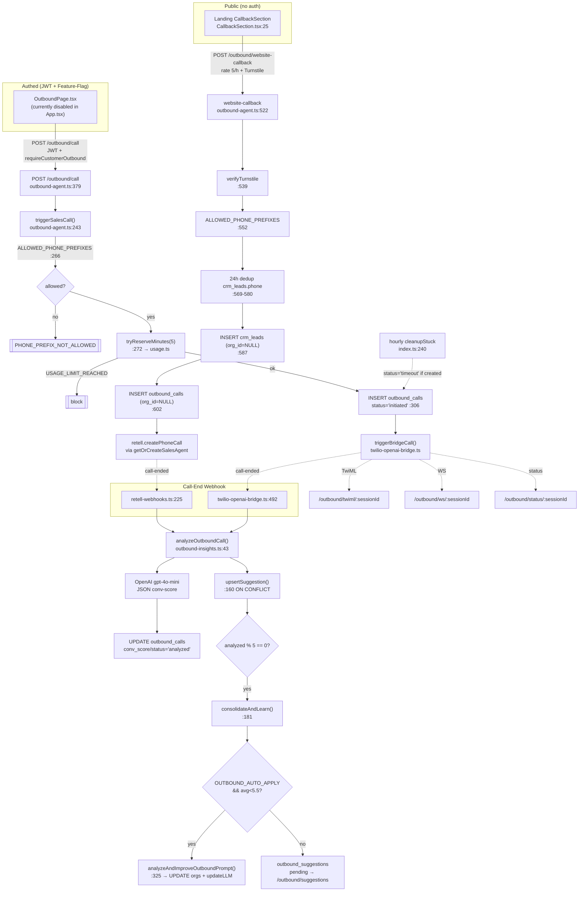

# Backend-Outbound

> Phonbot ist aktuell INBOUND-only. Customer-Outbound-Routen sind per
> `CUSTOMER_OUTBOUND_ENABLED` Feature-Flag gated; der einzige öffentlich
> aktive Outbound-Pfad ist `/outbound/website-callback` (Landing-Page
> Rückruf-Formular). Siehe `outbound-agent.ts:364-376`.

Verbundene Notes: [[Backend-Voice-Telephony]] · [[Backend-Billing-Usage]] · [[Backend-Database]] · [[Backend-Infra]] · [[Frontend-Pages]]

---

## 1. Endpoints

Alle Routen in `registerOutbound(app)` — `outbound-agent.ts:361`.

| Methode | Pfad | Auth | RateLimit | Flag-Gate | Datei:Zeile |
|---|---|---|---|---|---|
| POST | `/outbound/call` | JWT | global 100/min | requireCustomerOutbound | `outbound-agent.ts:379` |
| POST | `/outbound/call/:callId/outcome` | JWT | global | requireCustomerOutbound | `outbound-agent.ts:400` |
| GET  | `/outbound/calls` | JWT | global | requireCustomerOutbound | `outbound-agent.ts:418` |
| GET  | `/outbound/stats` | JWT | global | requireCustomerOutbound | `outbound-agent.ts:431` |
| GET  | `/outbound/prompt` | JWT | global | requireCustomerOutbound | `outbound-agent.ts:463` |
| GET  | `/outbound/suggestions` | JWT | global | requireCustomerOutbound | `outbound-agent.ts:478` |
| POST | `/outbound/suggestions/:id/apply` | JWT | global | requireCustomerOutbound | `outbound-agent.ts:490` |
| POST | `/outbound/suggestions/:id/reject` | JWT | global | requireCustomerOutbound | `outbound-agent.ts:508` |
| POST | `/outbound/website-callback` | **public** | **5/h per IP** + Turnstile | — (immer aktiv) | `outbound-agent.ts:522` |
| GET  | `/outbound/leads` | JWT | global | requireCustomerOutbound | `outbound-agent.ts:651` |
| PATCH | `/outbound/leads/:id` | JWT | global | requireCustomerOutbound | `outbound-agent.ts:677` |
| DELETE | `/outbound/leads/:id` | JWT | global | requireCustomerOutbound | `outbound-agent.ts:711` |
| GET  | `/outbound/leads/stats` | JWT | global | requireCustomerOutbound | `outbound-agent.ts:720` |

Zusätzliche Sibling-Routen (nicht in dieser Datei, aber im Namespace):
- `POST /outbound/twiml/:sessionId` — TwiML für Twilio-Bridge (`twilio-openai-bridge.ts:267`)
- `POST /outbound/status/:sessionId` — Twilio StatusCallback (`twilio-openai-bridge.ts:292`)
- `GET  /outbound/ws/:sessionId` — WS für Bridge (`twilio-openai-bridge.ts:323`)
- Diese sind in `index.ts:127-129` von der JSON-Body-Parsing-Logik ausgenommen.

`requireCustomerOutbound` (→ 503 `FEATURE_DISABLED`) in `outbound-agent.ts:369-376`.

---

## 2. Toll-Fraud-Guards

Hinweis: Der Status ist **uneinheitlich**. `/outbound/call` (authenticated) und `/outbound/website-callback` (public) haben **unterschiedliche** Schutzschichten.

### 2a. `triggerSalesCall()` — Backend-Funktion, von `/outbound/call` aufgerufen

| Guard | Datei:Zeile | Details |
|---|---|---|
| Feature-Flag | `outbound-agent.ts:254-256` | `CUSTOMER_OUTBOUND_ENABLED !== 'true'` → `FEATURE_DISABLED` |
| **ALLOWED_PHONE_PREFIXES** | `outbound-agent.ts:264-268` | Default `+49,+43,+41`. `toNumber.startsWith(p)` → sonst `PHONE_PREFIX_NOT_ALLOWED`. T-32 Defense-in-Depth |
| **tryReserveMinutes** | `outbound-agent.ts:272-274` | Atomic minute-reservation (E7) aus [[Backend-Billing-Usage]] — reserviert `DEFAULT_CALL_RESERVE_MINUTES=5`, Webhook reconciled |
| from-number vorhanden | `outbound-agent.ts:277-282` | Requires provisioned org-Nummer oder `RETELL_OUTBOUND_NUMBER` fallback |
| WEBHOOK_BASE_URL in prod | `outbound-agent.ts:319-323` | Fail-loud wenn fehlt — sonst könnte Twilio-TwiML nicht zurückgeliefert werden |
| Turnstile | **FEHLT** | `/outbound/call` hat keinen CAPTCHA (JWT-authenticated, daher bewusst off) |
| Redis global cap | **FEHLT** | Kein globaler Redis-Counter für authentifizierte Outbound-Kampagnen |

### 2b. `/outbound/website-callback` — public Landing-Page-Rückruf

| Guard | Datei:Zeile | Details |
|---|---|---|
| Per-IP RateLimit | `outbound-agent.ts:523` | `max: 5, timeWindow: '1 hour'` via Fastify-RateLimit |
| **Turnstile CAPTCHA** | `outbound-agent.ts:539-543` | `verifyTurnstile(token, req.ip)` — Dev skip wenn `TURNSTILE_SECRET_KEY` fehlt, prod required |
| Phone-Normalisierung | `outbound-agent.ts:546-549` | `00` → `+`, `0…` → `+49…`, sonst `+49` Prefix |
| **ALLOWED_PHONE_PREFIXES** | `outbound-agent.ts:552-556` | Zweite Instanz: Default `+49,+43,+41` — rejects non-DACH |
| RETELL_OUTBOUND_NUMBER required | `outbound-agent.ts:558-562` | 503 wenn nicht gesetzt |
| 24h-Dedup (Phone) | `outbound-agent.ts:569-580` | T-38: `SELECT 1 FROM crm_leads WHERE phone = $1 AND created_at > now() - interval '24 hours'`. Phone ist Identität — nicht source (attacker könnte spoofen). Identisch zu `/demo/callback` E2 |
| Name-Regex (Prompt-Injection) | `outbound-agent.ts:529` | `/^[\p{L}\p{N}\s'-]+$/u` |
| **tryReserveMinutes** | **FEHLT** | Public-Callback reserviert KEINE Minuten (Lead-Insert ist `org_id = NULL`, daher orgID-lose usage nicht messbar) |
| **Redis global hourly cap** | **FEHLT hier** | Der `/demo/*`-Pfad hat `enforceGlobalDemoCap()` via Redis (`demo.ts:182-199`, Key `demo:global:call:<hour>`). `/outbound/website-callback` hat das NICHT — Lücke vs. [[Backend-Infra]] `redis.ts` Cap. Nur per-IP 5/h + Turnstile schützt |

### 2c. Cross-cutting (aus CLAUDE.md §15)
- `isPlausiblePhone()` + Premium-Blocklist: **NICHT** in dieser Datei referenziert — nur in twilio-helpers (siehe [[Backend-Voice-Telephony]]).
- JWT-Trust: `orgId` kommt ausschließlich aus `req.user as JwtPayload`, nie aus Body (z.B. `outbound-agent.ts:380, 419, 432, …`).
- Org-Scoping: jede DB-Query hat `WHERE org_id = $1` (Ausnahme: `/outbound/website-callback` setzt `org_id = NULL` für Plattform-Leads, `outbound-agent.ts:604`).

---

## 3. Kampagnen-Lifecycle

Single-Call Flow (`triggerSalesCall` — `outbound-agent.ts:243-357`):

```
POST /outbound/call (JWT)
  └─> triggerSalesCall({ orgId, toNumber, … })         outbound-agent.ts:389
       ├─ Flag-check              outbound-agent.ts:254
       ├─ Phone-prefix allowlist  outbound-agent.ts:264-268
       ├─ tryReserveMinutes(5)    outbound-agent.ts:272-274
       ├─ Lookup from_number      outbound-agent.ts:277-282
       ├─ getOutboundConfig(org)  outbound-agent.ts:228 (prompt+version aus orgs)
       ├─ Render Prompt-Template  outbound-agent.ts:298-303
       │    (contact_name / to_number / agent_name / business_name / campaign_context)
       ├─ INSERT outbound_calls (status='initiated')   outbound-agent.ts:306-310
       ├─ triggerBridgeCall(...)  outbound-agent.ts:331 (→ twilio-openai-bridge)
       │    └─> TwiML URL: /outbound/twiml/:sessionId
       │        WS URL:    /outbound/ws/:sessionId
       │        StatusCB:  /outbound/status/:sessionId
       └─ UPDATE outbound_calls SET call_id, status='calling'  outbound-agent.ts:347-350

→ Bei Call-Ende (Retell/Twilio webhook):
   retell-webhooks.ts:225-232  →  analyzeOutboundCall() (outbound-insights.ts:43)
   twilio-openai-bridge.ts:492-499  →  analyzeOutboundCall() (alternate path)

→ Stuck-Call Cleanup (hourly):
   index.ts:237-255 — setInterval 1h: UPDATE outbound_calls SET status='timeout'
   WHERE status IN ('calling','initiated') AND created_at < now() - interval '1 hour'
```

Website-Callback Flow (`/outbound/website-callback` — `outbound-agent.ts:522-645`):

```
POST /outbound/website-callback (public)
  ├─ Zod parse + name-regex                   :525-535
  ├─ verifyTurnstile(token, ip)               :539-543
  ├─ Normalize phone E.164                    :546-549
  ├─ ALLOWED_PHONE_PREFIXES allowlist         :552-556
  ├─ 24h Dedup (phone)                        :569-580
  ├─ INSERT crm_leads (org_id=NULL)           :587-597
  ├─ INSERT outbound_calls (org_id=NULL)      :602-611
  ├─ Retell createPhoneCall via getOrCreateSalesAgent  :623-631
  └─ UPDATE outbound_calls SET call_id,status='calling'  :633-636
```

Bulk-Campaigns: **existieren nicht als Endpoint**. Der Code-Kommentar in `triggerSalesCall` (Zeile 251-253) erwähnt hypothetische "worker paths (auto-improve loops, scheduled campaigns)", aber kein solcher Caller ist aktuell im Repo registriert — `triggerSalesCall` wird nur von `/outbound/call` aufgerufen (siehe Ref-Grep §6).

---

## 4. Insights-Queries & Lifecycle

Datei: `outbound-insights.ts`.

### 4a. `analyzeOutboundCall(orgId, callId, transcript, durationS)` — `outbound-insights.ts:43-158`
- Idempotenz-Guard `:52-56`: skip wenn `conv_score` schon gesetzt.
- OpenAI-Analyse (`gpt-4o-mini` default, JSON-response) `:59-95`:
  - Dimensionen: `rapport`, `pain_identified`, `value_delivered`, `objections_handled`, `next_step_secured`, `overall` (1-10), `outcome_detected`, `weak_points[]`, `strong_points[]`, `specific_improvements[]`.
  - Transkript auf 6000 chars limitiert `:92`.
- Fallback-Score `:101-105`: Durchschnitt der 5 Dimensionen wenn `overall` fehlt.
- UPDATE `outbound_calls` `:107-120`:
  ```sql
  UPDATE outbound_calls
     SET conv_score = $1, score_breakdown = $2, outcome = COALESCE(outcome,$3),
         duration_s = COALESCE(duration_s,$4), status = 'analyzed'
   WHERE call_id = $5 AND org_id = $6
  ```
- Mirror in `call_transcripts` `:131-143` (score/conv_score/outcome).
- Pattern-Sammlung: `specific_improvements` → `upsertSuggestion(category='formulation')`; `weak_points` → `category='weakness'` (`:123-128`).
- Trigger Batch-Learning nach jeweils `MIN_CALLS_FOR_LEARNING=5` analysierten Calls (`:146-154`).

### 4b. `upsertSuggestion()` — `outbound-insights.ts:160-177`
Race-safe single-statement upsert (alte Version hatte SELECT-then-INSERT Race):
```sql
INSERT INTO outbound_suggestions (org_id, category, issue_summary, suggested_change, occurrence_count)
VALUES ($1, $2, $3, $4, 1)
ON CONFLICT (org_id, issue_summary) WHERE status = 'pending'
DO UPDATE SET occurrence_count = outbound_suggestions.occurrence_count + 1
```
Benötigt Partial UNIQUE Index `outbound_suggestions_pending_unique` (`outbound-agent.ts:75-78`).

### 4c. `consolidateAndLearn(orgId)` — `outbound-insights.ts:181-309`
- Fetch letzte 20 analysierte Calls `:185-191`, return wenn <5.
- Avg-Score `:194`, Top 30% vs. Low 30% Transcripts (`:197-199`).
- Fetch pending suggestions mit `occurrence_count >= MIN_OCCURRENCE_TO_APPLY=3` `:205-210`.
- Short-circuit `:212`: wenn keine patterns und avg ≥ `AUTO_APPLY_CONV_SCORE=5.5` → return.
- OpenAI-Call (`:215-257`): generiert `improvements[]` + `new_prompt_additions` + `summary`.
- UPDATE `outbound_suggestions SET conv_lift_est = $1 WHERE … AND issue_summary ILIKE $3` `:274-278`.
- **Auto-Apply-Gate** `:291-292`: nur wenn `OUTBOUND_AUTO_APPLY === 'true'` UND Prompt hat sich geändert UND (avgScore < 5.5 ODER new additions). Default OFF — Schutz vor prompt-injection via Transkript.
- Marker `outbound_suggestions.status = 'auto_applied'` `:299-303`.

### 4d. Stats-Query `/outbound/stats` — `outbound-agent.ts:435-448`
```sql
SELECT COUNT(*) AS total,
       COUNT(*) FILTER (WHERE outcome='converted')      AS converted,
       COUNT(*) FILTER (WHERE outcome='interested')     AS interested,
       COUNT(*) FILTER (WHERE outcome='not_interested') AS not_interested,
       COUNT(*) FILTER (WHERE outcome IN ('no_answer','voicemail')) AS no_answer,
       ROUND(AVG(conv_score),2) AS avg_score,
       ROUND(100.0 * COUNT(*) FILTER (WHERE outcome IN ('converted','interested'))
             / NULLIF(COUNT(*) FILTER (WHERE outcome IS NOT NULL),0), 1) AS conversion_rate
  FROM outbound_calls WHERE org_id = $1
```

### 4e. Prompt-Versioning — `analyzeAndImproveOutboundPrompt()` `:325-366`
- Append vs. Replace Heuristik (`newPromptOrAddition.length > current.length * 0.5`) `:339-341`.
- INSERT `outbound_prompt_versions (version, prompt, reason, avg_conv_score, call_count)` `:344-348` (call_count via Subquery auf `outbound_calls`).
- UPDATE `orgs SET outbound_prompt, outbound_prompt_v` `:351-354`.
- Push an Retell LLM via `updateLLM(llmId, { generalPrompt })` `:359-365` — try/catch swallow (non-critical, Retell-failure darf System nicht brechen).

---

## 5. DB-Tabellen (Migration in `migrateOutbound()`)

Siehe [[Backend-Database]]. Definiert in `outbound-agent.ts:24-142`:

### `outbound_calls` — `:26-43`
`id, org_id, created_at, call_id, to_number, contact_name, campaign, outcome, duration_s, transcript, conv_score, score_breakdown (JSONB), prompt_version, status`.
Outcome-Enum: `converted | interested | callback | not_interested | no_answer | voicemail`.
Status-Werte: `initiated → calling → analyzed`, plus `failed | timeout`.
Indices: `outbound_calls_org_idx` (`:44`), `outbound_calls_call_id_idx` (`:111`), `outbound_calls_call_id_uniq` partial-unique wo `call_id IS NOT NULL` (`:113-124`, with cleanup-safe exception handler).

### `outbound_prompt_versions` — `:46-56`
`id, org_id, version, prompt, reason, avg_conv_score, call_count, created_at`. Index `outbound_prompt_org_idx(org_id, version)` (`:57`).

### `outbound_suggestions` — `:59-71`
`id, org_id, created_at, category, issue_summary, suggested_change, occurrence_count, conv_lift_est, status, applied_at`.
Status: `pending | applied | auto_applied | rejected`.
Partial UNIQUE `outbound_suggestions_pending_unique (org_id, issue_summary) WHERE status='pending'` (`:75-78`) — exakt der ON-CONFLICT-Target in `upsertSuggestion()`.

### `orgs` ALTER — `:80-85`
`outbound_agent_id TEXT, outbound_llm_id TEXT, outbound_prompt TEXT, outbound_prompt_v INT NOT NULL DEFAULT 1`.

### `crm_leads` — `:89-141`
`id, created_at, name, email, phone, source, status, notes, call_id, converted_at, org_id` (nullable für anonyme Plattform-Leads, FK `crm_leads_org_fk` → `orgs(id) ON DELETE CASCADE`).
Indices: `crm_leads_phone_created_idx (phone, created_at DESC)` für 24h-Dedup (`:109`), `crm_leads_email_idx`, `crm_leads_status_idx`, `crm_leads_org_idx`.
**DSGVO Art. 5:** 90-day retention via `cleanupOldLeads()` in `db.ts`, daily job (`outbound-agent.ts:103` comment + `index.ts:271-…`).

---

## 6. Ein-/Ausgehende Referenzen

### Wer triggert Outbound?
| Caller | Pfad | Datei:Zeile |
|---|---|---|
| Frontend `OutboundPage.tsx` | `triggerSalesCall(...)` → `POST /outbound/call` | `web/src/ui/OutboundPage.tsx:4,78` (Page ist **aktuell nicht in App.tsx importiert**, `App.tsx:19-21`) |
| Frontend `CallbackSection.tsx` | `fetch('/api/outbound/website-callback')` | `web/src/ui/landing/CallbackSection.tsx:25` |
| Fastify-Boot | `registerOutbound(app)` + `migrateOutbound()` | `api/src/index.ts:26, 198, 207` |
| Stuck-Call Cleanup | hourly `UPDATE … WHERE status IN ('calling','initiated')` | `api/src/index.ts:237-257` |
| Retell-Webhook | `analyzeOutboundCall(...)` bei `isOutbound` | `api/src/retell-webhooks.ts:225-232` |
| Twilio-OpenAI-Bridge | `analyzeOutboundCall(orgId, recordId, transcript)` | `api/src/twilio-openai-bridge.ts:492-499` |
| `/outbound/suggestions/:id/apply` | `analyzeAndImproveOutboundPrompt(...)` | `outbound-agent.ts:501-503` |

### Frontend — wer zeigt Insights?
- `apps/web/src/ui/OutboundPage.tsx` — zeigt `getOutboundCalls() / getOutboundStats() / getOutboundSuggestions()` (Zeile 56-58), Outcome-Update (`:93`), Apply/Reject (`:100, 107`). **Aktuell in App.tsx auskommentiert** (`App.tsx:19-21`).
- `apps/web/src/lib/api.ts:673-754` — alle Wrapper-Funktionen (`triggerSalesCall`, `getOutboundCalls`, `getOutboundStats`, `getOutboundPrompt`, `getOutboundSuggestions`, `applyOutboundSuggestion`, `rejectOutboundSuggestion`, `updateOutboundOutcome`).
- `apps/web/src/ui/PhonbotIcons.tsx:269-270` — `IconOutbound` SVG.
- `apps/web/src/ui/TicketInbox.tsx:209-210` — error-handling für `NO_OUTBOUND_NUMBER`.

Siehe [[Frontend-Pages]] für Rendering-Details.

### Backend — aufrufende Module
- `outbound-insights.ts:19` importiert `BASE_OUTBOUND_PROMPT` von `outbound-agent.ts`.
- `outbound-agent.ts:501` dynamic-importiert `analyzeAndImproveOutboundPrompt` aus `outbound-insights.ts`.
- `outbound-agent.ts:272` dynamic-importiert `tryReserveMinutes, DEFAULT_CALL_RESERVE_MINUTES` aus `usage.ts` → [[Backend-Billing-Usage]].
- `outbound-agent.ts:623-624` dynamic-importiert `getOrCreateSalesAgent` (demo.ts) + `createPhoneCall` (retell.js).
- `outbound-insights.ts:20` importiert `updateLLM` (retell.js).
- `outbound-agent.ts:19` importiert `triggerBridgeCall` (twilio-openai-bridge.js) → [[Backend-Voice-Telephony]].
- `outbound-agent.ts:20` importiert `verifyTurnstile` (captcha.js).

---

## 7. Mermaid



---

## 8. Offene Punkte / Findings

- **Gap vs. CLAUDE.md §15:** CLAUDE.md verspricht "outbound-call-triggers mit hourly caps + Redis global counter". `/outbound/website-callback` hat aber NUR per-IP 5/h (Fastify) + Turnstile — **kein** Redis-global-Counter wie `enforceGlobalDemoCap()` in `demo.ts:187-199`. Inkonsistent. → [[Backend-Infra]] review.
- `/outbound/website-callback` reserviert keine Minuten (org_id=NULL path) — Kosten für Phonbot-eigene Leads werden nicht gegen Plan-Budget verbucht.
- `OutboundPage.tsx` ist im UI auskommentiert (`App.tsx:19-21`) → Customer-Outbound praktisch tot-gated. Trotzdem bleibt die Route-Registrierung aktiv; 503 via `requireCustomerOutbound` wenn Flag off.
- `triggerSalesCall` wird aktuell **nur** von `/outbound/call` aufgerufen — der "worker paths" Comment (`:251-253`) ist präventiv, nicht live.
- `outbound_calls_call_id_uniq` ist Best-Effort (exception-handler bei duplicate data, `:118-122`) — falls alte Duplikate existieren bleibt der Index off bis zum Cleanup.

---

## Verwandt

- [[Phonbot/Phonbot-Gesamtsystem|🧭 Gesamtsystem]] · [[Phonbot/Overview|Phonbot Overview]]
- **Verbundene Module:** [[Backend-Voice-Telephony]] · [[Backend-Billing-Usage]] · [[Backend-Database]] · [[Backend-Infra]] · [[Backend-Comm-Scheduling]] (Email-Notif, crm_leads) · [[Backend-Insights-Admin]] (outbound_suggestions)
- **Frontend:** [[Frontend-Pages]] (OutboundPage auskommentiert), [[Frontend-Shell]] (Landing CallbackSection)
- **Findings:** [[Daily/2026-04-21]] HIGH#3 (`/outbound/website-callback` ohne Redis-Global-Cap — Inkonsistenz zu CLAUDE.md §15) — getrackt als [GH#3](https://github.com/haskallalk-eng/voice-agent-phonbot/issues/3)
