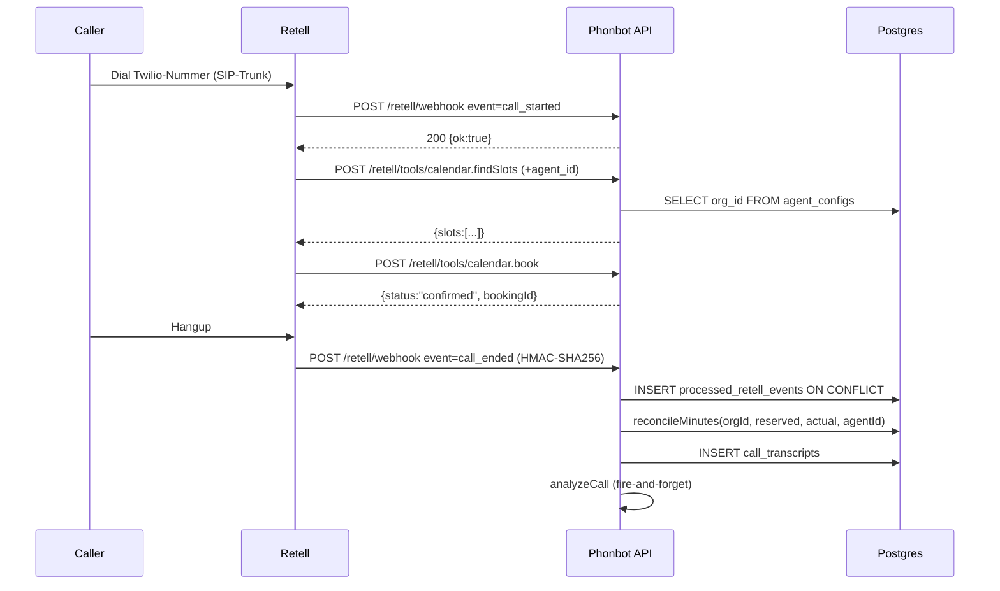
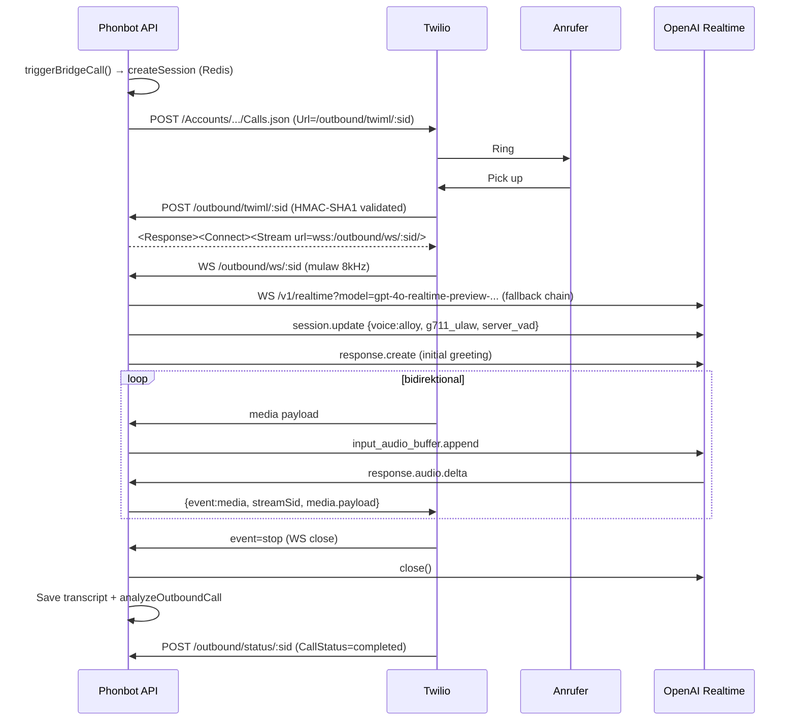

# Backend Voice & Telephony

Dieses Modul kapselt alle Voice-/Telephony-Provider-Integrationen: Retell AI (Agents, LLMs, Numbers, Calls), die direkte Twilio↔OpenAI-Realtime-Bridge (für Outbound-Callbacks ohne Retell) sowie Phone-Number-Provisioning inkl. DACH-Toll-Fraud-Schutz.

## Provider-Übersicht
- **Retell AI** — primärer Voice-Agent-Orchestrator: LLM+Agent+Voice+Number. (`apps/api/src/retell.ts:8`, Base URL `https://api.retellai.com`)
- **Twilio** — Number-Provisioning, SIP-Trunk, Outbound-Dial bei Callback-Flow, Verify-Calls. (`apps/api/src/phone.ts:14`, `apps/api/src/twilio-openai-bridge.ts:14`)
- **OpenAI Realtime** — Direkt-Pfad ohne Retell für `/outbound/*` Callback-Flow (Twilio Stream → wss://api.openai.com/v1/realtime). (`apps/api/src/twilio-openai-bridge.ts:71-78, 97-99`)
- **Cartesia / ElevenLabs / MiniMax / OpenAI / Fish Audio / Platform** — als `voice_provider` bei Retell Voice-Clone (`apps/api/src/retell.ts:277, 281`)
- **"Chipy" Default-Voice** — primär ElevenLabs-Clone (`custom_voice_5269b3f4732a77b9030552fd67`), Cartesia-Original als Rollback-Option (`custom_voice_28bd4920fa6523c6ac8c4e527b`) (`apps/api/src/retell.ts:16-17`, `apps/api/src/voice-catalog.ts:40-41`)

## HTTP-Endpoints

### retell-webhooks.ts (`apps/api/src/retell-webhooks.ts`)

| Method | Path | Auth | Zeile |
| --- | --- | --- | --- |
| POST | `/retell/webhook` | verifyRetellToolRequest (HMAC ODER agent_id-body-match) | L132 |
| POST | `/retell/tools/calendar.findSlots` | verifyRetellToolRequest | L252 |
| POST | `/retell/tools/calendar.book` | verifyRetellToolRequest | L313 |
| POST | `/retell/tools/ticket.create` | verifyRetellToolRequest + strict org lookup | L388 |

### twilio-openai-bridge.ts (`apps/api/src/twilio-openai-bridge.ts`)

| Method | Path | Auth | Zeile |
| --- | --- | --- | --- |
| POST | `/outbound/twiml/:sessionId` | `twilio.validateRequest` (HMAC-SHA1) | L267 |
| POST | `/outbound/status/:sessionId` | `twilio.validateRequest` | L292 |
| GET (WS) | `/outbound/ws/:sessionId` | Session-UUID in Redis/InMem | L323 |

### voices.ts (`apps/api/src/voices.ts`)

| Method | Path | Auth | Zeile |
| --- | --- | --- | --- |
| GET | `/voices` | JWT | L24 |
| GET | `/voices/recommended?language=xx` | JWT | L39 |
| POST | `/voices/clone` | JWT + rateLimit 5/h | L62 |

### phone.ts (`apps/api/src/phone.ts`)

| Method | Path | Auth | Zeile |
| --- | --- | --- | --- |
| GET | `/phone` | JWT | L345 |
| POST | `/phone/provision` | JWT + plan-gate | L360 |
| POST | `/phone/forward` | JWT + rateLimit 10/h + prefix-whitelist | L539 |
| POST | `/phone/twilio/import` | JWT | L604 |
| DELETE | `/phone/:id` | JWT | L653 |
| POST | `/phone/reassign` | JWT + cross-org-hijack guard | L698 |
| POST | `/phone/verify-forwarding` | JWT + rateLimit 5/h + prefix | L756 |
| POST | `/phone/verify` | JWT + rateLimit 10/h + prefix | L836 |
| POST | `/phone/admin/seed-pool` | JWT + `payload.admin` | L894 |
| GET | `/phone/admin/pool` | JWT + `payload.admin` | L935 |

### retell.ts / voice-catalog.ts
Reine SDK-/Helper-Module, keine HTTP-Routen.

## Webhook-Signatur-Verifikation (retell-webhooks.ts)
- **Algorithmus:** HMAC-SHA256 über rawBody mit `RETELL_API_KEY`, Header `x-retell-signature: <hex>` (`retell-webhooks.ts:67-70`)
- **Constant-time compare:** `crypto.timingSafeEqual` mit Length-Guard (`retell-webhooks.ts:73-75`)
- **Hex-Pre-Check:** `/^[0-9a-f]*$/` verhindert Buffer-Allocation-Fehler (`retell-webhooks.ts:64`)
- **rawBody-Capture:** `addContentTypeParser('application/json', { parseAs: 'buffer' })` in `apps/api/src/index.ts:134-149` setzt `req.rawBody = body` (Buffer). Ohne rawBody → `return false` (`retell-webhooks.ts:54-61`)
- **Dev-Bypass:** Nur wenn `RETELL_API_KEY` fehlt UND `ALLOW_UNSIGNED_WEBHOOKS=true` UND `NODE_ENV !== 'production'` (`retell-webhooks.ts:42-44`). Kein NODE_ENV-Bypass mehr.
- **Tool-Endpoints (nicht signature-strict):** `verifyRetellToolRequest` akzeptiert entweder gültige HMAC ODER `_retell_agent_id`/`agent_id` im Body — weil Retell Custom-Function-Calls keinen signierten Header mitschicken. Unknown-Agent wird durch `getOrgIdByAgentId()` später abgefangen (→ 403 bei `ticket.create`). (`retell-webhooks.ts:97-103`)

## Retell-SDK-Oberfläche (retell.ts)

Timeout 15 s auf allen Calls via `AbortSignal.timeout(RETELL_TIMEOUT_MS)` (`retell.ts:27, 37-43`). Voice-Clone hat eigenes 60 s-Timeout (`retell.ts:298`).

| Operation | SDK-Call | Zeile |
| --- | --- | --- |
| LLM erstellen | `POST /create-retell-llm` (model default `gpt-4o-mini`) | L101-108 |
| LLM updaten | `PATCH /update-retell-llm/:llmId` | L124-127 |
| LLM holen | `GET /get-retell-llm/:llmId` | L131 |
| Agent erstellen | `POST /create-agent` (voice_id = DEFAULT_VOICE_ID, language `de-DE`) | L164-175 |
| Agent updaten (sparsamer PATCH) | `PATCH /update-agent/:agentId` | L203-206 |
| Agent holen | `GET /get-agent/:agentId` | L250 |
| Agents listen | `GET /list-agents` | L254 |
| Calls listen (Tenant-Filter) | `POST /v2/list-calls` mit `filter_criteria.agent_id[]` | L237-240 |
| Call holen | `GET /v2/get-call/:callId` | L246 |
| Voices listen | `GET /list-voices` | L272 |
| Voice clonen (FormData) | `POST /clone-voice` | L294-299 |
| Phone-Numbers listen | `GET /list-phone-numbers` | L307 |
| Phone-Number updaten (Agent-Bind) | `PATCH /update-phone-number/:phone_number` | L320-323 |
| Web-Call (Test-Konsole) | `POST /v2/create-web-call` | L335-338 |
| BYOT Register-Call (Twilio-Stream) | `POST /v2/register-call` (`audio_websocket_protocol: 'twilio'`, `mulaw_8000`) | L359-369 |
| Outbound Phone-Call | `POST /v2/create-phone-call` | L392-400 |

Direkte HTTP-Calls (nicht über retell.ts Wrapper) sitzen in `phone.ts`: `POST /import-phone-number` (L224), `POST /create-phone-number` (L253), `PATCH /update-phone-number/...` (L498, L674, L733).

### Agent-Tuning-Defaults
- `interruption_sensitivity`: ENV `RETELL_AGENT_INTERRUPTION_SENSITIVITY` ∈ [0,1], default 1.0 (`retell.ts:139-151`)
- `enable_backchannel`: ENV `RETELL_AGENT_BACKCHANNEL !== 'false'`, default true (`retell.ts:152-154`)
- `enable_dynamic_responsiveness: true` (immer, auch auf Update) (`retell.ts:173, 195`)
- RET-08: `updateAgent` überschreibt tuning params nur, wenn Caller sie explizit setzt (`retell.ts:189-201`)

## Twilio↔OpenAI Bridge (twilio-openai-bridge.ts)

Parallel-Pfad zu Retell: wird (Stand heute) nur vom Phonbot-Website-Callback-Flow + `outbound-agent.ts` genutzt, wenn man NICHT über Retell gehen will. Prompt `CALLBACK_PROMPT` („Chipy", Sales-Skript) ist hardcoded (`twilio-openai-bridge.ts:146-166`).

### Flow
1. Backend ruft `triggerBridgeCall()` → `POST https://api.twilio.com/2010-04-01/Accounts/{sid}/Calls.json` mit `Url = /outbound/twiml/:sessionId` (`twilio-openai-bridge.ts:215-257`)
2. Twilio holt TwiML → Response `<Connect><Stream url="wss://.../outbound/ws/:sessionId"/>` (`twilio-openai-bridge.ts:277-286`)
3. Twilio öffnet WebSocket zu `/outbound/ws/:sessionId` (`twilio-openai-bridge.ts:323`)
4. Server öffnet zweiten WS zu `wss://api.openai.com/v1/realtime?model=...` mit Header `Authorization: Bearer OPENAI_API_KEY` + `OpenAI-Beta: realtime=v1` (`twilio-openai-bridge.ts:97-99`)
5. Model-Fallback-Chain: `OPENAI_REALTIME_MODEL` → `gpt-4o-realtime-preview` → `gpt-4o-mini-realtime-preview` (`twilio-openai-bridge.ts:71-78`, `openRealtimeWithFallback` L91-142)
6. `session.update` mit `voice: 'alloy'`, `input/output_audio_format: 'g711_ulaw'`, `server_vad` turn-detection (`twilio-openai-bridge.ts:370-386`)
7. Initial-Greeting: `response.create` (`twilio-openai-bridge.ts:395`)
8. Audio Twilio→OpenAI: `input_audio_buffer.append` mit media.payload; Puffer `pendingAudio[]` bis `openaiReady` (L443-462)
9. Audio OpenAI→Twilio: `response.audio.delta` → `{event: 'media', streamSid, media: {payload}}` (L410-418)
10. Barge-in: `response.audio_buffer.speech_started` → `{event: 'clear', streamSid}` (L421-425)
11. Transcript-Capture: `response.audio_transcript.done` (Agent) + `conversation.item.input_audio_transcription.completed` (User) in `transcriptParts[]` (L403-408)
12. WS-Close: Transcript-Persist in `outbound_calls.transcript` + Status `'completed'` + `analyzeOutboundCall` (L473-515)

### Session-Store
- Redis-Key `bridge_session:<uuid>` TTL 600 s, Fallback `Map<string, CallSession>` für Dev (`twilio-openai-bridge.ts:181-210`)
- Auth für WS ist Existenz der Session in Redis/InMem (Twilio sendet keinen Origin-Header) (`twilio-openai-bridge.ts:332-336`)
- Twilio-Webhook-Auth: `twilio.validateRequest(authToken, signature, fullUrl, params)` mit X-Forwarded-Proto/Host + `WEBHOOK_BASE_URL` (`twilio-openai-bridge.ts:22-57`). Prod fail-closed wenn `TWILIO_AUTH_TOKEN` fehlt (L27-30).

## Voice-Katalog (voice-catalog.ts)

- `DEFAULT_VOICE_ID` aus `retell.ts:16-17` (ElevenLabs-Chipy oder ENV `RETELL_DEFAULT_VOICE_ID`).
- Kuratierter Per-Sprach-Katalog: `de|en|fr|es|it|tr|pl|nl` (`voice-catalog.ts:38-79`)
- DE-Voices (`voice-catalog.ts:39-47`):
  - **Chipy (Standard, Premium)** — `DEFAULT_VOICE_ID`, ElevenLabs, isDefault, `surchargePerMinute: 0.05` €
  - **Chipy (Cartesia, Standard)** — `custom_voice_28bd4920fa6523c6ac8c4e527b`, Cartesia, kein Surcharge
  - Eva, Lina (Cartesia), Max (MiniMax), Carola (OpenAI), Carola (ElevenLabs)
- Ladevorgang: `getVoicesForLanguage()` (`voice-catalog.ts:96-98`), `getDefaultVoiceForLanguage()` (L85-90), `getVoiceSurcharge()` (L108-116) — iteriert alle Sprachen, gibt Surcharge zurück falls Match.
- API-Exposition: `/voices/recommended` liefert `{ language, defaultVoiceId, voices, allLanguages }` (`voices.ts:39-54`). `/voices` ruft Retell `listVoices()` (alle built-in + cloned, `voices.ts:29`).
- Voice-Clone-Provider-Whitelist: `cartesia|elevenlabs|minimax|fish_audio|platform` (`voices.ts:58`); Cartesia ≈ 0.015 $/min, ElevenLabs ≈ 0.040 $/min.

## phone.ts — DACH-Toll-Fraud-Schutz

- **ALLOWED_PHONE_PREFIXES** (`phone.ts:27-28`): ENV `ALLOWED_PHONE_PREFIXES` oder default `+49,+43,+41` (DACH). Gleiche Default-Liste dupliziert in `demo.ts:279`, `outbound-agent.ts:264, 552`, `tickets.ts:70, 253`.
- **isPhonePrefixAllowed()** (`phone.ts:30-32`): einfaches `startsWith`-Match; genutzt in `/phone/forward` (L556), `/phone/verify-forwarding` (L769), `/phone/verify` (L862).
- **isPlausiblePhone()** (`packages/shared/src/phone.ts:42-62`) — NICHT in `apps/api/src/phone.ts`, sondern im shared-Package.
  - 7 ≤ digits ≤ 15 (E.164) (`shared/phone.ts:45`)
  - `DE_BLOCKED_PREFIXES`: `0137, 0180, 0190, 0900, 0116, 0118, 0700` (`shared/phone.ts:15-19`)
  - `INTL_BLOCKED_PREFIXES`: `+1900, +1976, +44871/2/3, +4470, +4490, +44900, +3308, +39899, +34803/6/7, +4390, +43930, +41901, +41906` (`shared/phone.ts:25-35`)
  - DE-Normalisierung `+49/0049/49 → 0…` (`shared/phone.ts:49-51`); Match sowohl `+`-Form als auch `00`-European-Dial-Form (L57-59)
  - Nutzer: `tickets.ts:58` (pre-insert-check), Tests in `__tests__/phone-validation.test.ts`
- **E.164-Normalisierung / pretty-Format:** `.replace(/^\+49/, '0').replace(/(\d{3})(\d{3})(\d+)/, '$1 $2 $3')` (`phone.ts:123, 328, 485, 920`)
- **tryReserveMinutes-Referenz:** lebt in `apps/api/src/usage.ts:71` — NICHT in diesem Modul. Wird aufgerufen vor jedem Call-Initiate in `agent-config.ts:633` und `outbound-agent.ts:273` (dynamic import). Reconcile nach Call-End: `retell-webhooks.ts:186` (`reconcileMinutes(orgId, DEFAULT_CALL_RESERVE_MINUTES, minutes, agentId)`). Siehe [[Backend-Billing-Usage]].
- **SIP-Trunk (Retell-Import):** `SIP_TRUNK_USERNAME` + `SIP_TRUNK_PASSWORD` + `SIP_TERMINATION_URI` alle Pflicht-Envs in Prod, sonst `throw` (`phone.ts:217-221, 232-236`). Kein Default-Trunk mehr hartkodiert → kein Inbound-Hijack.
- **Pool-Mechanik:** `MAX_POOL_SIZE = 3` (`phone.ts:86`), atomarer Claim mit `FOR UPDATE SKIP LOCKED` (`phone.ts:418-431`), Redis-Locks `phone:twilio-sync-lock` (L104) und `phone:trim-lock` (L157).

## Webhook-Event-Typen (retell-webhooks.ts)

`/retell/webhook` unterscheidet via `body.event` oder `body.call.call_status`:

| Event | Handler-Aktion | DB-Tabelle | Zeile |
| --- | --- | --- | --- |
| `call_ended` | Dedup via `processed_retell_events` (UNIQUE call_id) → reconcileMinutes + Transcript-Insert + analyzeCall/analyzeOutboundCall | `processed_retell_events` (dedup, L160-166), `orgs.minutes_used` via `reconcileMinutes` (L186), `call_transcripts` ON CONFLICT call_id (L207-223) | L148-243 |
| `call_started`, `call_analyzed`, andere | kein expliziter Handler — return `{ok: true}` | — | — |

`/retell/tools/calendar.findSlots`: Tenant via `getOrgIdByAgentId` → `findFreeSlots(orgId, …)`, Fallback Demo-Slots. Tabellen: `agent_configs` (für Org-Lookup), `calendar_connections` (siehe [[Backend-Calendar]]). Zeile L252-310.

`/retell/tools/calendar.book`: Tenant-Lookup → `bookSlot(orgId, …)`, Fallback Demo-Confirmation. Zeile L313-385.

`/retell/tools/ticket.create`: **strict** — Unknown-Agent → 403 (kein Demo-Fallback). Ruft `createTicket` + optional `triggerCallback` (für `sofort|jetzt|asap|…` Wünsche). Zeile L388-476.

## DB-Zugriffe

Direkte Writes in diesem Modul:
- `processed_retell_events` — Idempotency-Gate für call_ended (`retell-webhooks.ts:161-166`). Siehe [[Backend-Database]].
- `call_transcripts` — ON CONFLICT call_id DO NOTHING (`retell-webhooks.ts:208-223`)
- `outbound_calls` — Status + Transcript (`twilio-openai-bridge.ts:307-310, 488-491, 493-496`)
- `phone_numbers` — CRUD inkl. Pool (`phone.ts:36-83, 124-129, 186-189, 328-334, 417-431, 521-531, 576-581, 638-643, 682-691, 720-725, 744-747, 775, 822-824, 855-857, 868, 879-883, 920-925`)
- `agent_configs` — Reads für `retellAgentId`-Lookup (`phone.ts:286, 399-402, 410-413, 628-631, 719-722`)
- `orgs` — Plan/Status-Check (`phone.ts:365-369`)

Siehe [[Backend-Database]] für Migrationen.

## Eingehende / Ausgehende Referenzen (grep)

**Wer triggert Retell-Calls?**
- `agent-config.ts:9-14` importiert `createLLM/updateLLM/createAgent/updateAgent/createWebCall/listCalls` → Agent-Build + Test-Konsole + Call-History UI
- `demo.ts:8` importiert `createWebCall, createLLM, createAgent, createPhoneCall, updatePhoneNumber, DEFAULT_VOICE_ID` → Demo-Agent + Demo-Callback
- `outbound-agent.ts:624` (dynamic import) `createPhoneCall` → Outbound-Sales-Calls („Uses Retell createPhoneCall directly (same as demo/callback) for reliability." L521)
- `insights.ts:366` + `learning-api.ts:275` + `outbound-insights.ts:20` → `updateLLM` (LLM-Prompt-Updates aus Learning-System)
- `voices.ts:11` → `listVoices + createVoice`

**Wer triggert phone-Utils?**
- `index.ts:22, 194` → `registerPhone(app)` + `migratePhone` + `syncTwilioNumbersToDb` (Boot)
- `isPlausiblePhone` nur in `tickets.ts:4, 58` + Tests
- `ALLOWED_PHONE_PREFIXES`-Duplikate: `demo.ts:279`, `outbound-agent.ts:264, 552`, `tickets.ts:70, 253` (→ Refactor-Kandidat: zentrale Util)
- `triggerBridgeCall` (twilio-openai-bridge): `agent-config.ts:426`, `outbound-agent.ts:331`

**Wer triggert tryReserveMinutes?**
- `agent-config.ts:6, 633` (web-call init)
- `outbound-agent.ts:272-273` (dynamic import, outbound-call init)
- reconcileMinutes-Aufruf: `retell-webhooks.ts:16, 186` (call_ended)

## Verbundene Notes
- [[Backend-Agents]] — agent-config.ts Build-/Deploy-Flow nutzt `createLLM`/`createAgent`/`updateAgent`/`createWebCall`
- [[Backend-Outbound]] — outbound-agent.ts nutzt `triggerBridgeCall` + `createPhoneCall`
- [[Backend-Billing-Usage]] — `tryReserveMinutes` + `reconcileMinutes` + `getVoiceSurcharge`
- [[Backend-Database]] — phone_numbers / call_transcripts / processed_retell_events / outbound_calls
- [[Backend-Calendar]] — Tool-Endpoints calendar.findSlots + calendar.book
- [[Backend-Learning]] — analyzeCall / analyzeOutboundCall / updateLLM-Loop

## Mermaid Call-Flow — Inbound (Retell)

## Mermaid Call-Flow — Outbound Callback (Twilio↔OpenAI Bridge, ohne Retell)

---

## Verwandt

- [[Phonbot/Phonbot-Gesamtsystem|🧭 Gesamtsystem]] · [[Phonbot/Overview|Phonbot Overview]]
- **Ruft auf:** [[Backend-Agents]] (Agent-Config + Tool-Loop), [[Backend-Billing-Usage]] (`reconcileMinutes`, Surcharge für Premium-Voices), [[Backend-Comm-Scheduling]] (Retell-Tool `calendar.*`), [[Backend-Database]] (`processed_retell_events`, `call_transcripts`), [[Backend-Insights-Admin]] (`analyzeCall → call_analyses`)
- **Frontend:** [[Frontend-Pages]] (TestConsole, WebCallWidget, OwlyDemoModal, PhoneManager, CallLog)
- **Outbound-Variante:** [[Backend-Outbound]] (`outbound-agent.ts` nutzt gleichen Twilio-Bridge)
- **Findings:** [[Audit-2026-04-18-Deep]] C3 (Twilio Webhook-Signatur — behoben), [[Audit-2026-04-18-Bugs]] C4 (call_ended Idempotency — behoben), [[Audit-2026-04-18-Bugs]] C5 (OpenAI Preview-Model Sunset-Risk), [[Audit-2026-04-18-Final]] H3 (Phone-Pool Backoff)
- **Ideen:** [[Ideas/Chipy Voice-Varianten]] (Voice-Charakter-Strategie)
