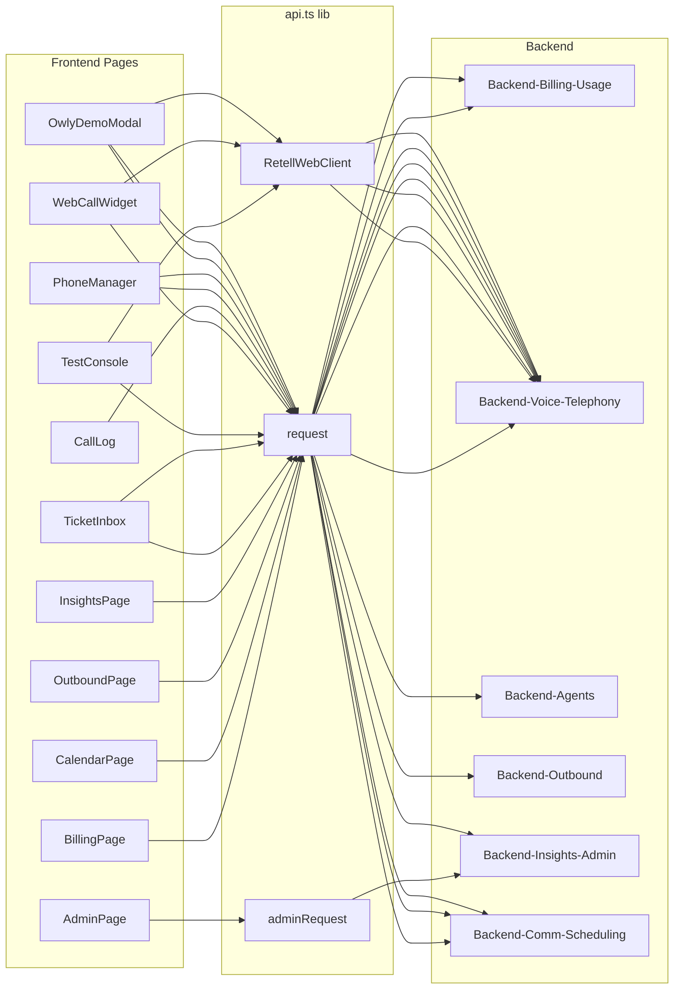

# Frontend-Pages

Feature-Seiten des Phonbot-Webclients. Alle unter `apps/web/src/ui/*`, geladen via Page-State in `App.tsx` (kein Router). Datenverkehr laeuft durch `apps/web/src/lib/api.ts` -> `request<T>()` (access-JWT in-memory, refresh als httpOnly cookie).

## Scope

- BillingPage, CalendarPage, AdminPage, OutboundPage, InsightsPage, TicketInbox, TestConsole, WebCallWidget, CallLog, PhoneManager, OwlyDemoModal.
- Admin laeuft auf getrenntem Token (`_adminToken` / `adminRequest()` in `api.ts:798-817`).
- Web-Call SDK: `retell-client-js-sdk` (in `TestConsole`, `WebCallWidget`, `OwlyDemoModal`).

---

## BillingPage

- **File:** `apps/web/src/ui/BillingPage.tsx` (297 Zeilen)
- **Zweck:** Plan-Uebersicht + Stripe-Checkout-Trigger + Billing-Portal (`BillingPage.tsx:54-297`).
- **Flow-Highlight:** URL-Query `?success` / `?canceled` nach Stripe-Rueckkehr -> Flash-Banner (`BillingPage.tsx:56-65`).

### api.ts-Aufrufe

| Frontend-Funktion | Endpoint | Backend-Modul |
|---|---|---|
| `getBillingPlans` | `GET /billing/plans` | [[Backend-Billing-Usage]] |
| `getBillingStatus` | `GET /billing/status` | [[Backend-Billing-Usage]] |
| `createCheckoutSession(planId, interval)` | `POST /billing/checkout` | [[Backend-Billing-Usage]] (Stripe) |
| `createPortalSession()` | `POST /billing/portal` | [[Backend-Billing-Usage]] (Stripe Portal) |

### States / Hooks

- `useQuery(['billing'])` parallel fetch von Status + Plans (`BillingPage.tsx:68-74`).
- `useState` fuer `actionLoading`, `flash`, `billingInterval` (`BillingPage.tsx:55-66`).

### Sub-Komponenten

- `UsageBar` (`BillingPage.tsx:21-36`) - prozentualer Minuten-Verbrauchsbalken.
- `PlanBadge` (`BillingPage.tsx:38-52`) - Status-Chip (active/trialing/past_due/canceled/free).
- Nummer-Row als Mini-Card unterhalb der 3-col Plans (`BillingPage.tsx:270-288`).

---

## CalendarPage

- **File:** `apps/web/src/ui/CalendarPage.tsx` (1158 Zeilen)
- **Zweck:** Drei Tabs - Kalender (Monatsansicht), Verfuegbarkeit (Wochenplan + Sperren), Verbindungen (Google/Microsoft/Cal.com + Chipy) (`CalendarPage.tsx:921-1158`).
- **Top-15 Funktionen (Zeilen):**
  1. `BookingModal` - Termin-Create-Form (`:50-137`)
  2. `DayDrawer` - Tages-Detail mit Bookings/Blocks + Zeitblock-Form (`:141-323`)
  3. `MonthlyCalendar` - Monats-Grid, Tages-Klassifikation (`:327-448`)
  4. `SettingsPanel` - Wochen-Schedule + Block-Ranges (`:467-700`)
  5. `ConnectionsPanel` - Provider-OAuth/API-Key UI (`:704-919`)
  6. `CalendarPage` - Tabs, State, Modal-Orchestrierung (`:925-1158`)
  7. `loadChipy()` - parallel `getChipyCalendar` + 3-Monats-Buchungsfenster (`:940-955`)
  8. `handleDeleteBooking()` (`:959-966`)
  9. `handleAddBlock(date, opts)` (`:968-981`)
  10. `handleBookingSaved()` (`:983-987`)
  11. `handleAddRange()` - Block pro Tag im Zeitraum (`:509-527`)
  12. `handleAddHoursBlock()` - Stundenblock (`:529-543`)
  13. `handleVerifyForwarding()` (Nur in PhoneManager, nicht hier)
  14. `isoDate()` / `getDaysInMonth()` / `formatTime()` Helper (`:15-35`)
  15. OAuth-Popup `postMessage`-Listener in `ConnectionsPanel` (`:733-742`)

### api.ts-Aufrufe

| Frontend-Funktion | Endpoint | Backend-Modul |
|---|---|---|
| `getCalendarStatus` | `GET /calendar/status` | [[Backend-Comm-Scheduling]] |
| `connectCalcom(apiKey)` | `POST /calendar/calcom/connect` | [[Backend-Comm-Scheduling]] |
| `disconnectCalendar` | `DELETE /calendar/disconnect` | [[Backend-Comm-Scheduling]] |
| `getGoogleCalendarAuthUrl` | `GET /calendar/google/auth-url` | [[Backend-Comm-Scheduling]] |
| `getMicrosoftCalendarAuthUrl` | `GET /calendar/microsoft/auth-url` | [[Backend-Comm-Scheduling]] |
| `getChipyCalendar` | `GET /calendar/chipy` | [[Backend-Comm-Scheduling]] |
| `saveChipySchedule(schedule)` | `PUT /calendar/chipy` | [[Backend-Comm-Scheduling]] |
| `addChipyBlock(date, opts)` | `POST /calendar/chipy/block` | [[Backend-Comm-Scheduling]] |
| `removeChipyBlock(id)` | `DELETE /calendar/chipy/block/:id` | [[Backend-Comm-Scheduling]] |
| `getChipyBookings(from, to)` | `GET /calendar/chipy/bookings` | [[Backend-Comm-Scheduling]] |
| `createChipyBooking(data)` | `POST /calendar/chipy/bookings` | [[Backend-Comm-Scheduling]] |
| `deleteChipyBooking(id)` | `DELETE /calendar/chipy/bookings/:id` | [[Backend-Comm-Scheduling]] |

### States / Hooks

- Shared: `schedule`, `blocks`, `bookings`, `calendarStatus`, `selectedDay`, `showAddBooking` (`:927-938`).
- `useCallback(loadChipy)` verhindert Loops (`:940-955`).
- OAuth-Return via URL-Query `calendarConnected` / `calendarError` + `postMessage` vom Popup (`:722-743`).

### Sub-Komponenten

`BookingModal`, `DayDrawer`, `MonthlyCalendar`, `SettingsPanel`, `ConnectionsPanel`, `FoxLogo` (fuer Chipy-Brand-Card).

---

## AdminPage

- **File:** `apps/web/src/ui/AdminPage.tsx` (574 Zeilen)
- **Zweck:** Owner-CRM - Overview/Leads/Users-Tabs, Passwort-Gate, in-memory Token (`AdminPage.tsx:504-574`).
- **Security:** Admin-Token **nie** in localStorage (`AdminPage.tsx:64-67`). Login pro Tab noetig.

### api.ts-Aufrufe (alle ueber `adminRequest` mit Bearer-Token)

| Frontend-Funktion | Endpoint | Backend-Modul |
|---|---|---|
| `adminLogin(password)` | `POST /admin/login` | [[Backend-Insights-Admin]] |
| `adminGetMetrics()` | `GET /admin/metrics` | [[Backend-Insights-Admin]] |
| `adminGetLeads({status, limit, offset})` | `GET /admin/leads` | [[Backend-Insights-Admin]] |
| `adminUpdateLead(id, {status, notes})` | `PATCH /admin/leads/:id` | [[Backend-Insights-Admin]] |
| `adminDeleteLead(id)` | `DELETE /admin/leads/:id` | [[Backend-Insights-Admin]] |
| `adminGetUsers()` | `GET /admin/users` | [[Backend-Insights-Admin]] |
| `adminGetOrgs()` | `GET /admin/orgs` | [[Backend-Insights-Admin]] |

### States / Hooks

- `isAuthed = !!getAdminToken()` (in-memory, `:505`).
- Pro Tab: `useEffect` fetch + `useState` fuer Leads/Users/Orgs/Metrics.
- `matchesSearch()` Case-insensitive Multi-Term-Filter (`:43-48`).

### Sub-Komponenten

`AdminLogin` (`:52-113`), `OverviewTab` (`:129-170`), `LeadsTab` (`:188-355`), `UsersTab` (`:359-490`), `StatCard`, `SearchInput`, `LoadingSpinner`.

---

## OutboundPage

- **File:** `apps/web/src/ui/OutboundPage.tsx` (362 Zeilen)
- **Zweck:** Outbound-Sales Dashboard - Stats, Call-Liste, Anruf-Starter-Form, AI-Prompt-Verbesserungsvorschlaege (`OutboundPage.tsx:33-362`).
- **Tabs:** `dashboard` | `call` | `suggestions` (`:16`).

### api.ts-Aufrufe

| Frontend-Funktion | Endpoint | Backend-Modul |
|---|---|---|
| `triggerSalesCall(to, name, campaign, context)` | `POST /outbound/call` | [[Backend-Outbound]] |
| `getOutboundCalls()` | `GET /outbound/calls` | [[Backend-Outbound]] |
| `getOutboundStats()` | `GET /outbound/stats` | [[Backend-Outbound]] |
| `getOutboundSuggestions()` | `GET /outbound/suggestions` | [[Backend-Outbound]] |
| `applyOutboundSuggestion(id)` | `POST /outbound/suggestions/:id/apply` | [[Backend-Outbound]] |
| `rejectOutboundSuggestion(id)` | `POST /outbound/suggestions/:id/reject` | [[Backend-Outbound]] |
| `updateOutboundOutcome(callId, outcome)` | `POST /outbound/call/:callId/outcome` | [[Backend-Outbound]] |

### States / Hooks

- `calls`, `stats`, `suggestions`, `loading`, `error`, `timerRef` (`:35-42`).
- Call-Form-State: `toNumber`, `contactName`, `campaign`, `campaignContext`, `calling`, `callResult` (`:45-50`).
- Nach Call: `setTimeout(load, 3000)` um frische Liste zu laden (`:82`).

### Sub-Komponenten

`ScoreBadge` (`:27-31`), Outcome-Dropdown inline in Call-Row (`:212-221`).

---

## InsightsPage

- **File:** `apps/web/src/ui/InsightsPage.tsx` (578 Zeilen)
- **Zweck:** KI-Insights ueber Call-Analysen + Prompt-Evolution mit A/B-Tests und Rollback (`InsightsPage.tsx:322-578`).

### api.ts-Aufrufe

| Frontend-Funktion | Endpoint | Backend-Modul |
|---|---|---|
| `getInsights()` | `GET /insights` | [[Backend-Insights-Admin]] |
| `applyInsightSuggestion(id)` | `POST /insights/suggestions/:id/apply` | [[Backend-Insights-Admin]] |
| `rejectInsightSuggestion(id)` | `POST /insights/suggestions/:id/reject` | [[Backend-Insights-Admin]] |
| `restorePromptVersion(id)` | `POST /insights/versions/:id/restore` | [[Backend-Insights-Admin]] |
| `triggerConsolidation()` | `POST /insights/consolidate` | [[Backend-Insights-Admin]] |

### States / Hooks

- `data` (`InsightsData`), `loading`, `error`, `consolidating` (`:323-326`).
- `useMemo` split: `pending` + `applied` Suggestions (`:362-363`).

### Sub-Komponenten

`ScoreBadge` (`:34-44`), `ScoreBar` (`:46-57`), `SuggestionCard` (`:59-149`), `AbTestCard` (`:151-218`), `CallCard` (Accordion, `:220-277`), `VersionCard` (`:287-320`).

---

## TicketInbox

- **File:** `apps/web/src/ui/TicketInbox.tsx` (251 Zeilen)
- **Zweck:** Ticket-Liste mit Status-Filter + Callback-Trigger per Ticket (`TicketInbox.tsx:17-251`).

### api.ts-Aufrufe

| Frontend-Funktion | Endpoint | Backend-Modul |
|---|---|---|
| `getTickets(limit=50)` | `GET /tickets` | [[Backend-Comm-Scheduling]] |
| `updateTicketStatus(id, status)` | `PATCH /tickets/:id` | [[Backend-Comm-Scheduling]] |
| `triggerTicketCallback(id)` | `POST /tickets/:id/callback` | [[Backend-Voice-Telephony]] |

### States / Hooks

- `tickets`, `filter` (`'all' | 'open' | 'assigned' | 'done'`), `page`, `PAGE_SIZE=20` (`:18-22`).
- TicketCard-lokal: `calling`, `callResult`, `callError` (`:141-143`).

### Sub-Komponenten

`TicketCard` (`:134-240`), `StatusButton` (`:242-250`), `EmptyState` (shared).

---

## TestConsole

- **File:** `apps/web/src/ui/TestConsole.tsx` (392 Zeilen)
- **Zweck:** Dev-Tool fuer Live-Webcall mit deployed Agents + Live-Transkript (`TestConsole.tsx:17-354`).

### Token / Form / API

- **Token:** `res.access_token` von `createWebCall(tenantId)` (`TestConsole.tsx:67, 79`) -> gereicht an `RetellWebClient.startCall({ accessToken })` (`:129`).
- **Form:** Keine klassische Form - Agent-Selector (Liste aus `getAgentConfigs`), Start/Stop-Buttons (`:174-224`, `:239-304`).
- **API-Calls:**

| Frontend-Funktion | Endpoint | Backend-Modul |
|---|---|---|
| `getAgentConfigs()` | `GET /agent-configs` | [[Backend-Agents]] |
| `createWebCall(tenantId)` | `POST /agent-config/web-call` | [[Backend-Voice-Telephony]] (Retell) |

### RetellWebClient-Events

- `call_started`, `call_ended`, `agent_start_talking`, `agent_stop_talking`, `update` (Transkript), `error` (`:86-127`).
- Error-Codes behandelt: `USAGE_LIMIT_REACHED`, `AGENT_NOT_DEPLOYED` (`:69-73`).

### States / Hooks

- `config` (ausgewaehlter Agent), `allAgents`, `callState` (`idle|connecting|active|error`), `agentTalking`, `seconds` (Timer), `logs` (`:18-23`).
- `clientRef`, `timerRef`, `endRef` fuer Auto-Scroll-Transkript (`:24-26`).

### Sub-Komponenten

`LogBubble` (`:356-392`) - User/Agent/System-Chat-Bubbles.

---

## WebCallWidget

- **File:** `apps/web/src/ui/WebCallWidget.tsx` (158 Zeilen)
- **Zweck:** Schlanker Web-Call-Button fuer Embeds / Secondary-UI (`WebCallWidget.tsx:7-158`).

### retell-client-js-sdk Nutzung

- Import `RetellWebClient` (`WebCallWidget.tsx:2`).
- `new RetellWebClient()` bei Start (`:29`).
- Events: `call_started` (`:31`), `call_ended` (`:35`), `agent_start_talking` (`:41`), `agent_stop_talking` (`:42`), `error` (`:43`).
- `client.startCall({ accessToken: res.access_token })` (`:49`).
- `client.stopCall()` bei Unmount + Stop (`:17, 57`).

### api.ts-Aufrufe

| Frontend-Funktion | Endpoint | Backend-Modul |
|---|---|---|
| `createWebCall(agentTenantId?)` | `POST /agent-config/web-call` | [[Backend-Voice-Telephony]] |

### States / Hooks

- `state`, `error`, `agentTalking`, `seconds`, `clientRef`, `timerRef` (`:8-13`).

---

## CallLog

- **File:** `apps/web/src/ui/CallLog.tsx` (185 Zeilen)
- **Zweck:** Call-History mit Detail-Panel (Transkript + Recording-Audio-Player) (`CallLog.tsx:28-185`).

### api.ts-Aufrufe

| Frontend-Funktion | Endpoint | Backend-Modul |
|---|---|---|
| `getCalls()` | `GET /calls` | [[Backend-Voice-Telephony]] (Retell-Proxy) |
| `getCall(callId)` | `GET /calls/:callId` | [[Backend-Voice-Telephony]] |

### States / Hooks

- `calls`, `selectedCall`, `detailLoading`, `page`, `PAGE_SIZE=20` (`:29-34`).
- Lazy-Detail: `openDetail(id)` fetcht `/calls/:id` on click (`:53-63`).

### Sub-Komponenten

Keine eigenen - nur lokale `formatDuration` / `formatTime` + inline Detail-Card.

---

## PhoneManager

- **File:** `apps/web/src/ui/PhoneManager.tsx` (465 Zeilen)
- **Zweck:** Phone-Number-CRUD, Agent-Zuordnung, Rufumleitungs-Onboarding mit Carrier-Codes, Auto-Upsell bei fehlendem Plan (`PhoneManager.tsx:299-465`).

### Phone-Number-CRUD

- **List:** `useQuery(['phone-manager'])` parallel `getPhoneNumbers` + `getAgentConfigs` (`:302-308`).
- **Create:** `handleProvision(agentTenantId?)` -> `provisionPhoneNumber` (`:319-331`); bei >1 Agent erst `AgentSelector` (`:277-295, :333-339`).
- **Delete:** `handleDelete(phoneId)` -> `deletePhoneNumber` (`:341-344`) + inline Confirm in `NumberCard` (`:132-141`).
- **Reassign Agent:** `handleChangeAgent(newAgentTenantId)` -> `reassignPhoneAgent` (`:55-67`).
- **Verify:** `handleVerify(phoneId)` -> `verifyPhoneNumber` (`:346-349`).
- **Verify Forwarding:** `handleVerifyForwarding()` -> `verifyForwarding(customerNumber, num.id)` nach Nummer-Normalisierung (0176... -> +49176...) (`:75-94`).

### Retell-Anbindung

- Keine direkte Retell-SDK-Nutzung hier. Stattdessen ruft `provisionPhoneNumber` serverseitig die Retell/Twilio-APIs ab und liefert die fertige Nummer plus Agent-Binding zurueck.
- Agent-Mapping UI: `num.agent_id` wird gegen `agents[].retellAgentId` verglichen (`:49-53`).

### api.ts-Aufrufe

| Frontend-Funktion | Endpoint | Backend-Modul |
|---|---|---|
| `getPhoneNumbers()` | `GET /phone` | [[Backend-Voice-Telephony]] |
| `getAgentConfigs()` | `GET /agent-configs` | [[Backend-Agents]] |
| `provisionPhoneNumber(agentTenantId?)` | `POST /phone/provision` | [[Backend-Voice-Telephony]] (Retell+Twilio) |
| `verifyPhoneNumber(phoneId)` | `POST /phone/verify` | [[Backend-Voice-Telephony]] |
| `deletePhoneNumber(id)` | `DELETE /phone/:id` | [[Backend-Voice-Telephony]] |
| `reassignPhoneAgent(phoneId, tenantId)` | `POST /phone/reassign` | [[Backend-Voice-Telephony]] |
| `verifyForwarding(customerNumber, phoneId)` | `POST /phone/verify-forwarding` | [[Backend-Voice-Telephony]] |
| `createCheckoutSession('nummer','month')` | `POST /billing/checkout` | [[Backend-Billing-Usage]] (Upsell) |

### Sub-Komponenten

`CopyButton` (`:20-29`), `NumberCard` (`:33-273`), `AgentSelector` (`:277-295`).

### Carrier-Codes Flow

Zwei Schritte in `NumberCard`: Step 1 Kundennummer eingeben (`:175-187`), Step 2 Code-Liste (Nichtannahme, Besetzt, Immer) + Verify-Call (`:189-269`). Codes: `**61*...#` / `**67*...#` / `**21*...#` / `##002#`.

---

## OwlyDemoModal

- **File:** `apps/web/src/ui/OwlyDemoModal.tsx` (342 Zeilen) - Datei heisst "Owly" historisch, Maskottchen ist jetzt "Chipy" (Kommentar `:1`).
- **Zweck:** Public-Landing-Demo - Web-Call zu Demo-Agenten pro Branche ODER Callback-Form (`OwlyDemoModal.tsx:32-342`).

### Oeffentlicher Demo-Flow

- 6 Demo-Templates (Friseur, Handwerker, Arzt, Reinigung, Restaurant, Auto) (`:18-25`).
- User klickt Template -> `startWebCall(templateId)` -> `createDemoCall(templateId)` (`:49-69`).
- Antwort enthaelt `access_token` -> `new RetellWebClient().startCall({ accessToken })` (`:57-64`).
- Kein Auth, kein Account.

### Backend-Endpoint

| Frontend-Funktion | Endpoint | Backend-Modul |
|---|---|---|
| `createDemoCall(templateId, turnstileToken?)` | `POST /demo/call` | [[Backend-Voice-Telephony]] (Demo, rate-limited, Turnstile-protected) |
| `fetch('/api/demo/callback', ...)` raw (kein api.ts Wrapper) | `POST /demo/callback` | [[Backend-Comm-Scheduling]] (Callback-Lead) |

Hinweis: `createDemoCall` besitzt einen optionalen Turnstile-Token-Parameter (`api.ts:286-291`), wird im Modal aktuell ohne Token aufgerufen. Backend ist laut CLAUDE.md `/demo/*` CAPTCHA-protected (Cloudflare Turnstile, prod fail-closed).

### States / Hooks

- `tab` (`'webcall' | 'callback'`), `selectedTemplate`, `callState`, `agentTalking`, `callError`, `clientRef` (`:33-40`).
- Callback-Form: `cbName`, `cbEmail`, `cbPhone`, `cbSent`, `cbLoading` (`:43-47`).

### Sub-Elemente

Template-Grid (`:171-187`), Connecting/Active/Ended/Error-States (`:193-284`), Callback-Form (`:296-317`), Success-View mit `onGoToRegister`-Call-to-Action (`:321-334`).

---

## Cross-Layer Map (Frontend -> Backend)

| Frontend-Page | Primaerer Backend-Namespace |
|---|---|
| BillingPage | `/billing/*` -> [[Backend-Billing-Usage]] |
| CalendarPage | `/calendar/*`, `/calendar/chipy/*` -> [[Backend-Comm-Scheduling]] |
| AdminPage | `/admin/*` -> [[Backend-Insights-Admin]] |
| OutboundPage | `/outbound/*` -> [[Backend-Outbound]] |
| InsightsPage | `/insights/*` -> [[Backend-Insights-Admin]] |
| TicketInbox | `/tickets/*` + `/tickets/:id/callback` -> [[Backend-Comm-Scheduling]] + [[Backend-Voice-Telephony]] |
| TestConsole | `/agent-configs`, `/agent-config/web-call` -> [[Backend-Agents]] + [[Backend-Voice-Telephony]] |
| WebCallWidget | `/agent-config/web-call` -> [[Backend-Voice-Telephony]] |
| CallLog | `/calls`, `/calls/:id` -> [[Backend-Voice-Telephony]] |
| PhoneManager | `/phone/*` + `/billing/checkout` -> [[Backend-Voice-Telephony]] + [[Backend-Billing-Usage]] |
| OwlyDemoModal | `/demo/call`, `/demo/callback` -> [[Backend-Voice-Telephony]] (public) |

---

## Eingehende / Ausgehende Referenzen

### Eingehend (wer importiert diese Pages?)

- `apps/web/src/App.tsx` - Page-State-Switcher (kein Router), lazy-imports aller Pages.
- `apps/web/src/ui/TestConsole.tsx` akzeptiert `onNavigate` von App -> kann zu `agent` navigieren.
- `apps/web/src/ui/PhoneManager.tsx` akzeptiert `onNavigate` -> springt zu `billing` bei Upsell-Fallback.
- `apps/web/src/ui/OwlyDemoModal.tsx` akzeptiert `onGoToRegister` aus Landing Page.

### Ausgehend (was importieren die Pages?)

- `../lib/api.ts` - Alle HTTP-Calls (siehe Tabellen oben).
- `../components/ui.js` - Shared `SkeletonCard`, `EmptyState`, `Card`, `Button`, `StatusBadge`, `PageHeader`.
- `./PhonbotIcons.js` - Custom SVG-Icon-Set.
- `./FoxLogo.js` - Chipy-Maskottchen-SVG.
- `retell-client-js-sdk` - `RetellWebClient` (nur in TestConsole, WebCallWidget, OwlyDemoModal).
- `@tanstack/react-query` - `useQuery` / `useQueryClient` in BillingPage + PhoneManager.

---

## Verbundene Notes

- [[Frontend-Shell]] - Auth, Layout, App-Routing, api.ts-Client
- [[Backend-Agents]] - `/agent-configs`, `/agent-config/*`
- [[Backend-Voice-Telephony]] - `/phone/*`, `/agent-config/web-call`, `/demo/call`, `/calls/*`, Retell-Integration
- [[Backend-Outbound]] - `/outbound/*`
- [[Backend-Billing-Usage]] - `/billing/*`, Stripe-Integration
- [[Backend-Insights-Admin]] - `/insights/*`, `/admin/*`
- [[Backend-Comm-Scheduling]] - `/calendar/*`, `/tickets/*`, `/demo/callback`

---

## Mermaid

---

## Verwandt

- [[Phonbot/Phonbot-Gesamtsystem|🧭 Gesamtsystem]] · [[Phonbot/Overview|Phonbot Overview]]
- **Shell + Infrastruktur:** [[Frontend-Shell]] (api.ts, auth.tsx, Sidebar, LegalModal, CookieBanner)
- **Backend-Counterparts:** [[Backend-Agents]] · [[Backend-Voice-Telephony]] · [[Backend-Outbound]] · [[Backend-Billing-Usage]] · [[Backend-Insights-Admin]] · [[Backend-Comm-Scheduling]]
- **Findings:** [[Audit-2026-04-18-Deep]] M7-M8 (302 useState, OnboardingWizard 1159 LOC), [[Phonbot/Phonbot-Gesamtsystem]] §10 LOW#17 (OutboundPage auskommentiert)
- **Tasks:** [GH#9 Admin Pagination](https://github.com/haskallalk-eng/voice-agent-phonbot/issues/9)
