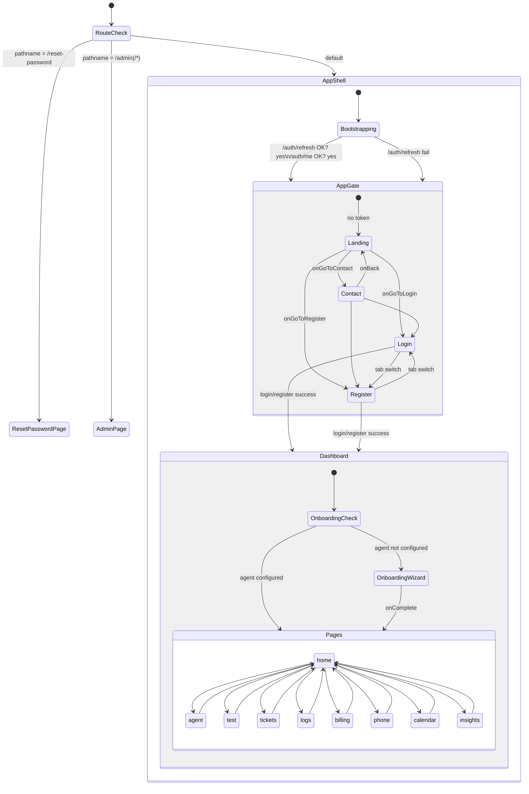

# Frontend-Shell

Die gesamte App-Shell der Phonbot-Web-App: Bootstrapping, Auth-Provider, Token-Handling, API-Helper, Navigation (Page-State, **kein React Router** — CLAUDE.md §10), Sidebar, Dashboard-Home, Login/Reset, UI-Kit (Button/Modal/Card), Chipy-Maskottchen (FoxLogo + Copilot + Guide), Cookie-Banner, Legal-Modal, Turnstile, Connection-Status.

## CLAUDE.md §10 — Frontend Patterns (Referenz)

Quelle: `CLAUDE.md:92-99`. Die Shell implementiert exakt diese Regeln:

1. Alle API-Calls ueber `apps/web/src/lib/api.ts` -> `request<T>()` Helper (CLAUDE.md:93).
2. Access JWT **nur im Speicher** (`_accessToken` module-scope in `api.ts`, sync via `setAccessToken()` vom `AuthProvider`); niemals in `localStorage` (CLAUDE.md:94, F-01/F-02).
3. Refresh Token = `httpOnly` Cookie `vas_refresh` (path=/auth, sameSite=strict). Bootstrap: `POST /auth/refresh` -> frischer Access JWT (CLAUDE.md:95).
4. Dark Theme `bg-[#0a0a12]` Basis + Glass `bg-white/5 backdrop-blur-xl border border-white/10` (CLAUDE.md:96).
5. Brand Orange (`#F97316`, `#FB923C`), kein Indigo/Lila (CLAUDE.md:97).
6. Chipy = goldener Hamster in `FoxLogo.tsx` (CLAUDE.md:98).
7. Navigation = Page-State in `App.tsx`, **kein React Router** (CLAUDE.md:99).

> [!info] Leichte Abweichung vom §10-Text
> CLAUDE.md:96 nennt `bg-[#0a0a12]` — der Code verwendet durchgaengig `bg-[#0A0A0F]` (`apps/web/src/ui/App.tsx:L187`, `apps/web/src/ui/LoginPage.tsx:L65`, `apps/web/src/ui/ResetPasswordPage.tsx:L32`, usw.). Visuelles Delta gering (fast-schwarz), semantisch identisch.

---

## 1. `apps/web/src/main.tsx` (67 Zeilen)

React-Entry-Point + optionale Sentry-Init.

- `apps/web/src/main.tsx:L4` importiert `App` aus `./ui/App.js`.
- `apps/web/src/main.tsx:L10-12` Sentry nur wenn `VITE_SENTRY_DSN` gesetzt UND `localStorage['phonbot_cookie_consent'] === 'accepted'` (**nur mit Cookie-Consent** — DSGVO-konform).
- `apps/web/src/main.tsx:L25-48` `beforeSend`-Hook: strippt `authorization`/`cookie`/`x-api-key`-Header, request bodies, `event.user` auf `{id}` reduziert, Breadcrumb `body/request_body/response_body/cookies` gedroppt -> mirror des Backend-PII-Filters.
- `apps/web/src/main.tsx:L50-60` dynamischer Import von `@sentry/react` (vermeidet Bundle-Bloat wenn nicht konfiguriert).
- `apps/web/src/main.tsx:L63-67` React-Root-Mount mit `<StrictMode>`.

---

## 2. `apps/web/src/ui/App.tsx` (394 Zeilen) — Page-State-Navigation

Zentrale Shell-Komponente. Drei logische Schichten: `App` -> `AppGate` -> `Dashboard`.

### Seitenregistrierung (Dashboard-Pages)

`apps/web/src/ui/App.tsx:L83`:
```ts
export type Page = 'home' | 'agent' | 'test' | 'tickets' | 'logs' | 'billing' | 'phone' | 'calendar' | 'insights';
```

`apps/web/src/ui/App.tsx:L87` enthaelt die `VALID_PAGES`-Whitelist (identisch mit `Page`).

### Navigation-Mechanik (kein React Router)

- **Initial-Page** (`App.tsx:L88-95`):
  - Query-Param `?calendarConnected=` oder `?calendarError=` -> `calendar` (OAuth-Return).
  - URL-Hash (z. B. `#billing`) wird gelesen und validiert gegen `VALID_PAGES`.
  - Default `home`.
- **Hash-Persistenz** (`App.tsx:L99-105`): `useEffect` auf `[page]` ruft `history.pushState(null, '', '#billing')` -> Reload bleibt auf der Seite + Browser-History-Entries.
- **Popstate-Sync** (`App.tsx:L108-119`): `popstate`-Listener liest Hash beim Back/Forward und `setPage(...)`.
- **Seiten-Rendering** (`App.tsx:L281-291`): Conditional Render mit `key={page}` auf dem Container fuer `fade-up` CSS-Animation beim Wechsel.

### Gate-Layer (`AppGate`, `App.tsx:L300-359`)

Drei Gates: `'landing' | 'login' | 'register' | 'contact' | 'app'`.

- Deep-Link via `?page=contact|login|register` (`App.tsx:L307-317`), Param wird nach dem Lesen mit `history.replaceState` entfernt.
- Loading-Screen waehrend `bootstrapping` oder `token && !user` (`App.tsx:L323-329`), verhindert Landing-Page-Flash nach Reload (F-14).
- Wenn eingeloggt (`token && user`) -> `<Dashboard />`.

### Top-Level-Router (`App`, `App.tsx:L361-394`)

- `/reset-password` -> `<ResetPasswordPage />` (standalone, kein Auth).
- `/admin` + `/admin/*` -> `<AdminPage />` (standalone).
- Sonst: `ErrorBoundary` -> `ConnectionStatus` -> `QueryClientProvider` -> `AuthProvider` -> `ToastProvider` -> `AppGate`.

### Dashboard-Layer (`Dashboard`, `App.tsx:L85-298`)

- Onboarding-Check (`App.tsx:L127-147`): `getAgentConfig()` -> wenn `businessName && !== 'Demo Business'` -> onboarding-done; Fallback auf `<OnboardingWizard />`.
- Email-Verify-Banner (`App.tsx:L150-172`): Liest `user.email_verified`, bietet `resendVerification()`-Button; Fehler werden sichtbar gesurfaced (D7).
- Mobile-Top-Bar + Sidebar-Overlay (`App.tsx:L189-212`).
- Ambient Glow Orbs (`App.tsx:L222-247`) -> 12 animierte Radial-Gradients als Hintergrund.
- Chipy-Copilot global eingebettet (`App.tsx:L295`).

### Registrierte Dashboard-Pages

| Page-State | Komponente | Datei |
| --- | --- | --- |
| `home` | `DashboardHome` | `apps/web/src/ui/DashboardHome.tsx` |
| `agent` | `AgentBuilder` | `apps/web/src/ui/agent-builder/index.tsx` |
| `test` | `TestConsole` | `apps/web/src/ui/TestConsole.tsx` |
| `tickets` | `TicketInbox` | `apps/web/src/ui/TicketInbox.tsx` |
| `logs` | `CallLog` | `apps/web/src/ui/CallLog.tsx` |
| `billing` | `BillingPage` | `apps/web/src/ui/BillingPage.tsx` |
| `phone` | `PhoneManager` | `apps/web/src/ui/PhoneManager.tsx` |
| `calendar` | `CalendarPage` | `apps/web/src/ui/CalendarPage.tsx` |
| `insights` | `InsightsPage` | `apps/web/src/ui/InsightsPage.tsx` |

`OutboundPage` ist bewusst **nicht** registriert (`App.tsx:L19-21` Kommentar: customer-outbound disabled, nur fuer Landing-Demo-Callback intern).

---

## 3. `apps/web/src/lib/api.ts` (943 Zeilen)

### 3.1 Token-Security (kritischer Bereich)

- `apps/web/src/lib/api.ts:L11` **`let _accessToken: string | null = null;`** — module-scope, **in-memory only**. Verschwindet mit dem Tab (F-01/F-02 Fix).
- `apps/web/src/lib/api.ts:L12` `let _adminToken: string | null = null;` — separat fuer `/admin`-Routen.
- `apps/web/src/lib/api.ts:L13` `export function setAccessToken(t: string | null): void { _accessToken = t; }`
- `apps/web/src/lib/api.ts:L14` `export function getAccessToken(): string | null`
- `apps/web/src/lib/api.ts:L15-16` gleiches Muster fuer Admin-Token.
- `apps/web/src/lib/api.ts:L37-39` `authHeader()` -> `{ authorization: 'Bearer <token>' }` nur wenn gesetzt.
- `apps/web/src/lib/api.ts:L4-10` Kommentar begruendet: *"Previously the access JWT was persisted in localStorage — an XSS vuln anywhere on the origin would exfiltrate it directly. Now it only lives for the lifetime of the tab's JS context"*.

### 3.2 `request<T>()` Helper

`apps/web/src/lib/api.ts:L68-94`:

- `credentials: 'include'` -> refresh cookie wird mitgesendet.
- Automatisch `content-type: application/json` wenn `body`.
- `authHeader()` injiziert bearer token.
- `AbortSignal.timeout(30_000)` Default-Timeout.
- **Silent Refresh + Retry** (`L75-88`): bei `401` und nicht-`/auth/*`-Pfad -> `refreshAccessToken()`, dann einmaliger Retry. Schlaegt der Refresh fehl -> redirect `/?page=login` (Guard gegen Redirect-Loop).
- Fehler -> `ApiError` (`L18-35`) mit Convenience-Gettern `isUnauthorized`/`isForbidden`/`isNotFound`/`isConflict`/`isValidation`/`isRateLimited`/`isServerError`.

### 3.3 Refresh-Coalescing

`apps/web/src/lib/api.ts:L42-66` `refreshAccessToken()`:
- `refreshInFlight`-Promise deduped parallele 401-Refreshes (5 gleichzeitige Calls -> 1 Refresh).
- POST `/auth/refresh` mit `credentials: 'include'`.
- Reset nach 50ms via `setTimeout`.

### 3.4 Exportierte API-Funktionen — vollstaendige Tabelle

| Funktion | Backend-Route | HTTP | Zeile |
| --- | --- | --- | --- |
| `getAgentConfigs` | `/agent-configs` | GET | `api.ts:L225` |
| `getAgentConfig` | `/agent-config[?tenantId=]` | GET | `api.ts:L229` |
| `createNewAgent` | `/agent-config/new` | POST | `api.ts:L234` |
| `deleteAgent` | `/agent-config/:tenantId` | DELETE | `api.ts:L241` |
| `saveAgentConfig` | `/agent-config` | PUT | `api.ts:L248` |
| `deployAgentConfig` | `/agent-config/deploy` | POST | `api.ts:L255` |
| `getAgentPreview` | `/agent-config/preview` | GET | `api.ts:L262` |
| `createWebCall` | `/agent-config/web-call` | POST | `api.ts:L266` |
| `getDemoTemplates` | `/demo/templates` | GET | `api.ts:L282` |
| `createDemoCall` | `/demo/call` | POST | `api.ts:L286` |
| `getPhoneNumbers` | `/phone` | GET | `api.ts:L295` |
| `provisionPhoneNumber` | `/phone/provision` | POST | `api.ts:L310` |
| `setupForwarding` | `/phone/forward` | POST | `api.ts:L317` |
| `importTwilioNumber` | `/phone/twilio/import` | POST | `api.ts:L324` |
| `verifyPhoneNumber` | `/phone/verify` | POST | `api.ts:L331` |
| `deletePhoneNumber` | `/phone/:id` | DELETE | `api.ts:L338` |
| `reassignPhoneAgent` | `/phone/reassign` | POST | `api.ts:L342` |
| `verifyForwarding` | `/phone/verify-forwarding` | POST | `api.ts:L349` |
| `sendChat` | `/chat` | POST | `api.ts:L360` |
| `getChatHistory` | `/chat/:sessionId/history` | GET | `api.ts:L373` |
| `clearChat` | `/chat/:sessionId` | DELETE | `api.ts:L379` |
| `getTickets` | `/tickets?limit=` | GET | `api.ts:L401` |
| `updateTicketStatus` | `/tickets/:id` | PATCH | `api.ts:L405` |
| `triggerTicketCallback` | `/tickets/:id/callback` | POST | `api.ts:L412` |
| `getCalls` | `/calls` | GET | `api.ts:L435` |
| `getCall` | `/calls/:callId` | GET | `api.ts:L439` |
| `getCalendarStatus` | `/calendar/status` | GET | `api.ts:L445` |
| `connectCalcom` | `/calendar/calcom/connect` | POST | `api.ts:L449` |
| `disconnectCalendar` | `/calendar/disconnect` | DELETE | `api.ts:L456` |
| `getGoogleCalendarAuthUrl` | `/calendar/google/auth-url` | GET | `api.ts:L460` |
| `getMicrosoftCalendarAuthUrl` | `/calendar/microsoft/auth-url` | GET | `api.ts:L464` |
| `getChipyCalendar` | `/calendar/chipy` | GET | `api.ts:L484` |
| `saveChipySchedule` | `/calendar/chipy` | PUT | `api.ts:L487` |
| `addChipyBlock` | `/calendar/chipy/block` | POST | `api.ts:L490` |
| `removeChipyBlock` | `/calendar/chipy/block/:id` | DELETE | `api.ts:L496` |
| `getChipyBookings` | `/calendar/chipy/bookings?from=&to=` | GET | `api.ts:L499` |
| `createChipyBooking` | `/calendar/chipy/bookings` | POST | `api.ts:L502` |
| `deleteChipyBooking` | `/calendar/chipy/bookings/:id` | DELETE | `api.ts:L505` |
| `getBillingPlans` | `/billing/plans` | GET | `api.ts:L531` |
| `getBillingStatus` | `/billing/status` | GET | `api.ts:L535` |
| `createCheckoutSession` | `/billing/checkout` | POST | `api.ts:L539` |
| `deleteAccount` | `/auth/account` | DELETE | `api.ts:L546` |
| `createPortalSession` | `/billing/portal` | POST | `api.ts:L550` |
| `getVoices` | `/voices` | GET | `api.ts:L570` |
| `getRecommendedVoices` | `/voices/recommended?language=` | GET | `api.ts:L574` |
| `cloneVoice` | `/voices/clone` (multipart) | POST | `api.ts:L578` |
| `getInsights` | `/insights` | GET | `api.ts:L653` |
| `applyInsightSuggestion` | `/insights/suggestions/:id/apply` | POST | `api.ts:L657` |
| `rejectInsightSuggestion` | `/insights/suggestions/:id/reject` | POST | `api.ts:L661` |
| `restorePromptVersion` | `/insights/versions/:id/restore` | POST | `api.ts:L665` |
| `triggerConsolidation` | `/insights/consolidate` | POST | `api.ts:L669` |
| `triggerSalesCall` | `/outbound/call` | POST | `api.ts:L719` |
| `getOutboundCalls` | `/outbound/calls` | GET | `api.ts:L726` |
| `getOutboundStats` | `/outbound/stats` | GET | `api.ts:L730` |
| `getOutboundPrompt` | `/outbound/prompt` | GET | `api.ts:L734` |
| `getOutboundSuggestions` | `/outbound/suggestions` | GET | `api.ts:L738` |
| `applyOutboundSuggestion` | `/outbound/suggestions/:id/apply` | POST | `api.ts:L742` |
| `rejectOutboundSuggestion` | `/outbound/suggestions/:id/reject` | POST | `api.ts:L746` |
| `updateOutboundOutcome` | `/outbound/call/:callId/outcome` | POST | `api.ts:L750` |
| `forgotPassword` | `/auth/forgot-password` | POST | `api.ts:L759` |
| `resetPassword` | `/auth/reset-password` | POST | `api.ts:L766` |
| `resendVerification` | `/auth/resend-verification` | POST | `api.ts:L773` |
| `sendCopilotMessage` | `/copilot/chat` | POST | `api.ts:L789` |
| `adminLogin` | `/admin/login` | POST | `api.ts:L819` |
| `adminGetLeads` | `/admin/leads[?...]` | GET | `api.ts:L844` |
| `adminGetLeadStats` | `/admin/leads/stats` | GET | `api.ts:L861` |
| `adminUpdateLead` | `/admin/leads/:id` | PATCH | `api.ts:L865` |
| `adminDeleteLead` | `/admin/leads/:id` | DELETE | `api.ts:L872` |
| `adminGetMetrics` | `/admin/metrics` | GET | `api.ts:L889` |
| `adminGetUsers` | `/admin/users` | GET | `api.ts:L905` |
| `adminGetOrgs` | `/admin/orgs` | GET | `api.ts:L923` |
| `getLearningConsent` | `/learning/consent` | GET | `api.ts:L934` |
| `setLearningConsent` | `/learning/consent` | POST | `api.ts:L938` |

Zusaetzlich interne Helfer: `ApiError` (`L18`), `authHeader()` (`L37`), `refreshAccessToken()` (`L44`), `adminAuthHeader()` (`L798`), `adminRequest<T>()` (`L802`).

### 3.5 Admin-Pfad (eigene Request-Kette)

`apps/web/src/lib/api.ts:L796-817` — `adminRequest<T>` nutzt `_adminToken` statt `_accessToken`, **keinen** automatischen Refresh (Admin-Login ist kurzlebig). `credentials` wird hier nicht auf `'include'` gesetzt (Admin-Cookie-Flow ist separat; nur Bearer).

> [!warning] Abweichung beachten
> `adminRequest` sendet kein `credentials: 'include'`. Wenn Admin-Routes spaeter HTTPOnly-Cookies nutzen sollen, muesste das ergaenzt werden.

---

## 4. `apps/web/src/lib/auth.tsx` (177 Zeilen) — AuthProvider

### 4.1 Kontext & Typen

- `apps/web/src/lib/auth.tsx:L4-8` `AuthUser = { id, email, role: 'owner'|'admin'|'member' }`
- `apps/web/src/lib/auth.tsx:L10-14` `AuthOrg = { id, name, slug }`
- `apps/web/src/lib/auth.tsx:L16-26` `AuthState` inkl. `bootstrapping: boolean` (F-14: verhindert Landing-Flash).
- `apps/web/src/lib/auth.tsx:L28-32` Kontext-Value um `login`/`register`/`logout` erweitert.

### 4.2 Bootstrap-Flow (/auth/refresh -> /auth/me)

`apps/web/src/lib/auth.tsx:L94-125`:

1. Beim Mount `tryRefresh()` (`L64-73`): `POST /auth/refresh` mit `credentials: 'include'` -> der `vas_refresh`-httpOnly-Cookie wird vom Browser mitgeschickt.
2. Bei Erfolg `setAccessToken(token)` (sync zum `api.ts`-Store) und Call auf `GET /auth/me` (`L104-108`) mit `Authorization: Bearer ...`.
3. State-Update mit `{token, user, org, bootstrapping: false}` (`L110-115`).
4. Bei `/auth/me`-Fehler -> State leeren, `setAccessToken(null)`.
5. Bei `tryRefresh`-Fail: `bootstrapping` dennoch auf `false` setzen (`L100`), damit Landing/Login rendern koennen.

### 4.3 Token-Sync-Hook

`apps/web/src/lib/auth.tsx:L87-89`:
```ts
useEffect(() => { setAccessToken(state.token); }, [state.token]);
```
-> Jeder React-State-Aenderung folgt ein Update des `_accessToken`-Modul-Speichers in `api.ts`. Garantie: `request()` und direkte `getAccessToken()`-Nutzer sehen immer denselben Token. Beim Logout wird der Token zwingend geleert (F-08).

### 4.4 Login/Register/Logout

- `login` (`L127-136`): `POST /auth/login` -> `setAccessToken` **vor** `setState` (Dashboard-Initial-Requests haben sofort den Header).
- `register` (`L138-145`): `POST /auth/register` mit `{orgName, email, password}`.
- `logout` (`L147-164`):
  - Fire-and-forget `POST /auth/logout` (Server revokes refresh + clears cookie).
  - Wipe `localStorage` + `sessionStorage` fuer alle Keys mit Prefix `phonbot_` und `vas_token` (F-08) — verhindert, dass der naechste User Account-Reste sieht.
  - `setAccessToken(null)` + State reset.

### 4.5 Helper

`apiFetch<T>` (`L41-59`) wird **nur** innerhalb von `auth.tsx` genutzt (eigener Fetcher mit 10s-Timeout und `credentials: 'include'`); `request()` aus `api.ts` wird hier nicht verwendet, um Zirkulaer-Refresh zu vermeiden.

`useAuth()` (`L173-177`) wirft bei Nutzung ausserhalb des Providers.

---

## 5. `apps/web/src/ui/Sidebar.tsx` (204 Zeilen)

Desktop-Sidebar (w-56) + Delete-Account-Modal.

### Navigations-Items (`Sidebar.tsx:L20-48`)

4 Gruppen:

| Gruppe | Items | Page-IDs |
| --- | --- | --- |
| (ohne Label) | Dashboard | `home` |
| `UEBERSICHT` | Anrufe, Tickets, Kalender | `logs`, `tickets`, `calendar` |
| `AGENT` | Agent Builder, Testen | `agent`, `test` |
| `EINSTELLUNGEN` | Telefon, Billing | `phone`, `billing` |

Nicht in Sidebar: `insights` (Page existiert, aber keine Nav-Kachel). Icons alle aus `PhonbotIcons.tsx`.

### Aktiv-Darstellung (`Sidebar.tsx:L143-148`)

```ts
active
  ? 'bg-white/[0.08] text-white font-medium border-l-2 border-orange-500'
  : 'text-white/45 hover:text-white/75 hover:bg-white/[0.04] border-l-2 border-transparent'
```
Orange-Border-Left als Aktiv-Indikator.

### User-Footer (`Sidebar.tsx:L159-195`)

- Avatar = Email-Initiale mit Orange->Cyan-Gradient.
- `Abmelden`-Button (`onLogout`).
- `Loeschen`-Button oeffnet `DeleteAccountModal`.

### DeleteAccountModal (`Sidebar.tsx:L58-115`)

Input `LOESCHEN` als Bestaetigung, Call `deleteAccount()` -> `onLogout()`. Fail-Surface mit Error-State.

---

## 6. `apps/web/src/ui/DashboardHome.tsx` (498 Zeilen)

### Parallel-Queries (`DashboardHome.tsx:L95-117`)

Ein `useQuery(['dashboard'], ...)` mit `Promise.all` auf 6 Endpoints:

| Fetcher | Route | Fallback |
| --- | --- | --- |
| `getBillingStatus()` | `/billing/status` | `null` |
| `getCalls()` | `/calls` | `{items: []}` |
| `getTickets()` | `/tickets` | `{items: []}` |
| `getAgentConfig()` | `/agent-config` | `null` |
| `getChipyBookings(from, to)` | `/calendar/chipy/bookings` | `{bookings: []}` |
| `getPhoneNumbers()` | `/phone` | `{items: []}` |

Jeder Call `.catch`t einzeln (`console.error` + leere Liste) -> Partial-Failure-Safe.

### Widgets (Reihenfolge)

1. Header + animierter `FoxLogo size="lg" animate` (`L186-192`).
2. Error-Banner bei `queryError` (`L194-200`).
3. **Getting-Started-Checkliste** (`L202-263`): 5 Schritte (Agent konfiguriert / deployed / Testanruf / Nummer / Live); zeigt Completion oder "Alles eingerichtet!"-Panel.
4. **Stat-Cards Row 1** (`L269-294`): Calls heute, Zeit gespart (Stunden aus `duration_ms`-Summe), Offene Tickets, Plan.
5. **Stat-Cards Row 2** (`L297-322`): Calls diese Woche, Durchschn. Dauer, Erfolgsrate (`call_status === 'ended'`), Tickets geloest.
6. **Quick-Actions** (`L326-363`): "Agent testen" (orange outline) + 4 Sekundaere (Nummer, Plan, Anrufe, Tickets).
7. **Bottom-Grid** (`L366-495`): 3 Spalten
   - Letzte Calls (`recentCalls = calls.slice(0,5)`).
   - Offene Tickets (filter `status === 'open'`, `slice(0,5)`).
   - Naechste Termine (`upcomingBookings` sortiert nach `slot_time`, max 4).

Alle Panels nutzen `.glass`-Klasse (siehe §9) + `rounded-2xl`.

Skelett-State (`L173-181`) nutzt `SkeletonCard` aus `components/ui.tsx`.

---

## 7. `apps/web/src/ui/LoginPage.tsx` (290 Zeilen)

- `react-hook-form` (`L25-38`) fuer Login/Register + separates `forgotEmail`-Form.
- **Modi** (`L7, L16`): `'login' | 'register'`, umschaltbar via Tab-Buttons (`L93-118`).
- **DSGVO-Checkbox** (`L236-254`): nur im Register-Mode, verlinkt `?page=legal` fuer AGB+Datenschutz. Submit-Button disabled bis `dsgvoAccepted === true`.
- **Forgot Password Inline** (`L121-168`): `forgotPassword(email)` -> **zeigt Success immer**, auch bei Fehler (`L58-62`) = Email-Enumeration-Defense.
- **Error-Message** (`L257-261`): Surface generic errors; sensible Login-Fehler kommen vom Backend (keine User-Enumeration).
- **Styling**: `bg-[#0A0A0F]` + `.glass`-Card + Background-Glow `radial-gradient(..., rgba(249,115,22,0.1) ...)` (`L68-71`).

---

## 8. `apps/web/src/ui/ResetPasswordPage.tsx` (108 Zeilen)

Standalone-Page auf `/reset-password` (von `App.tsx:L363` geroutet).

- Liest `?token=` aus `URLSearchParams` (`L7`).
- Validierung: >=8 Zeichen, Confirm-Match, Token-Existenz (`L16-18`).
- Call `resetPassword(token, password)` (`L23`).
- Status-Machine `'idle'|'loading'|'success'|'error'` -> Success zeigt Button "Zum Login" (`L48-54`).
- **Design-System-Stichprobe** (`L44, L57`): `bg-white/5 backdrop-blur-xl border border-white/10 rounded-2xl` — exakt die CLAUDE.md-Glass-Formel.

---

## 9. `apps/web/src/ui/Toast.tsx` (51 Zeilen)

- Kontext-basiertes Toast-System (`ToastProvider` + `useToast()`).
- 3 Typen: `success` (gruen), `error` (rot), `info` (weiss).
- Auto-Dismiss nach 4000ms (`L17`).
- Click-To-Dismiss (`L21-23`).
- Fixed bottom-right, `z-[100]`, backdrop-blur-xl.

---

## 10. `apps/web/src/ui/ConnectionStatus.tsx` (89 Zeilen)

Non-blocking Banner an `top-0` wenn Offline oder API-Down.

- States: `'online' | 'offline' | 'api-down'` (`L12`).
- Listener: `online`/`offline` auf `window` + periodischer `GET /api/health` (Intervall `30s`, Timeout `5s`).
- **Battery-Friendly** (`L61-65`): `visibilitychange`-Listener stoppt Polling wenn Tab hidden.
- Render: `role="alert"`, `z-[9999]`, rot fuer offline, gelb fuer api-down.

---

## 11. `apps/web/src/ui/FoxLogo.tsx` (166 Zeilen) — Chipy-Maskottchen

Chipy = goldener Hamster (nicht Fuchs trotz Filename-Legacy). Kommentar `L1` bestaetigt: *"Chipy — Phonbot mascot (the hamster)"*.

### Design-Prinzipien (`FoxLogo.tsx:L4-11`)

- 50-65% Gesicht = Augen (Duolingo-Prinzip).
- Max 5 Farben, erkennbar bei 16px.
- Signature: dicke Backen-Pouches.
- Ein Tech-Detail: cyan Speech-Bubble (`L110-114`, `#22D3EE`).

### Export-API

- **`FoxLogo`** (`L18-118`) — Haupt-SVG. Props: `size: 'xs'|'sm'|'md'|'lg'|'xl'|'hero'` oder `number`, `glow`, `animate` (CSS-Class `chipy-float`).
  - Unique `useId()` fuer Gradient-IDs -> mehrere Chipys auf einer Seite kollidieren nicht (`L21`).
  - Blink-Animation via `chipy-blink-l` / `chipy-blink-r` Klassen (`L77, L91`).
  - Sparkles via `chipy-sparkle` (`L83, L97`).
  - Farb-Palette: `#F5C842`/`#D49B12`/`#E8B32D` (Gold-Toene) + `#FCD34D`/`#B45309` (Augen-Gradient) + `#22D3EE` (Tech-Accent).
- **`FoxEyes`** (`L121-148`) — Minimal-Variant, nur die grossen Augen (60×36 viewBox).
- **`PhonbotBrand`** (`L151-166`) — Wordmark: `FoxLogo` + "Phon<span>bot</span>" mit Orange-Gradient (`L162`). Wird in Sidebar Header und Mobile-Top-Bar (`App.tsx:L195`) verwendet.

---

## 12. `apps/web/src/components/ChipyCopilot.tsx` (330 Zeilen)

Floating-Chat-Assistant, auf allen Dashboard-Pages eingebettet (`App.tsx:L295`).

- **FAB-Button** (`L188-204`): `fixed bottom-5 right-5`, 60×60, Orange-glow-Animation (`chipy-fab-glow`), `FoxLogo size={40} animate`.
- **Chat-Window** (`L206-327`): Max 400×540, glass `rgba(15,15,26,0.97)` + orange border, `chipy-window-in`-Animation.
- **Welcome-Message** hardcoded (`L96-101`): *"Hey! Ich bin Chipy 👋 Dein Phonbot-Assistent..."*.
- **Message-History** fuer API (`L133-136`): letzte 20 Messages, Welcome wird rausgefiltert; Signaturen (`sig` = Server-HMAC) werden mitgesendet.
- **Anti-Prompt-Injection** (`L11-16`): Server-HMAC `sig` pro Assistant-Message; naechster Turn muss `history: [{role, content, sig}]` mitsenden, sonst filtert Backend die Message raus (E5-Hardening).
- **Fehler-Texte** (`L151-158`): 401 -> "Bitte melde dich erneut an"; 429 -> "Zu viele Anfragen"; sonst generisch.
- Backend-Call: `sendCopilotMessage(text, history)` -> `POST /copilot/chat` (siehe `api.ts:L789`).

---

## 13. `apps/web/src/ui/ChipyGuide.tsx` (142 Zeilen)

Chipy-Waypoints fuer die Landing-Page — Chipy rollt beim Scrollen zwischen Sections ein.

- **`ChipyWaypoint`** (`L25-127`): Per-Section-Komponente. Nutzt `IntersectionObserver` (Threshold 0.3) fuer "rollt rein"-Animation (`rotate(-360deg)->0`). Speech-Bubble erscheint gestaggered (`setTimeout 400ms`).
- **`ChipyStyles`** (`L133-142`): Einmalige Injektion der `chipy-bounce` Keyframes; sollte einmal top-level in der Landing gerendert werden.
- Props: `message`, `from: 'left'|'right'`, `size` (default 52).
- Rolling-Trail mit 3 kleinen Orange-Dots (`L109-124`).

---

## 14. `apps/web/src/ui/PhonbotIcons.tsx` (491 Zeilen)

Custom SVG-Icon-Library. ~50 Icons. Alle als `export const IconXxx = icon(() => <svg>...)` oder als komponierte Functional-Components. Beispiele:

- **Navigation**: `IconHome`, `IconAgent`, `IconTest`, `IconTickets`, `IconCalls`, `IconPhone`, `IconCalendar`, `IconBilling`, `IconLogout`.
- **Actions**: `IconDeploy`, `IconPlay`, `IconMicUpload`, `IconSettings`, `IconRefresh`.
- **Features**: `IconKnowledge`, `IconCapabilities`, `IconPrivacy`, `IconWebhook`, `IconBrain`, `IconInsights`, `IconOutbound`.
- **Branchen**: `IconScissors`, `IconWrench`, `IconMedical`, `IconBroom`, `IconRestaurant`, `IconCar`.
- **Status**: `IconStar`, `IconCheckCircle`, `IconAlertTriangle`, `IconInfo`, `IconX`.
- **Misc**: `IconChevronDown`, `IconChevronRight`, `IconPhonePlus`, `IconPhoneForward`, `IconPhoneOut`, `IconPhoneOff`, `IconVolume`, `IconSliders`, `IconBookOpen`, `IconMessageSquare`, `IconTemplate`, `IconGlobe`, `IconFileText`, `IconPlug`, `IconMic`, `IconUser`, `IconTicket`, `IconHeadphones`, `IconBolt`, `IconBuilding`.

Konsistentes Design: default `size=24`, `stroke="currentColor"`, `strokeWidth="2"`.

---

## 15. `apps/web/src/ui/CookieBanner.tsx` (76 Zeilen) — Consent-Logik

- **STORAGE_KEY** (`L3`): `'phonbot_cookie_consent'`.
- State-Machine: `localStorage.getItem(STORAGE_KEY)` -> wenn nicht vorhanden, Banner zeigen (`L8-13`).
- Zwei Aktionen:
  - **Akzeptieren** (`L15-18`) -> `setItem('accepted')` -> Sentry kann laden (siehe `main.tsx:L11`).
  - **Nur notwendige** (`L20-23`) -> `setItem('necessary')` -> keine non-essential tools.
- Styling: fixed bottom, `rgba(15,15,24,0.85)` + `backdrop-blur(20px)`.
- Text klaert auf: nur technisch notwendige Cookies + Sentry (Error-Tracking, anonymisiert). **Keine Marketing- oder Tracking-Cookies**.
- Optional-Callback `onShowDatenschutz` -> oeffnet `LegalModal` mit `page='datenschutz'`.

**Einbindung**:
- `apps/web/src/ui/landing/index.tsx:L134` (Landing-Page).
- `apps/web/src/ui/landing/ContactPage.tsx:L53` (Contact-Page).

---

## 16. `apps/web/src/ui/LegalModal.tsx` (533 Zeilen) — DSGVO-Inhalte

Modal mit drei Seiten, per Prop `page: 'impressum'|'datenschutz'|'agb'` gesteuert.

### 16.1 Impressum (`ImpressumContent`, L16-135)

Sektionen:
- § 5 TMG Anbieter: **Mindrails UG (haftungsbeschraenkt), Scharnhorststrasse 8, 12307 Berlin** (`L19-27`).
- Geschaeftsfuehrer: **Hans Ulrich Waier** (`L30-34`).
- Kontakt: Tel `+49 30 75937169`, `info@phonbot.de`, `phonbot.de` (`L37-42`).
- Registereintrag (HRB-Nr. TODO) (`L46-52`). ⚠️ Platzhalter `[TODO: Nummer einfuegen]`.
- USt-IdNr. (`L55-60`). ⚠️ Ebenfalls Platzhalter `[TODO: USt-IdNr. einfuegen]`.
- Verantwortlich §18 Abs 2 MStV (`L63-70`).
- Konzernzugehoerigkeit (`L74-81`): *"Phonbot ist ein Produkt der Mindrails UG. Weitere Produkte: Socibot (in Entwicklung)."*
- Streitschlichtung + OS-Plattform-Link (`L85-101`).
- Haftung fuer Inhalte/Links + Urheberrecht (`L105-131`).

### 16.2 Datenschutz (`DatenschutzContent`, L137-328)

7 Haupt-Sektionen:
1. **Verantwortlicher** DSGVO (`L141-148`).
2. **Datenerfassung** — Server-Logs (Art. 6 Abs. 1 lit. f) + Cookies (technisch notwendig) + Kontaktformular/Registrierung (Art. 6 Abs. 1 lit. b) (`L151-180`).
3. **Rechte der Betroffenen** (`L183-222`) — Art. 15-21 DSGVO, Auskunft/Berichtigung/Loeschung/Einschraenkung/Portabilitaet/Widerspruch/Beschwerde. Kontakt `info@phonbot.de`.
4. **Auftragsverarbeitung / Drittanbieter** (`L225-299`) — 7 Unterabschnitte:
   - **Stripe** (`L232-238`) — Irland (Dublin), Art. 28 DSGVO.
   - **Resend** (E-Mail-Versand) (`L240-245`).
   - **Retell AI** (KI-Telefonie, USA) (`L247-256`) — EU-SCCs + EU-US Data Privacy Framework, § 201 StGB Hinweis.
   - **Twilio** (Telefonie-Infra, USA) (`L258-267`) — SCCs + DPF.
   - **OpenAI** (KI-Sprachverarbeitung) (`L269-278`) — API-Daten NICHT fuer Training, DPA, SCCs + DPF.
   - **Cloudflare Turnstile** (CAPTCHA) (`L280-289`) — Art. 6 Abs. 1 lit. f, keine Tracking-Cookies.
   - **Sentry** (`L291-299`) — Error-Tracking, PII-Filter, Art. 6 Abs. 1 lit. f.
5. **Hosting** (`L302-310`) — Supabase EU, DE-Server, AV-Vertrag Art. 28.
6. **Kontakt Datenschutz** (`L312-325`) — Stand: April 2026.

### 16.3 AGB (`AgbContent`, L330-469)

9 Paragraphen:
- § 1 Geltungsbereich (`L333-340`).
- § 2 Vertragsschluss (`L342-354`) — DE Sprache, 18+, Anbieter darf ablehnen.
- § 3 Leistungsbeschreibung (`L356-374`) — SaaS KI-Agenten, 99% Ziel-Verfuegbarkeit.
- § 4 Nutzungsbedingungen (`L376-393`) — Spam/DSGVO/UWG/TKG-Verbote.
- § 5 Zahlungsbedingungen (`L395-414`) — Stripe, monatl. Vorauszahlung, **sekundengenaue Abrechnung** (61s = 1,02 Min).
- § 6 Laufzeit/Kuendigung (`L416-427`) — monatlich, `info@phonbot.de`.
- § 7 Haftung (`L429-444`) — Kardinalpflichten-Begrenzung, Dritt-Ausschluss (Retell/Stripe/force majeure).
- § 8 AGB-Aenderungen (`L446-454`) — 30 Tage Widerspruchs-Fiktion.
- § 9 Recht/Gerichtsstand (`L456-466`) — DE Recht, UN-Kaufrecht ausgeschlossen. Stand: Maerz 2025.

### 16.4 Modal-Shell (`LegalModal`, L471-533)

- Backdrop + Click-Outside-Close (`L472-474`).
- Inner-Container `bg rgba(15,15,24,0.97)` + subtiler Orange-Glow (`boxShadow 0 0 80px rgba(249,115,22,0.08)`).
- Header mit `✕`-Button, scrollable Content, Footer-Schliessen-Button.

---

## 17. `apps/web/src/ui/TurnstileWidget.tsx` (125 Zeilen)

Cloudflare Turnstile (CAPTCHA) via `forwardRef<TurnstileHandle>`.

- **SITE_KEY** (`L14`): `import.meta.env.VITE_TURNSTILE_SITE_KEY`. Wenn leer -> renders nichts (`L116`).
- Script-Loader singleton (`L28-49`) — `challenges.cloudflare.com/turnstile/v0/api.js?render=explicit` wird einmalig nachgeladen.
- **Zwei Modi** (`L6-13`):
  - `managed` — sichtbar, auto-start (default).
  - `execute` — unsichtbar (0×0), Parent triggert via `ref.current.execute()`. Risiko-basierte UX: nur wenn der User tatsaechlich klickt.
- `TurnstileHandle` Interface (`L51-53`): `{ execute(): Promise<string> }` — 10s-Timeout im `execute()` (`L107-112`).

**Einbindung** (Grep-Ergebnis):
- `apps/web/src/ui/landing/DemoSection.tsx:L6, L120, L256` (mode=`execute`, fuer `/demo/call`).
- `apps/web/src/ui/landing/CallbackSection.tsx:L4, L11, L167` (mode=`execute`, fuer `/outbound/website-callback`).

---

## 18. `apps/web/src/components/ui.tsx` (247 Zeilen) — UI-Kit

Zentrale Design-System-Primitives.

- **`SafeHTML`** + **`sanitize()`** (`L6-12`) — DOMPurify-Wrapper fuer XSS-sicheres dangerouslySetInnerHTML.
- **`Button`** (`L16-45`) — Variants `primary|secondary|danger|ghost`, `loading`-Spinner, `icon`-Prop.
- **`Spinner`** (`L49-57`) — animiert.
- **`Skeleton`** + **`SkeletonCard`** (`L61-77`) — Loading-Placeholders. `SkeletonCard` nutzt **exakt** die Glass-Formel `bg-white/5 backdrop-blur-xl border border-white/10 rounded-2xl` (`L67`).
- **`EmptyState`** (`L88-97`) — Icon + Title + Description + Action.
- **`Modal`** (`L122-185`) — Accessible:
  - Focus-Trap (TAB-Bound + Restore) mit gehaerteter `TABBABLE_SELECTOR` (`L112-120`, F-06).
  - Escape-Close, Backdrop-Close.
  - `role="dialog"`, `aria-modal`, `aria-labelledby`.
- **`Card`** (`L195-202`) — Glass-Wrapper.
- **`StatusBadge`** (`L216-222`) — 5 Status-Typen (success/warning/error/info/neutral) mit Tailwind-Farb-Map.
- **`PageHeader`** (`L226-236`) — Title + Description + Actions.
- **`useUnsavedChanges`** (`L240-247`) — `beforeunload`-Hook.

---

## Token-Security — Nachweis (kritisch)

### In-Memory only

| Datei | Zeile | Nachweis |
| --- | --- | --- |
| `api.ts` | `L11` | `let _accessToken: string | null = null;` — module-scope. |
| `api.ts` | `L12` | `let _adminToken: string | null = null;` — ebenfalls in-memory. |
| `api.ts` | `L4-10` | Kommentar: *"Previously the access JWT was persisted in localStorage — ... Now it only lives for the lifetime of the tab's JS context"*. |
| `auth.tsx` | `L36-39` | *"Access JWT is held in memory only (module scope in api.ts + React state here). ... XSS cannot lift the access token from localStorage the way it used to. Fixes F-01"*. |
| `auth.tsx` | `L79-80` | *"Access JWT starts null every session; bootstrap below tries to swap the httpOnly refresh cookie for a fresh one. Never read from localStorage."* |
| `AdminPage.tsx` | `L64` | *"In-memory only — admin token never touches localStorage. Each tab..."* |

### Keine Tokens in localStorage — Grep-Ergebnis

Grep `localStorage` im gesamten `apps/web/src`:

| Verwendung | Datei:Zeile | Inhalt |
| --- | --- | --- |
| Cookie-Consent lesen | `main.tsx:L11`, `CookieBanner.tsx:L9` | `'phonbot_cookie_consent'` (nicht-sensibel, Ja/Nein-Flag) |
| Cookie-Consent setzen | `CookieBanner.tsx:L16, L21` | `'accepted'` / `'necessary'` |
| Stale-Onboarding-Key loeschen | `App.tsx:L137` | `removeItem('phonbot_onboarding')` |
| Onboarding-Wizard-Progress | `OnboardingWizard.tsx:L112, L119, L123` | Wizard-State (kein Token) |
| Logout-Wipe | `auth.tsx:L152-160` | loescht **alle** `phonbot_*` Keys + `vas_token` (F-08, defensive falls Legacy-Code mal setzt) |
| Comment only | `api.ts:L6-10`, `auth.tsx:L38, L79, L152` | Dokumentation |

**-> Kein `localStorage.setItem('token'|'jwt'|'auth_token'|...)` irgendwo gefunden.** Token-Regel eingehalten.

### Httponly-Refresh-Cookie-Nachweis

- `apps/web/src/lib/auth.tsx:L48-52` — `apiFetch` nutzt `credentials: 'include'`.
- `apps/web/src/lib/api.ts:L49-52` und `L71` — `request()` + `refreshAccessToken()` setzen `credentials: 'include'` -> Cookie `vas_refresh` (path=/auth) wird vom Browser mitgeschickt.

---

## Navigation-State — Mermaid



Navigation-Trigger:
- `setPage(p)` -> `useEffect` -> `history.pushState(null, '', '#p')`.
- `popstate` Browser-Event -> `setPage(hashFromURL)`.
- Query-Param `?calendarConnected|calendarError` bei Dashboard-Mount -> `initialPage = 'calendar'`.

---

## Design-System-Nachweise (Tailwind-Stichproben)

### Dark-Theme-Base `#0A0A0F`

- `App.tsx:L65` ErrorBoundary-Fallback.
- `App.tsx:L176` Loading-Screen.
- `App.tsx:L187` Dashboard-Shell `flex h-screen bg-[#0A0A0F] text-white`.
- `App.tsx:L325` AppGate-Bootstrapping.
- `LoginPage.tsx:L65`, `ResetPasswordPage.tsx:L32`.
- `TestConsole.tsx:L148`, `CalendarPage.tsx:L998`, `InsightsPage.tsx:L367`.
- `AdminPage.tsx:L77, L516`, `OnboardingWizard.tsx:L320`.
- Landing-Page `landing/index.tsx:L52` `bg-[#0A0A0F]`.

### Glass `bg-white/5 backdrop-blur-xl border border-white/10`

- `components/ui.tsx:L67` `SkeletonCard`.
- `components/ui.tsx:L198` `Card`.
- `ResetPasswordPage.tsx:L44, L57`.
- Verwendet in `DashboardHome` via CSS-Klasse `.glass` (definiert vermutlich in `index.css`).

### Orange-Gradient-Primary

- `App.tsx:L72` ErrorBoundary-Button `linear-gradient(135deg, #F97316, #06B6D4)`.
- `LoginPage.tsx:L101, L113, L149, L269`.
- `ResetPasswordPage.tsx:L51, L95`.
- `Sidebar.tsx:L164` User-Avatar-Gradient.
- `components/ui.tsx:L38` Button-Primary.
- `FoxLogo.tsx:L162` `PhonbotBrand`-Wordmark Orange `linear-gradient(135deg,#F97316,#FB923C)`.
- `ChipyCopilot.tsx:L63, L314, L41` User-Bubble + Dot-Animation + Send-Button.

### Active-Highlight Orange

- `Sidebar.tsx:L146` `border-l-2 border-orange-500`.
- `DashboardHome.tsx:L333` Quick-Action-Primary `border-orange-500/40 text-orange-300`.

---

## Chipy-Maskottchen — Rolle der drei Komponenten

| Komponente | Zweck | Einbindung |
| --- | --- | --- |
| **`FoxLogo.tsx`** (SVG) | Der eigentliche Hamster. Variants `FoxLogo`, `FoxEyes`, `PhonbotBrand` (Wordmark). | Ueberall: Sidebar, LoginPage, Dashboard, Copilot, Guide. |
| **`ChipyCopilot.tsx`** | Floating-Chat-Assistent. In-App-Hilfe, beantwortet Fragen zum Dashboard via `/copilot/chat`. Mit HMAC-Signed-History gegen Prompt-Injection. | `App.tsx:L295` — auf allen Dashboard-Pages sichtbar. |
| **`ChipyGuide.tsx`** | Scroll-basierte Marketing-Waypoints auf der Landing. Chipy rollt in Sections und zeigt Speech-Bubbles. | Vermutlich in `landing/index.tsx` (siehe Backend-Notes / Frontend-Pages). |

Der Hamster ist damit gleichzeitig: Brand-Marker (`PhonbotBrand`), Interaction-Partner (`ChipyCopilot`), und Storytelling-Element (`ChipyGuide`).

---

## DSGVO-relevante Frontends (Zusammenfassung)

- **`CookieBanner.tsx`** — Consent-Logik, persistent in `localStorage['phonbot_cookie_consent']`. Kein Tracking ohne Opt-In (Sentry nur bei `accepted`).
- **`LegalModal.tsx`** — Impressum, Datenschutz (7 Sektionen inkl. 7 Auftragsverarbeiter), AGB (9 Paragraphen).
- **`main.tsx`** — Sentry-Init gated by Consent + `beforeSend`-PII-Filter (mirrors Backend).
- **`LoginPage.tsx:L236-254`** — explizite DSGVO/AGB-Zustimmungs-Checkbox bei Registrierung, Submit disabled ohne Haken.
- **`TurnstileWidget.tsx`** — Bot-Schutz bei Risiko-Aktionen; DSGVO-Abwaegung Art. 6 Abs. 1 lit. f (Datenschutz-Doku `LegalModal.tsx:L280-289`).
- **`Sidebar.tsx:DeleteAccountModal`** — Recht auf Loeschung Art. 17 DSGVO (ruft `DELETE /auth/account` auf).

---

## Cross-Layer-Map: Pages -> Backend-Routen

Welche Seiten rufen welche Backend-Routen auf (aus Imports + `api.ts`-Tabelle abgeleitet):

| Page (Komponente) | Genutzte API-Funktionen | -> Backend-Routen |
| --- | --- | --- |
| `App.tsx` (Shell) | `getAgentConfig`, `resendVerification` | `GET /agent-config`, `POST /auth/resend-verification` |
| `auth.tsx` (Provider) | direktes `apiFetch`: `/auth/refresh`, `/auth/me`, `/auth/login`, `/auth/register`, `/auth/logout` | POST refresh/login/register/logout, GET me |
| `DashboardHome.tsx` | `getBillingStatus`, `getCalls`, `getTickets`, `getAgentConfig`, `getChipyBookings`, `getPhoneNumbers` | `/billing/status`, `/calls`, `/tickets`, `/agent-config`, `/calendar/chipy/bookings`, `/phone` |
| `Sidebar.tsx` | `deleteAccount` | `DELETE /auth/account` |
| `LoginPage.tsx` | `forgotPassword` + Auth-Context `login/register` | `POST /auth/forgot-password`, `/auth/login`, `/auth/register` |
| `ResetPasswordPage.tsx` | `resetPassword` | `POST /auth/reset-password` |
| `BillingPage.tsx` | `getBillingPlans`, `getBillingStatus`, `createCheckoutSession`, `createPortalSession` | `/billing/plans`, `/billing/status`, `/billing/checkout`, `/billing/portal` |
| `PhoneManager.tsx` | `getPhoneNumbers`, `getAgentConfigs`, `provisionPhoneNumber`, `verifyPhoneNumber`, `deletePhoneNumber`, `reassignPhoneAgent`, `verifyForwarding`, `createCheckoutSession` | `/phone`, `/agent-configs`, `/phone/provision`, `/phone/verify`, `/phone/:id`, `/phone/reassign`, `/phone/verify-forwarding`, `/billing/checkout` |
| `CalendarPage.tsx` | `getCalendarStatus`, `connectCalcom`, `disconnectCalendar`, `getGoogleCalendarAuthUrl`, `getMicrosoftCalendarAuthUrl`, `getChipyCalendar`, `saveChipySchedule`, `addChipyBlock`, `removeChipyBlock`, `getChipyBookings`, `createChipyBooking`, `deleteChipyBooking` | `/calendar/status`, `/calendar/calcom/connect`, `/calendar/disconnect`, `/calendar/google/auth-url`, `/calendar/microsoft/auth-url`, `/calendar/chipy[...]`, `/calendar/chipy/block[...]`, `/calendar/chipy/bookings[...]` |
| `CallLog.tsx` | `getCalls`, `getCall` | `/calls`, `/calls/:id` |
| `TicketInbox.tsx` | `getTickets`, `updateTicketStatus`, `triggerTicketCallback` | `/tickets`, `PATCH /tickets/:id`, `POST /tickets/:id/callback` |
| `TestConsole.tsx` | `createWebCall`, `getAgentConfigs` | `/agent-config/web-call`, `/agent-configs` |
| `WebCallWidget.tsx` | `createWebCall` | `/agent-config/web-call` |
| `InsightsPage.tsx` | `getInsights`, `applyInsightSuggestion`, `rejectInsightSuggestion`, `restorePromptVersion`, `triggerConsolidation` | `/insights[...]` |
| `OutboundPage.tsx` (disabled) | `triggerSalesCall`, `getOutboundCalls`, `getOutboundStats`, `getOutboundPrompt`, `getOutboundSuggestions`, `applyOutboundSuggestion`, `rejectOutboundSuggestion`, `updateOutboundOutcome` | `/outbound/[...]` |
| `agent-builder/index.tsx` | `getAgentConfig`, `getAgentConfigs`, `createNewAgent`, `saveAgentConfig`, `deployAgentConfig`, `getAgentPreview`, `getBillingStatus`, `getVoices`, `getRecommendedVoices`, `getInsights`, `getAccessToken` | `/agent-config[...]`, `/billing/status`, `/voices[...]`, `/insights` |
| `agent-builder/AgentListView.tsx` | `deleteAgent`, `getAccessToken` | `DELETE /agent-config/:id` |
| `agent-builder/VoiceClonePanel.tsx` | `cloneVoice` | `POST /voices/clone` |
| `agent-builder/CapabilitiesTab.tsx` | (weitere Agent-Config-Typen; ruft keine neuen Routen zusaetzlich zu index) | — |
| `agent-builder/PrivacyTab.tsx` | `getLearningConsent`, `setLearningConsent` | `/learning/consent` |
| `ChipyCopilot.tsx` | `sendCopilotMessage` | `POST /copilot/chat` |
| `OwlyDemoModal.tsx` | `createDemoCall` | `POST /demo/call` |
| `landing/DemoSection.tsx` | `createDemoCall` + `TurnstileWidget` | `POST /demo/call` (Turnstile-Token im Body) |
| `landing/CallbackSection.tsx` | (direkter `fetch` via `TurnstileWidget`) | `POST /outbound/website-callback` (extern zur `api.ts`) |
| `onboarding/OnboardingWizard.tsx` | `deployAgentConfig`, `createWebCall`, `connectCalcom`, `getMicrosoftCalendarAuthUrl`, `getAccessToken` | `/agent-config/deploy`, `/agent-config/web-call`, `/calendar/calcom/connect`, `/calendar/microsoft/auth-url` |
| `AdminPage.tsx` | `adminLogin`, `adminGetMetrics`, `adminGetLeads`, `adminUpdateLead`, `adminDeleteLead`, `adminGetUsers`, `adminGetOrgs`, `setAdminToken`, `getAdminToken` | `/admin/[...]` |

---

## Eingehende / Ausgehende Referenzen

### Eingehend (wer nutzt Shell-Exports)

- `main.tsx` -> `ui/App.tsx: App`.
- Alle Dashboard-Pages -> `ui/App.tsx: type Page`.
- Alle Pages, die Auth brauchen -> `lib/auth.tsx: useAuth()`.
- Alle Pages mit Backend-Calls -> `lib/api.ts` (siehe Cross-Layer-Map).
- Page-Komponenten -> `components/ui.tsx` (Button/Modal/Card/SkeletonCard/EmptyState/PageHeader).
- Ganze App -> `ui/FoxLogo.tsx: FoxLogo/PhonbotBrand`.
- Landing+Contact -> `ui/CookieBanner.tsx`, `ui/LegalModal.tsx`, `ui/ChipyGuide.tsx`.
- Landing -> `ui/TurnstileWidget.tsx`.

### Ausgehend (Shell nutzt externe Pakete)

- `react`, `react-dom` (19).
- `@tanstack/react-query` (QueryClient in `App.tsx:L29-37`, useQuery in `DashboardHome.tsx`).
- `react-hook-form` (`LoginPage.tsx:L2`).
- `dompurify` (`components/ui.tsx:L2`).
- Optional: `@sentry/react` (dynamic import in `main.tsx:L50`).
- Cloudflare Turnstile Script (`TurnstileWidget.tsx:L15`).

---

## Verbundene Notes

- [[Phonbot/Phonbot-Gesamtsystem|🧭 Gesamtsystem]] · [[Phonbot/Overview|Phonbot Overview]]
- [[Backend-Auth-Security]] — Gegenstueck zu `auth.tsx`: `/auth/login`, `/auth/register`, `/auth/refresh`, `/auth/me`, `/auth/logout`, `/auth/forgot-password`, `/auth/reset-password`, `/auth/resend-verification`, `/auth/account`. JWT + httpOnly-Cookie + Rotation.
- [[Backend-Agents]] — `/agent-config[s]`, `/agent-config/new|/deploy|/preview|/web-call`, `/voices`. Gegenstueck zu `agent-builder/*`.
- [[Frontend-Pages]] — detaillierte Analyse der einzelnen Page-Komponenten (BillingPage, PhoneManager, CalendarPage, InsightsPage, CallLog, TicketInbox, TestConsole, AgentBuilder, OnboardingWizard, LandingPage, AdminPage).
- [[Backend-Infra]] — Sentry, Health-Check, Rate-Limits, Turnstile-Verify.

---

## Risiken / Auffaelligkeiten

1. **Impressum-Platzhalter** (`LegalModal.tsx:L50, L58`) — HRB-Nr. und USt-IdNr. sind `[TODO: ...]`. **Muss gefixt werden vor Prod-Launch** (TMG-Pflichtangaben).
2. **AGB-Stand Maerz 2025** (`L464`) vs. **Datenschutz Stand April 2026** (`L323`) — AGB-Datum veraltet relativ zum Datenschutz (beide sollten synchron sein).
3. **OutboundPage nicht gemountet**, aber alle API-Exports bleiben in der Bundle — Tree-Shaking-Wirkung abhaengig vom Build-Target (Vite sollte Dead-Code-eliminieren, unused Exports aus `api.ts` koennten aber ueber re-exports gehalten werden).
4. **adminRequest** ohne `credentials: 'include'` (`api.ts:L803-811`) — bewusst gewaehlt (Bearer-only), aber inkonsistent zur normalen `request()`-Chain; Doku-Kommentar fehlt hier.
5. **`insights` Page** existiert im `Page`-Type und wird gerendert (`App.tsx:L290`), ist aber nicht in der Sidebar (`Sidebar.tsx:L20-48`) — erreichbar nur via direkten Hash `#insights` oder anderen Nav-Buttons. Absicht? Oder vergessene Nav-Entry?
6. **`bg-[#0A0A0F]` statt `bg-[#0a0a12]`** aus §10 — siehe Info-Block oben. Entweder CLAUDE.md aktualisieren oder Code anpassen (ich empfehle CLAUDE.md, da der Code konsistent `#0A0A0F` nutzt).

---

## Findings & Tasks

- [[Audit-2026-04-18-Deep]] H3 (Sub-Processor in Datenschutzerklärung fehlen — LegalModal), [[Daily/2026-04-21]] HIGH#4 (Impressum-Platzhalter = Prod-Blocker), [GH#9 Admin Pagination](https://github.com/haskallalk-eng/voice-agent-phonbot/issues/9)

---

*Stand 2026-04-20 — Read-only Audit; keine Edits an der Codebase.*
