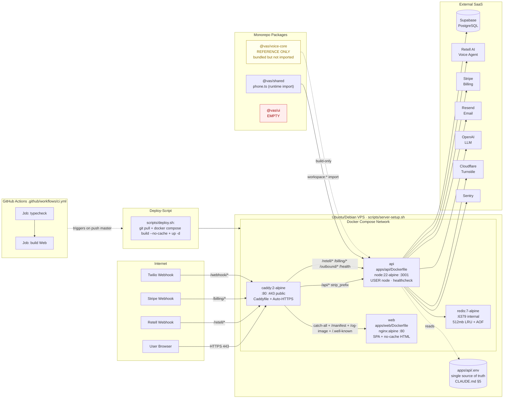

# Shared-Infra-Tests

Modul-Note für **Shared-Packages + Infra + Tests + Monorepo-Config** des Phonbot-Monorepos. Alles mit `file:line`-Referenzen auf den Repo-Root `C:\Users\pc105\.openclaw\workspace\voice-agent-saas`.

Verwandte Module: [[Backend-Auth-Security]] · [[Backend-Agents]] · [[Backend-Voice-Telephony]] · [[Backend-Infra]]

---

## 1. Packages-Sektion

### 1.1 `@vas/shared` — `packages/shared/`

Minimaler Shared-Code-Layer. Publiziert als `@vas/shared` (workspace-Protokoll, ESM, NodeNext).

| Datei                                      | Zweck                                                                 |
|--------------------------------------------|-----------------------------------------------------------------------|
| `packages/shared/src/index.ts`             | Barrel: `export * from './phone.js'` (`index.ts:1`)                   |
| `packages/shared/src/phone.ts`             | Phone-Normalisierung + Premium-Blocklist (DE + intl)                  |
| `packages/shared/package.json`             | `@vas/shared` · `main: dist/index.js` · `types: dist/index.d.ts`      |
| `packages/shared/tsconfig.json`            | extends `../../tsconfig.base.json`, `outDir: dist`, NodeNext-Module   |
| `packages/shared/README.md`                | "Shared types, schemas, and utilities."                               |
| `packages/shared/dist/*`                   | Gebaute JS + `.d.ts` (committed? → ja, vorhanden)                     |

**Exports aus `phone.ts`:**
- `normalizePhoneLight(input): { digits, normalized }` — `phone.ts:1` — strippt alles außer Ziffern, erhält führendes `+`.
- `isPlausiblePhone(input): boolean` — `phone.ts:42` — lehnt Toll-Fraud-/Premium-Nummern ab.
- Modul-privat: `DE_BLOCKED_PREFIXES` (`phone.ts:15`) — `0137, 0180, 0190, 0900, 0116, 0118, 0700`.
- Modul-privat: `INTL_BLOCKED_PREFIXES` (`phone.ts:25`) — US 1900/1976, UK 44871/872/873/70/900, FR 3308, IT 39899, ES 34803/806/807, AT 4390/43930, CH 41901/41906.

**Anti-Toll-Fraud-Logik** (`phone.ts:42-62`):
1. 7 ≤ `digits.length` ≤ 15 (E.164-Envelope).
2. DE-Normalisierung: `0049…` / `49…` → `0…` lokal.
3. Prefix-Match gegen DE-Blocklist auf normalisierter Lokalform.
4. Prefix-Match gegen Intl-Blocklist sowohl auf `+`-Form als auch `00`-Form (europäisches International-Prefix).
5. Kommentar `phone.ts:38-41` betont: **positiver Return heißt nicht "sicher zu wählen"** — Callsites müssen zusätzlich `ALLOWED_PHONE_PREFIXES` checken (siehe `apps/api/src/phone.ts`).

#### Wer importiert `@vas/shared` (grep-verifiziert)
| Importer                                                  | Line | Symbole                                  |
|-----------------------------------------------------------|------|------------------------------------------|
| `apps/api/src/tickets.ts`                                 | `:4` | `isPlausiblePhone`, `normalizePhoneLight`|
| `apps/api/src/__tests__/phone-validation.test.ts`         | `:2` | `isPlausiblePhone`, `normalizePhoneLight`|
| `apps/api/package.json`                                   | `:22`| `"@vas/shared": "workspace:*"`           |
| `pnpm-lock.yaml`                                          | `:40`| workspace-resolution                     |

**Wichtig:** Der **Web-Frontend importiert `@vas/shared` NICHT**. Alle DE/intl-Prefix-Checks laufen ausschließlich serverseitig.

---

### 1.2 `@vas/voice-core` — `packages/voice-core/` (REFERENCE-ONLY)

Minimaler Voice-Provider-SDK (OpenAI Realtime WebSocket). Laut `CLAUDE.md` Zeile 15: **"reference, not imported at runtime"**.

| Datei                                      | Zweck                                                                 |
|--------------------------------------------|-----------------------------------------------------------------------|
| `packages/voice-core/src/index.ts`         | **Einzige Source-Datei**, 257 Zeilen. Types + abstract base + OpenAI Realtime Provider |
| `packages/voice-core/package.json`         | `@vas/voice-core` · Deps: `zod@^3.24.1`, `ws@^8.18.0`                 |
| `packages/voice-core/tsconfig.json`        | Identisch zu shared (extends base, NodeNext, declaration)             |
| `packages/voice-core/README.md`            | "Realtime voice pipeline + agent runtime." + "Key modules (planned)"  |
| `packages/voice-core/dist/*`               | Nur `index.js` + `.d.ts` + maps                                       |

**Exports (`src/index.ts`):**
- Types: `VoiceSessionId` (:3), `AudioEncoding` (:5), `VoiceInputFrame` (:7), `VoiceOutputFrame` (:17), `TraceEvent` (:25–36, 11-variant union), `VoiceSessionOptions` (:42), `VoiceSessionEventHandler` (:50).
- Interfaces: `TraceSink` (:38), `VoiceSession` (:52), `VoiceProvider` (:61).
- Abstract: `VoiceSessionBase` (:65–89) — event-fanout + trace-emit.
- Klassen: `MemoryTraceSink` (:91, ring-buffer max 500), `OpenAIRealtimeProvider` (:116), intern `OpenAIRealtimeSession` (:125–256) — macht WS `wss://api.openai.com/v1/realtime`, sendet `session.update` mit `pcm16`, `gpt-4o-transcribe`, `server_vad`.

#### Runtime-Import-Audit (verifiziert mit grep)
- `grep "from '@vas/voice-core'"` → **0 Treffer** in `apps/**`.
- `grep "voice-core"` in `apps/` → ausschließlich Build-/Deploy-Referenzen:
  - `apps/api/package.json:6` — `dev`-Script ruft `pnpm --filter @vas/voice-core build` pre-start.
  - `apps/api/package.json:23` — dep `@vas/voice-core: workspace:*`.
  - `apps/api/Dockerfile:10, 24, 27` — kopiert `package.json` + `dist/` ins Image.

**Ergebnis:** CLAUDE.md-Claim bestätigt. Das Paket wird gebaut + ins Image bundled + als workspace-Dep deklariert, aber **kein TS-Source in `apps/` importiert davon**. Wahrscheinlich vestigial von früher OpenAI-Realtime-Experiment, bevor auf Retell AI gewechselt wurde (siehe [[Backend-Voice-Telephony]]).

---

### 1.3 `@vas/ui` — `packages/ui/` (LEER)

**Explizit dokumentiert: Das Paket ist leer.**

| Inhalt                             | Status                                                      |
|------------------------------------|-------------------------------------------------------------|
| `packages/ui/README.md`            | 1 Zeile: `# ui` + "Reusable UI components." (`README.md:1-3`)|
| `packages/ui/package.json`         | **FEHLT** — kein `package.json`, kein `src/`, kein Build     |
| Importe von `@vas/ui`              | **0 Treffer** im gesamten Repo (grep verifiziert)            |
| In `CLAUDE.md` Architektur         | Zeile 14: `ui/ # Shared UI components (@vas/ui)` — Planning-Placeholder |
| In `pnpm-workspace.yaml`           | Matched durch `packages/*`-Glob, wird aber ignoriert (kein `package.json`) |

**Konsequenz:** Alle UI-Komponenten leben aktuell direkt in `apps/web/src/ui/*` (siehe z. B. `apps/web/src/ui/landing/shared.ts`, referenziert in `scripts/gen-landing-pages.mjs:2`). Kein Code-Sharing zwischen mehreren Web-Apps — noch.

---

## 2. Docker / Compose-Sektion

### 2.1 Produktions-Stack: `docker-compose.yml` (Repo-Root)

Quelle: `docker-compose.yml:5-59`. Kommentar Zeile 1–3: "only Caddy is exposed to the public internet".

| Service   | Image/Build                      | Exposed Ports      | env_file            | Volumes                      | Healthcheck                       |
|-----------|----------------------------------|--------------------|---------------------|------------------------------|-----------------------------------|
| `api`     | Build `apps/api/Dockerfile`      | `expose 3001` (Docker-net only) | `apps/api/.env` (`:13`) | —                            | Container-level via Dockerfile    |
| `web`     | Build `apps/web/Dockerfile`      | `expose 80` (Docker-net only)   | —                   | —                            | —                                 |
| `redis`   | `redis:7-alpine`                 | `expose 6379`      | —                   | `redis-data:/data`           | `redis-cli ping` 10s/5s/3r        |
| `caddy`   | `caddy:2-alpine`                 | **`80:80`, `443:443`** (public) | — | `./Caddyfile:/etc/caddy/Caddyfile:ro`, `caddy-data:/data`, `caddy-config:/config` | — |

- **Single env source**: `apps/api/.env` (siehe `CLAUDE.md §5` + `docker-compose.yml:13`). Kein Root-`.env`.
- Redis-Config: `maxmemory 512mb`, `allkeys-lru`, `appendonly yes`, AOF-Rewrite 100%/64MB (`docker-compose.yml:31`).
- `restart: unless-stopped` auf allen Services.
- `depends_on.redis.condition: service_healthy` für API (`:16-18`).

### 2.2 Dev-/Secondary-Stack: `infra/docker/docker-compose.yml`

Alternative Compose-Datei (vermutlich legacy/local-dev). Unterschiede:

| Aspekt                 | Root-Compose                  | `infra/docker/docker-compose.yml`               |
|------------------------|-------------------------------|-------------------------------------------------|
| Postgres-Container     | **NEIN** (Supabase)            | **JA** (`postgres:16`, Port `5432:5432`) (`:2-16`) |
| Redis-Port             | `expose 6379` only            | `6379:6379` publisched (`:20-28`)               |
| API-Port               | `expose 3001`                  | `127.0.0.1:3001:3001` (localhost-bound) (`:34-35`) |
| Web-Port               | `expose 80`                    | `127.0.0.1:8080:80` (`:58-59`)                  |
| env_file-Pfad          | `apps/api/.env`                | `../../apps/api/.env` (`:36-37`)                |
| `DOMAIN` env           | — (aus Caddyfile gelesen)      | `${DOMAIN:-localhost}` (`:73`)                  |
| Healthcheck API        | Dockerfile-level               | `wget http://localhost:3001/health` (`:48-52`)  |

→ Root-`docker-compose.yml` ist prod-authoritative. `infra/docker/*` ist secondary/local-integration-test (mit echtem Postgres).

### 2.3 Dockerfiles

#### `apps/api/Dockerfile` (Multi-Stage, 43 Zeilen)
- Stage `base`: `node:22-alpine` + `corepack pnpm@9.15.3` (`:1-3`).
- Stage `build`: Kopiert Lockfile + `package.json`s, macht `pnpm install --frozen-lockfile --shamefully-hoist` (`:12`), kopiert Sources, `pnpm -r build` (`:15`).
- Stage `runtime`: Leanes `node:22-alpine`, kopiert nur `node_modules` + `dist`s von api/shared/voice-core + root-workspace-files.
- `ENV NODE_ENV=production`, `EXPOSE 3001` (`:30-32`).
- **Security**: `USER node` (UID 1000, nicht root) (`:36`, Kommentar `:34-35`).
- `HEALTHCHECK --interval=30s --timeout=5s --start-period=20s --retries=3` via `wget http://localhost:3001/health` (`:39-40`).
- CMD: `node apps/api/dist/index.js` (`:42`).

#### `apps/web/Dockerfile` (Multi-Stage, 16 Zeilen)
- Build stage: `node:22-alpine` → `pnpm --filter @vas/web build` (`:5-10`).
- Runtime stage: `nginx:alpine`, kopiert `apps/web/dist` → `/usr/share/nginx/html`, custom `apps/web/nginx.conf` (`:12-14`).
- `EXPOSE 80`.

#### `apps/web/nginx.conf` (40 Zeilen)
- SPA-Fallback: `try_files $uri $uri/ /index.html`.
- **HTML: Zero-Cache-Headers** (`Cache-Control: no-cache, no-store, must-revalidate`) auf `.html` + Industry-Slug-Dirs (`friseur|handwerker|arztpraxis|reinigung|restaurant|autowerkstatt|impressum|datenschutz|agb`) (`:8-22`).
- **Static JS/CSS/Fonts: 1y immutable** (`:32-35`).
- `gzip on` für text/JS/CSS/JSON/XML/SVG (`:38-39`).

---

## 3. K8s-Sektion

### `infra/k8s/` — **LEER**

| Inhalt              | Status                         |
|---------------------|--------------------------------|
| Manifeste (.yaml)   | **0 Dateien**                  |
| Deployments         | keine                          |
| Services            | keine                          |
| Ingress             | keiner                         |

**Explizit dokumentiert: `infra/k8s/` ist ein leeres Verzeichnis.** Prod-Deployment läuft ausschließlich via `docker compose` auf einer Single-VM (siehe `scripts/server-setup.sh` — Ubuntu/Debian + Docker CE). Kein Kubernetes-Setup.

---

## 4. Caddy-Sektion

Der produktive **`Caddyfile` liegt im Repo-Root** (`Caddyfile`, 82 Zeilen, zuletzt 2026-04-20 editiert).

`infra/docker/Caddyfile` (18 Zeilen) ist die **alte/minimale Version** — nur für `infra/docker/docker-compose.yml`, kein Security-Headers-Block, kein Industry-Redirect. Wird von Root-Compose NICHT genutzt (Root mountet `./Caddyfile`).

### Root `Caddyfile` — Struktur

| Abschnitt                              | Zeilen      | Zweck                                                            |
|----------------------------------------|-------------|------------------------------------------------------------------|
| Host-Binding                           | `:1`        | `{$DOMAIN:phonbot.de}` — Env-Var mit Default `phonbot.de`         |
| `header` (global Security-Headers)     | `:5-16`     | CSP, HSTS, X-Content-Type-Options, X-Frame-Options, Referrer-Policy, Permissions-Policy, `-Server` |
| `handle /api/*`                        | `:19-22`    | `uri strip_prefix /api` → `reverse_proxy api:3001`                |
| `handle /retell*`                      | `:25-27`    | Retell-Webhooks direkt (ohne `/api`-Prefix)                       |
| `handle /billing*`                     | `:28-30`    | Stripe-Webhooks direkt                                            |
| `handle /webhook*`                     | `:31-33`    | Generic webhook path                                              |
| `handle /outbound*`                    | `:34-36`    | Outbound-Call-Trigger (siehe [[Backend-Voice-Telephony]])         |
| `handle /health`                       | `:37-39`    | Backend-Healthcheck                                               |
| `@textfiles` matcher + handle          | `:42-49`    | `llms.txt`, `llms-full.txt`, `ai.txt`, `robots.txt`, `humans.txt`, `^/[a-f0-9]{16,}\.txt$` (IndexNow-Key), alle als `text/plain` |
| `handle /.well-known/*`                | `:51-55`    | z. B. `security.txt`, als `text/plain`                            |
| `handle /manifest.webmanifest`         | `:57-61`    | Correct `application/manifest+json` content-type                   |
| `handle /og-image.svg`                 | `:63-67`    | SVG content-type                                                  |
| `@industry_no_slash` redir             | `:72-75`    | 301 `/friseur` → `/friseur/` (SEO canonical enforcement)           |
| `handle` (catch-all)                   | `:77-80`    | → `web:80` (SPA)                                                  |

### CSP (Content-Security-Policy) — Zeile `:9`

```
default-src 'self';
script-src 'self' 'unsafe-inline' https://challenges.cloudflare.com;
style-src 'self' 'unsafe-inline' https://fonts.googleapis.com;
style-src-elem 'self' 'unsafe-inline' https://fonts.googleapis.com;
font-src 'self' data: https://fonts.gstatic.com;
img-src 'self' data: https://phonbot.de https://*.retellai.com https://challenges.cloudflare.com;
connect-src 'self' wss://*.retellai.com https://*.retellai.com wss://*.livekit.cloud https://*.livekit.cloud wss://phonbot.de https://challenges.cloudflare.com;
media-src 'self' blob: https://*.cloudfront.net;
frame-src 'self' https://challenges.cloudflare.com;
object-src 'none';
base-uri 'self';
form-action 'self';
```

**Rationale (aus Kommentaren `:6-8`):** CSP blockt XSS → Exfiltration via fetch. Turnstile benötigt `challenges.cloudflare.com` auf script/frame/connect. LiveKit/Retell auf connect für WebRTC.

### Weitere Security-Header (`:10-15`)
- `Strict-Transport-Security "max-age=31536000; includeSubDomains"` (1 Jahr HSTS)
- `X-Content-Type-Options "nosniff"`
- `X-Frame-Options "SAMEORIGIN"` (Clickjacking-Schutz)
- `Referrer-Policy "strict-origin-when-cross-origin"`
- `Permissions-Policy "microphone=(self), camera=(), geolocation=(), payment=(self)"` (nur Mic + Stripe-Payment)
- `-Server` (strippt Caddy-Banner)

### TLS
- Caddy macht **Auto-HTTPS** via Let's Encrypt (Hostname aus `$DOMAIN` oder Default `phonbot.de`).
- Persistenz in Volumes `caddy-data`, `caddy-config` (`docker-compose.yml:50-51`).

---

## 5. Scripts-Sektion

Alle unter `scripts/`.

| Script                            | Typ     | Zweck                                                                                   |
|-----------------------------------|---------|-----------------------------------------------------------------------------------------|
| `scripts/check-prod-env.sh`       | bash    | Validiert `apps/api/.env` — 13 **REQUIRED_VARS** (DB/JWT/Retell/Stripe/Resend/OpenAI/Encryption/OAUTH_STATE_SECRET/Admin/Turnstile) + 9 **RECOMMENDED_VARS** (Redis/Sentry/Twilio/SIP/Bundle/Address). Grün/rot pro Zeile. Exit 1 bei fehlenden Required. (`check-prod-env.sh:23-50`) |
| `scripts/deploy.sh`               | bash    | `git pull origin master` + `docker compose build --no-cache` + `docker compose up -d` + `docker compose ps`. Läuft **auf dem Server** nach First-Time-Setup oder für Updates. (`deploy.sh:1-20`) |
| `scripts/server-setup.sh`         | bash    | First-Time VPS-Setup: Docker CE + compose-plugin install auf Ubuntu/Debian, `usermod -aG docker`. Gibt Hinweis für `git clone https://github.com/Hansweier/voice-agent-saas.git /opt/phonbot`. (`server-setup.sh:1-30`) |
| `scripts/setup-stripe.ts`         | tsx     | **Einmalig**: erstellt Stripe Products+Prices für Starter (49 €), Pro (149 €), Agency (399 €). Run: `npx tsx scripts/setup-stripe.ts`. Liest `../.env` (relative — Achtung, old path pre-CLAUDE-§5). (`setup-stripe.ts:10,14-18`) |
| `scripts/test-db.mjs`             | mjs     | **Quick Supabase-Sanity-Check** mit hartkodiertem `DATABASE_URL` (siehe Zeile 2 — **enthält plaintext password** — sollte rotiert sein). Erstellt `orgs`-Tabelle idempotent. |
| `scripts/gen-landing-pages.mjs`   | mjs     | Generiert Industry-Landing-Pages unter `apps/web/public/<slug>/index.html`. Slugs: `friseur, handwerker, arztpraxis, reinigung, restaurant, autowerkstatt` (BRANCHEN-Array in `gen-landing-pages.mjs:9`). Muss **sync** bleiben mit `apps/web/src/ui/landing/shared.ts::TEMPLATES`. Run: `node scripts/gen-landing-pages.mjs`. |
| `scripts/voice-migration/*`       | mjs+mp3 | One-shot Migration von Retell-Custom-Voices (ElevenLabs/Platform-Provider) → Cartesia. `clone-all-to-cartesia.mjs` (`:1-40`): lädt MP3 von Retell-S3 runter, POST an `/clone-voice` mit `provider=cartesia`. 6 Stimmen (Richard Stephan, hahaha, bruce, shamil akh, mostar, Hansi). Outputs liegen als MP3s in `cartesia-previews/` + `originals/`. Siehe auch [[Backend-Voice-Telephony]] für "Chipy"-Voice-Context. |
| `start-dev.bat` (Repo-Root)       | Win-bat | Dev-Convenience (Windows): startet API (`npx tsx src/index.ts` Port 3001) + Vite (Port 3000). |

**⚠ Security-Finding**: `scripts/test-db.mjs:2` enthält ein **hardcoded Supabase-DB-Passwort** (`TsBzUNC8yNNLTF2T`). Der Key sollte rotiert und das Script auf `process.env.DATABASE_URL` umgestellt werden. (Separates Finding; nicht Teil dieses Read-Only-Reports.)

---

## 6. Tests-Sektion

Alle unter `apps/api/src/__tests__/`. **Vitest** (konfiguriert in `apps/api/package.json:10` als `"test": "vitest"`), Version `^2.1.8` (matcht root-workspace). Kein separater `vitest.config.ts` → Default-Config (ESM, tsx via `tsx`).

| Datei                                | Subject                                     | Test-Count (`it(...)`) | Key-Invarianten                                                  |
|--------------------------------------|---------------------------------------------|:---------------------:|-------------------------------------------------------------------|
| `auth-flow.test.ts`                  | `auth.ts` — register/login/refresh/reset/logout | **12**             | 201/400/401 Status-Codes, Refresh-Rotation, 72-char bcrypt-Limit, email-enumeration-guard (forgot-password always 200), `GET /auth/me` ohne Token → 401. Mockt pg-Pool + bcrypt + `email.ts`. |
| `captcha.test.ts`                    | `captcha.ts` — Cloudflare Turnstile         | **6**                 | Dev fail-open (no secret), Prod fail-closed, empty token → true (defense-in-depth), success/failure response routing, network-error → false. Stubs `fetch`. |
| `crypto.test.ts`                     | `crypto.ts` — AES-256-GCM                   | **8**                 | Round-trip, different IV → different ciphertext, legacy-plaintext passthrough, null/undefined/empty handling, corrupt ciphertext → null, malformed prefix → null, Unicode. `ENCRYPTION_KEY` = `'a'.repeat(64)` via `vi.stubEnv`. |
| `org-id-cache.test.ts`               | `org-id-cache.ts` — LRU cache              | **4**                 | DB-Query nur einmal beim Cache-Hit, **NULL wird nicht gecacht** (permanent-403-Bug-Regression), `invalidateOrgIdCache` evicted, SQL checkt `retellAgentId OR retellCallbackAgentId` (Fix `6a7eaa3`). Mockt pg-Pool. |
| `phone-validation.test.ts`           | `@vas/shared` — `isPlausiblePhone` + `normalizePhoneLight` | **14** | DE/AT/CH valide Nummern, too-short/too-long rejected, DE-premium blocked (0900/0180/0137/0700), intl premium blocked (US 1-900, UK 44871/44-70, CH 090x, AT 0930). |
| `pii.test.ts`                        | `pii.ts` — `redactPII`                      | **10**                | Redaction von EMAIL/PHONE (de-nat/de-int/at)/IBAN/DOB (`DD.MM.YYYY` + `DD/MM/YYYY`)/ADDRESS (Straße/Str.)/CC, null/empty passthrough, normaler Business-Text unverändert, multi-PII in einem String. |
| `session-store.test.ts`              | `session-store.ts` — cross-tenant isolation | **6**                 | `pushMessage` erstellt Session, cross-tenant-Read gibt `[]`, **`SESSION_ID_COLLISION` throws bei Org-B-Write** (D1-Schutz), `clearSession` no-op für falschen Tenant, Messages akkumulieren korrekt. Stubt `redis=null` → in-memory Fallback. |
| `usage.test.ts`                      | `usage.ts` — `tryReserveMinutes` / `reconcileMinutes` / `checkUsageLimit` | **11** | **Atomic single-statement CASE** für Reservation (`within_limit` / `overage_allowed` / `hard_blocked` / `blocked`), 0 rows → denied, `paidPlans` als `$3`-Param, `reconcileMinutes` atomic CTE mit `GREATEST(0,…)`-Guard beim Refund, no-op wenn actual === reserved, `checkUsageLimit` blockt `paused`-Subscriptions. `DEFAULT_CALL_RESERVE_MINUTES === 5`. |
| `webhook-signature.test.ts`          | Retell HMAC-SHA256 + Stripe sig-format      | **7**                 | Korrekte HMAC matches via `timingSafeEqual`, wrong key → different HMAC, tampered body → different HMAC, empty sig rejected (length-mismatch), non-hex → invalid, deterministisch, Stripe `t=…,v1=…`-Header-Format. |

**Gesamt: 9 Dateien · 78 `it(...)` / 105 `describe|it` Match (inkl. describes).**

**Test-Strategie (aus CLAUDE.md §14 + Files):**
- Pure unit tests, no real DB. Mocks via `vi.mock('../db.js', …)` mit pg-Pool-Stub.
- bcrypt-Mock (instant, keine 200 ms).
- Redis-Mock via `vi.mock('../redis.js', () => ({ redis: null }))` → session-store fällt auf In-Memory-Map.
- Vitest-Top-level-await-Pattern: `const { X } = await import('../X.js')` **nach** `vi.mock(…)` (siehe `session-store.test.ts:14`, `crypto.test.ts:13`, `usage.test.ts:24`).

---

## 7. CI-Sektion

### `.github/workflows/ci.yml` (53 Zeilen, einzige Workflow-Datei)

**Trigger:** `push` + `pull_request` auf `master` (`ci.yml:3-7`).

**Jobs:**

| Job        | runs-on        | Needs      | Steps                                                                                        |
|------------|----------------|------------|----------------------------------------------------------------------------------------------|
| `typecheck`| ubuntu-latest  | —          | `checkout@v4` · `pnpm/action-setup@v4 v9` · `actions/setup-node@v4 node-22 cache:pnpm` · `pnpm install --frozen-lockfile` · `cd apps/api && pnpm typecheck` · `cd apps/web && pnpm typecheck` |
| `build`    | ubuntu-latest  | `typecheck`| checkout + pnpm + node-22 + install + `cd apps/web && pnpm build` |

**Lücken / auffällig:**
- ❌ **Kein `test`-Job** — Vitest-Suite (9 Files, 78 Tests) läuft NICHT in CI.
- ❌ **Kein API-Build-Job** — nur Web wird gebaut; API-Build wird implizit via `apps/api/Dockerfile` zur Deploy-Zeit gemacht.
- ❌ **Kein `lint`-Job** — obwohl `pnpm -r lint` in Root `package.json:8` existiert.
- ❌ Kein Security-Scan (CodeQL / `npm audit` / Snyk).
- ❌ Keine Image-Build/Push (GHCR) — `deploy.sh` baut auf dem Target-VM selbst.

---

## 8. Monorepo-Config

### Workspace-Struktur (`pnpm-workspace.yaml:1-4`)
```yaml
packages:
  - "apps/*"
  - "packages/*"
```

→ matched: `apps/api`, `apps/web`, `packages/shared`, `packages/voice-core`, `packages/ui` (letzteres ohne `package.json` → ignored).

### Root `package.json` (`:1-13`)
- `packageManager: pnpm@9.15.3` (wird in Dockerfile via `corepack prepare` aktiviert).
- Scripts (rekursiv über workspaces):
  - `dev` = `pnpm -r dev` · `build` = `pnpm -r build` · `lint` = `pnpm -r lint` · `test` = `pnpm -r test` · `typecheck` = `pnpm -r typecheck`.
  - `check` = `pnpm --filter @vas/api typecheck && pnpm --filter @vas/web typecheck` (Pre-Commit-Quick-Gate).

### TypeScript — `tsconfig.base.json` (Repo-Root, 15 Zeilen)
```json
{
  "compilerOptions": {
    "target": "ES2022", "lib": ["ES2022", "DOM"],
    "module": "ESNext", "moduleResolution": "Bundler",
    "resolveJsonModule": true, "esModuleInterop": true,
    "strict": true, "skipLibCheck": true,
    "forceConsistentCasingInFileNames": true,
    "noUncheckedIndexedAccess": true
  }
}
```

**Extends-Kette:**
- `packages/shared/tsconfig.json` (`:1`) extends base → overridet `module: NodeNext`, `moduleResolution: NodeNext`, `declaration: true` (für `.d.ts`-Output).
- `packages/voice-core/tsconfig.json` — identisch zu shared.
- `apps/api/tsconfig.json` (nicht direkt Teil dieses Moduls, aber referenziert) extends base.
- `apps/web/tsconfig.json` extends base.

**Projekt-Regel (CLAUDE.md §7):** Alle TS-Imports müssen `.js`-Extension tragen (ESM+NodeNext): `import { x } from './file.js'` — nicht `./file`.

**Strictness (CLAUDE.md §25):** `strict: true` + `noUncheckedIndexedAccess: true`. Letzteres ist der Grund für viele `obj[key]!`-Assertions im Test-Code (z. B. `webhook-signature.test.ts:75`, `usage.test.ts:99`).

---

## 9. Eingehende / Ausgehende Referenzen

### 9.1 `@vas/shared` — Eingehende Importe (runtime)
```
apps/api/src/tickets.ts:4           →  isPlausiblePhone, normalizePhoneLight
apps/api/src/__tests__/phone-validation.test.ts:2  →  isPlausiblePhone, normalizePhoneLight
```
**Ausgehende Importe aus `shared/src/`:** Keine (Zero-Dep-Paket, nur TypeScript-std).

### 9.2 `@vas/voice-core` — Eingehende Importe (runtime)
**KEINE.** Verifiziert per `grep "from '@vas/voice-core'" apps/` → 0 Treffer. Nur als Build-Dep in `apps/api/Dockerfile:24,27`.

**Ausgehende Importe aus `voice-core/src/index.ts`:**
- `ws` (`:1`)
- `crypto` (`:2`, für `randomUUID`)

### 9.3 `@vas/ui` — Eingehende Importe
**KEINE.** Paket ist leer.

### 9.4 `Caddyfile` — Hinein-Referenzen
- `docker-compose.yml:49` mountet `./Caddyfile:/etc/caddy/Caddyfile:ro`
- Routing-Ziele: `api:3001` (8× in handlers), `web:80` (catch-all + text/manifest/og-image handlers)

### 9.5 `docker-compose.yml` — Hinein-Referenzen
- `scripts/deploy.sh:12` — `docker compose build --no-cache && docker compose up -d`
- `CLAUDE.md §5` — "Docker prod (`docker-compose.yml`) liest direkt `apps/api/.env`"

### 9.6 Tests — Hinein-Referenzen
- Alle Test-Files `import … from '../X.js'` aus `apps/api/src/*`. Siehe [[Backend-Auth-Security]] (auth/crypto/captcha/session-store/webhook-signature tests), [[Backend-Voice-Telephony]] (org-id-cache, phone-validation, webhook-signature-Retell-teil), [[Backend-Agents]] (usage/billing-Minuten-Reservation), [[Backend-Infra]] (pii).

---

## 10. Verbundene Notes

- [[Backend-Auth-Security]] — Konsument der Crypto/Captcha/Auth-Tests; `crypto.ts`, `captcha.ts`, `auth.ts`, `session-store.ts` sind dort dokumentiert.
- [[Backend-Agents]] — Konsument von `usage.ts`/`billing.ts`; Usage-Reservation + Stripe-Plans (siehe `scripts/setup-stripe.ts`).
- [[Backend-Voice-Telephony]] — Importiert `isPlausiblePhone` via `tickets.ts` + enthält Retell-Webhook-HMAC-Logik (`webhook-signature.test.ts`). `scripts/voice-migration/*` gehört zum Voice-Stack.
- [[Backend-Infra]] — Pino-Redaction (`pii.ts`), Redis, DB-Pool, Deployment-Wiring (`docker-compose.yml`), Caddy-Reverse-Proxy.

---

## 11. Deployment-Topologie (Mermaid)



---

## 12. Report-Zusammenfassung

**Assigned Bereiche vollständig abgedeckt:**
- ✅ `packages/shared/src/*` — `index.ts` + `phone.ts` mit exports + runtime-consumers grep-verified (2 Importer).
- ✅ `packages/voice-core/src/index.ts` — REFERENCE-ONLY bestätigt (0 runtime-Importer in `apps/`).
- ✅ `packages/ui/` — LEER bestätigt (nur README, kein `package.json`).
- ✅ `infra/docker/*` — Secondary Compose + legacy Caddyfile.
- ✅ `infra/k8s/*` — LEER bestätigt (0 Manifeste).
- ✅ `Caddyfile` (root) — 82 Zeilen, volles Security-Header-Setup + CSP + Industry-Redirects dokumentiert.
- ✅ `docker-compose.yml` (root) — 4 Services, env_file `apps/api/.env` verifiziert.
- ✅ `scripts/*` — 7 Scripts + 1 voice-migration-subdir katalogisiert.
- ✅ `apps/api/src/__tests__/*` — 9 Dateien, Subject+Testcount+Invarianten.
- ✅ `pnpm-workspace.yaml`, `tsconfig.base.json`, `package.json` (Root + api + web) — alles dokumentiert.
- ✅ `.github/workflows/ci.yml` — einzige Datei, `typecheck` + `build` Jobs.

**Key Findings / Auffälligkeiten:**
1. `@vas/voice-core` wird im Docker-Image gebündelt aber **nirgends importiert** — Dead-Code-Candidate, ~257 LoC + deps.
2. `@vas/ui` existiert nur als README-Stub — kein Package.
3. `infra/k8s/` ist **leer** — kein k8s-Setup, nur Docker-Compose Single-VM.
4. **Zwei konkurrierende Compose-Files**: Root (prod, Supabase) vs. `infra/docker/` (legacy, eigenes Postgres). Root ist authoritative.
5. **Zwei konkurrierende Caddyfiles**: Root (prod, volle Security-Headers) vs. `infra/docker/Caddyfile` (minimal, legacy).
6. **Vitest läuft NICHT in CI** — `.github/workflows/ci.yml` hat nur `typecheck` + Web-`build`. 78 Tests werden lokal vor Deploy erwartet (CLAUDE.md §14).
7. **`scripts/test-db.mjs:2` enthält hardcoded Supabase-Passwort** — rotationsbedürftig (out-of-scope für diesen Read-Report; aber dokumentiert).
8. Alle Tests nutzen pure-unit-mocks (vi.mock für `../db.js`, `../redis.js`, `bcrypt`, `fetch`) — kein Integration-Tier.

---

_Generated by Claude Code (Opus 4.7, 1M context), Read-only audit, 2026-04-20._

---

## Verwandt

- [[Phonbot/Phonbot-Gesamtsystem|🧭 Gesamtsystem]] · [[Phonbot/Overview|Phonbot Overview]]
- **Packaged:** [[Backend-Infra]] (docker-compose + Caddyfile), alle Backend-Module (`apps/api/src/*`), [[Frontend-Shell]] + [[Frontend-Pages]] (`apps/web`)
- **Tests hängen an:** [[Backend-Auth-Security]] (auth-flow, crypto, captcha, pii, session-store) · [[Backend-Billing-Usage]] (usage Race) · [[Backend-Voice-Telephony]] (phone-validation, webhook-signature) · [[Backend-Database]] (org-id-cache)
- **Findings:** [[Audit-2026-04-18-Deep]] H6 (Test-Coverage 6%), Daily [[Daily/2026-04-21|2026-04-21]] (CI-Lücke: Vitest läuft nicht), `scripts/test-db.mjs:2` hardcoded Passwort
